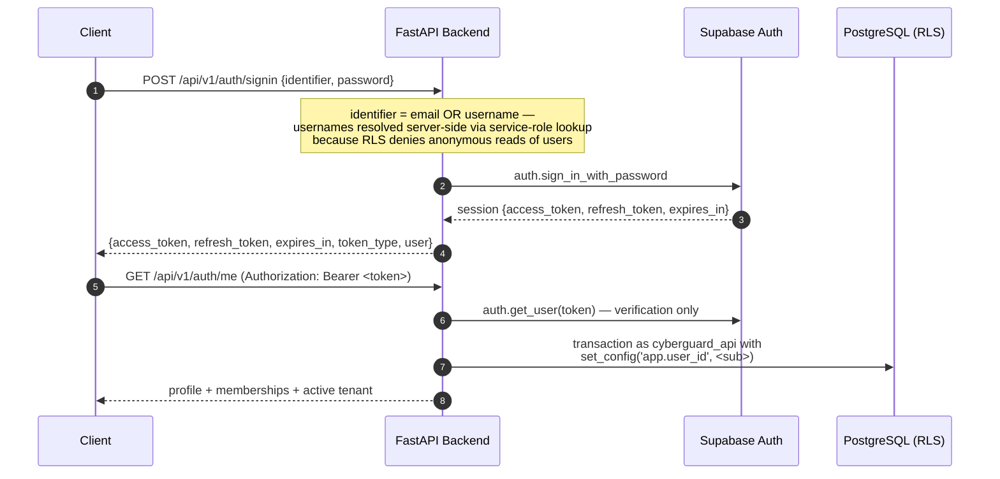
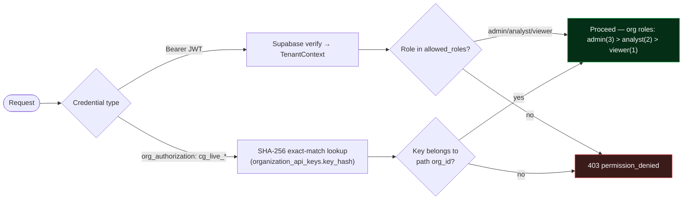
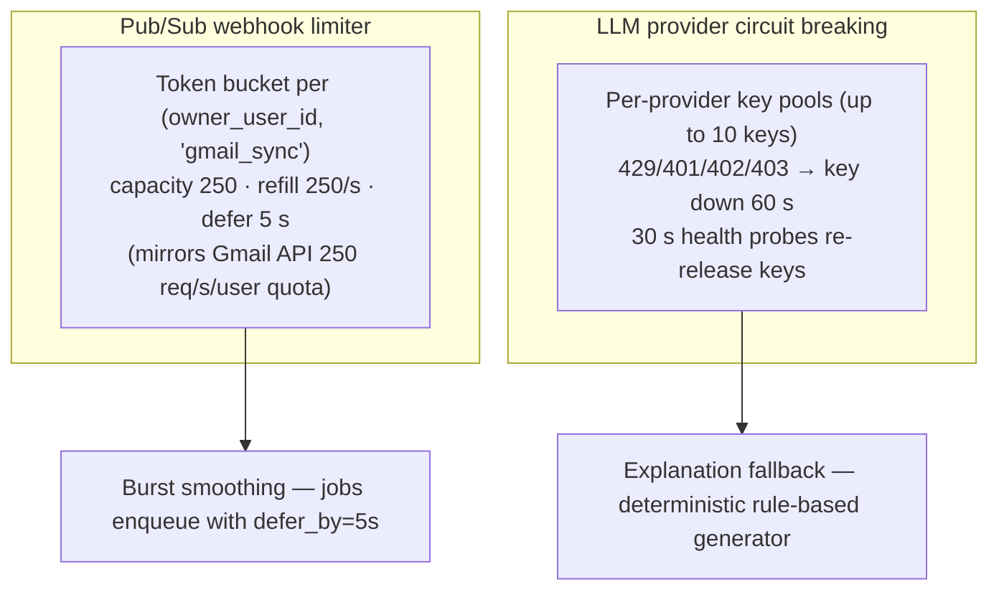
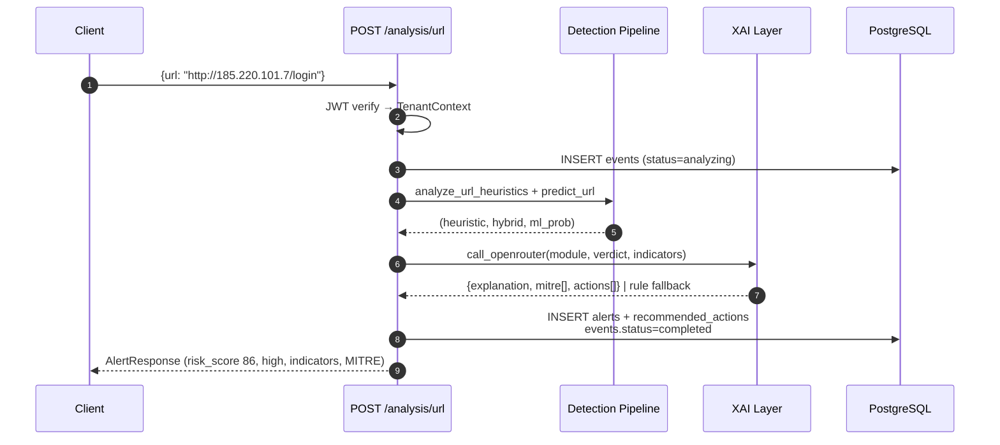
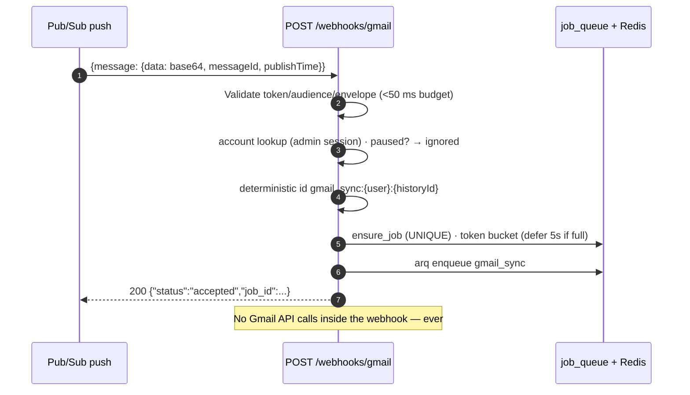
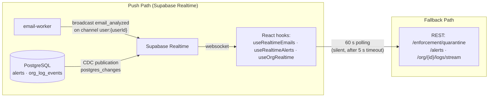

# CYBERGUARD — API Documentation

**Base URL:** `/api/v1` (configurable via `API_V1_PREFIX`) · **Interactive docs:** `http://localhost:8000/docs` (Swagger UI) · **Auth:** Supabase JWT bearer · **Format:** JSON (multipart for media) · **Error envelope:** `{ "error": "<code>", "message": "…", "details"?: … }`

Every route below is transcribed from the backend routers (`backend/app/api/`). The in-app `/docs` page additionally mechanically verifies its API reference rows against live routers (`frontend/scripts/check-docs.mjs`).

**Related documents:** [ARCHITECTURE.md](ARCHITECTURE.md) · [INTEGRATION_GUIDE.md](INTEGRATION_GUIDE.md) · [SECURITY_MODEL.md](SECURITY_MODEL.md) · [DATA_MODEL.md](DATA_MODEL.md)

## Table of Contents

1. [Authentication](#1-authentication)
2. [Authorization & Roles](#2-authorization--roles)
3. [Error Handling & Envelopes](#3-error-handling--envelopes)
4. [Rate Limiting](#4-rate-limiting)
5. [Endpoint Reference](#5-endpoint-reference)
6. [Request/Response Flows](#6-requestresponse-flows)
7. [Real-Time Communication](#7-real-time-communication)
8. [Working Examples (curl)](#8-working-examples-curl)
9. [FAQ](#9-faq)

---

## 1. Authentication

CYBERGUARD uses **Supabase Auth** as the identity provider; the backend verifies bearer JWTs with the Supabase anon client and mirrors users into a local `users` row (JIT upsert on first request).



| Endpoint | Method | Auth | Purpose |
|---|---|---|---|
| `/auth/config` | GET | public | `{org_enabled}` capability flag |
| `/auth/username-available?username=` | GET | public | Validates `^[a-z0-9_.]{3,32}$` + availability |
| `/auth/signup` | POST | public | Backend-mediated signup; enforces server-side usernames; returns session + `confirmation_pending` |
| `/auth/signin` | POST | public | Email **or** username sign-in (username resolved server-side) |
| `/auth/me` | GET | bearer | Profile + org memberships + active tenant |
| `/auth/notification-email` | PUT | bearer | Registers the *system* notification address (never a connected mailbox) |
| `/auth/switch-org` | POST | bearer | Frozen behind `ORG_ENABLED` (501 while false) |

**Why backend-mediated signup?** Username uniqueness across auth identities cannot be guaranteed client-side; the backend creates the Supabase auth user and the local row atomically, and the frontend installs the returned session via `supabase.auth.setSession` to keep refresh flows intact.

---

## 2. Authorization & Roles

Two authorization surfaces exist:

1. **User JWT** (`Authorization: Bearer`) — personal workspace and org-plane UI routes. Personal workspaces always resolve to `TenantContext{organization_id: NULL, owner_user_id: user.id, role: "admin"}`.
2. **Org API keys** (`org_authorization: <cg_live_…>`) — server-to-server gateway ingestion only. SHA-256-hashed, prefix-displayed, plaintext returned exactly once.



Role usage by route family: `require_role(["admin","analyst"])` on analysis/events/integrations; viewer included on read-mostly surfaces (alerts, dashboard); `/dlq` uses a custom dependency that **forbids analysts (403)** and shows non-admins only their own jobs; org settings keys `api_keys`/`billing` are viewer-blocked.

---

## 3. Error Handling & Envelopes

All errors return a consistent envelope. FastAPI validation errors are normalized to `invalid_payload`.

| Code | HTTP | Raised By |
|---|---|---|
| `not_found` | 404 | `NotFoundError` |
| `unauthorized` | 401 | `UnauthorizedError`; expired/invalid Supabase token |
| `permission_denied` | 403 | `PermissionDeniedError`; also provider `reauth_required` / `insufficient_scope` on enforcement routes |
| `invalid_payload` | 400 | Pydantic validation; `ValidationError` |
| `conflict` | 409 | `ConflictError`; SQLAlchemy `IntegrityError` |
| `external_service_error` | 502 | `ExternalServiceError`; generic provider failure (`provider_error`) |
| `coming_soon` | 501 | `ComingSoonError` — frozen org router while `ORG_ENABLED=false` (`{"detail": "Organization accounts are coming soon."}`) |
| internal | 500 | Unhandled exception; SQLAlchemy errors |

**Honesty mapping on enforcement routes:** provider auth failures → 403 `reauth_required` (prompt reconnection), missing scope → 403 `insufficient_scope`, provider outage → 502 `provider_error`. The API never reports a simulated operation as a provider success.

---

## 4. Rate Limiting

Two independent limiters protect different resources:



There is no global HTTP rate limiter on the API itself; abusive clients are bounded by the webhook limiter, the LLM circuit breaker, and provider-side quotas. The DLQ retry matrix adds ±10% jitter on rate-limit backoffs to prevent thundering herds.

---

## 5. Endpoint Reference

### 5.1 Health & Metrics

| Endpoint | Method | Auth | Description |
|---|---|---|---|
| `/health` · `/api/v1/health` | GET | public | Liveness: `{status, timestamp, database_connected, supabase_connected}` |
| `/ready` · `/api/v1/ready` | GET | public | Readiness: Postgres `SELECT 1` + Redis ping (2 s timeout); 503 with `details` on failure |
| `/metrics` · `/api/v1/metrics` | GET | public | Prometheus exposition (10 metric families; queue depth refreshed pre-scrape) |

### 5.2 Analysis (6 detection modules) — `require_role(["admin","analyst"])`

All analysis routes run the shared pipeline: Event → heuristics + ML → monotonic blend → severity → XAI → Alert.

| Endpoint | Method | Body | Module |
|---|---|---|---|
| `/analysis/email` | POST | `{source, sender, subject, body, target_user?}` | `phishing` |
| `/analysis/url` | POST | `{source, url, target_user?}` | `url` |
| `/analysis/impersonation` | POST | `{source, message, claimed_identity}` | `impersonation` |
| `/analysis/account-takeover` | POST | `{source, events: [auth-event dicts]}` | `account_takeover` |
| `/analysis/network` | POST | `{source, flows[], api_logs[]}` | `network` (or `api_abuse` when only API logs) |
| `/analysis/media` | POST | multipart `file` (image/video/audio, ≤25 MB) | `deepfake` |
| `/analysis/media/event/{event_id}` | POST | — | re-run deepfake pipeline for a stored media event |

Response shape (`AlertResponse`): verdict, risk_score, severity, indicators (incl. `ml_model` with probability), explanation, MITRE techniques, recommended actions.

### 5.3 Raw Event Ingestion — admin/analyst

| Endpoint | Method | Body |
|---|---|---|
| `/events/email` · `/events/url` · `/events/message` · `/events/auth-log` · `/events/network` · `/events/api-log` | POST | typed event schemas (`app/schemas/events.py`) — persisted with status `received` |
| `/events/media` | POST | multipart upload → Event + `media_files` + Supabase Storage |
| `/events/media/{event_id}/url` | GET | 1-hour signed URL (`SIGNED_URL_EXPIRY_SECONDS=3600`) |

### 5.4 Webhooks

| Endpoint | Method | Description |
|---|---|---|
| `/webhooks/gmail` | POST | Google Pub/Sub push. Contract: validate envelope (structure, base64 `message.data`, verification token, optional `GMAIL_PUBSUB_AUDIENCE`) → lookup `gmail_accounts` → deterministic job `gmail_sync:{user}:{history_id}` → token-bucket gate (defer 5 s) → enqueue → **HTTP 200 in <50 ms**. Responses: `accepted`, `duplicate: true`, `ignored` (paused account), 400 invalid payload. |

### 5.5 Alerts · Incidents · Dashboard

| Endpoint | Method | Auth | Description |
|---|---|---|---|
| `/alerts` | GET | + viewer | Filters: severity, module, status, search, offset, limit |
| `/alerts/{alert_id}` | GET | + viewer | Detail with recommended actions |
| `/alerts/{alert_id}/status` | PATCH | admin/analyst | Status update (audited) |
| `/incidents` | GET / POST | + viewer / admin+ | List / create |
| `/incidents/{id}` | GET | + viewer | Detail + timeline |
| `/incidents/{id}/status` · `/assign` · `/escalate` | PATCH / POST | admin/analyst | Lifecycle: `open → investigating → contained → closed` (validated server-side) |
| `/dashboard/summary` | GET | bearer | Aggregated counts for the SOC dashboard |

### 5.6 Response & Actions (dual-mode control plane)

| Endpoint | Method | Description |
|---|---|---|
| `/responses/catalog` | GET | The 10 seeded catalog actions |
| `/responses/execute` | POST | `{catalog_id, target, approved}` — approval gate if catalog action requires it |
| `/responses/history` | GET | Limit 1–200 |
| `/actions` | GET | Filters: status, action_type, module, severity, paging |
| `/actions/{id}` | GET | Execution detail |
| `/actions/{id}/approve` · `/reject` | POST | admin/analyst; approve executes immediately (simulated) and stamps approver |
| `/actions/quarantine/list` · `/actions/quarantine/{id}/release` | GET / POST | Quarantine view + lifecycle release |
| `/actions/blocklist/list` · `/actions/blocklist/{id}/unblock` | GET / POST | Blocklist view + unblock |

Status model: `pending | approved | executing | success | failed | rejected | skipped | released | unblocked`. Client mode always yields `skipped` (recommendation only).

### 5.7 Enforcement (personal, owner-scoped)

| Endpoint | Method | Description |
|---|---|---|
| `/enforcement/quarantine` | GET | Quarantined items list |
| `/enforcement/quarantine/{item_id}/release` | POST | Real Gmail release (label removed, INBOX restored); 404-tolerant |
| `/enforcement/quarantine/{item_id}/release-and-trust` | POST | Release + trust sender; reports `existing_block` if still blocked (honest two-step) |
| `/enforcement/quarantine/{item_id}/delete` | POST | Trash or permanent delete per `permanent_delete_enabled` |
| `/enforcement/quarantine/{item_id}/keep` | POST | No-op review outcome (recorded) |
| `/enforcement/blocked-senders` | GET | List (auto-heals 404 rows to `released`) |
| `/enforcement/blocked-senders/{block_id}/release` | POST | Deletes the Gmail filter |
| `/enforcement/trusted-senders` | GET / POST / DELETE | Trust list management (idempotent trust) |

### 5.8 Connectors & Settings

| Endpoint | Method | Description |
|---|---|---|
| `/connectors/capabilities` · `/connectors/operations` | GET | Provider registry + operation vocabulary (honest capability reporting) |
| `/connectors` | GET | Connected accounts |
| `/connectors/gmail/authorize` | POST | Begins OAuth (single-use state row, TTL 600 s) |
| `/connectors/gmail/callback` | GET | OAuth callback (hidden; atomic state consumption) |
| `/connectors/{id}/test` · `/connectors/{id}` (DELETE) | POST / DELETE | Connectivity test / disconnect |
| `/connectors/{id}/messages` · `/messages/{mid}/analysis` | GET | Mailbox listing / per-message analysis |
| `/connectors/{id}/scan` | POST | Batch mailbox scan (engines shared with all other paths; trust-list annotation) |
| `/connectors/{id}/settings` | GET / PUT | Expiry, permanent-delete, auto-quarantine toggles |
| `/connectors/activity` | GET | Recent connector operations |

### 5.9 Organizations & Org Plane

| Endpoint | Method | Description |
|---|---|---|
| `/organizations…` (entire router) | * | **Frozen** behind `ORG_ENABLED=false` → 501 coming-soon |
| `/orgs` | POST | Create org (creator = admin) |
| `/orgs/{orgId}/api-keys` | GET / POST / DELETE | Key lifecycle; plaintext returned **exactly once** |
| `/orgs/{orgId}/settings[/{key}]` | GET / PUT | Org settings (viewer blocked on sensitive keys) |
| `/orgs/{orgId}/members` (+`/{userId}`) | GET / POST / PATCH / DELETE | RBAC membership |
| `/org/{org_id}/gateway` | POST | **Server-to-server ingestion** (`org_authorization` header): `scan_email | scan_url | ingest_log` |
| `/org/{orgId}/dashboard/summary` · `/dashboard/{feature}` | GET | Org analytics (service-role aggregation with explicit org predicate) |
| `/org/{orgId}/logs/ingest` · `/logs/stream` · `/logs/{logId}/action` | POST / GET | Shape-based log ingestion; manual analyst actions (`block_ip`, `revoke_session`, `isolate_host`, `escalate_incident`, `mark_safe`) |
| `/org/{orgId}/mail-servers…` | 12 endpoints | Org mail connector management (connect/disconnect/fetch/quarantine/settings/logs) |
| `/org/{orgId}/notifications/emails|settings|logs` | GET / POST / PUT / DELETE | Role-grouped notification management |

### 5.10 Policies · History · Notifications · Audit · Assistant · DLQ

| Endpoint | Method | Description |
|---|---|---|
| `/policies` · `/policies/{id}` (GET/PUT) · `/policies/{id}/activate` | GET/POST | Enforcement policy CRUD (per-module thresholds + per-band actions) |
| `/security-history` · `/security-history/{id}` | GET | Filters: event_type, actor_type, severity, sender_email, from/to |
| `/quarantine/{item_id}/review` | GET | Ordered event chain + live-computed available actions |
| `/notifications` | GET | Personal notification log |
| `/audit/logs` | GET | Audit ledger (limit, actor_type filters) |
| `/assistant/chat` | POST | SOC assistant grounded in recent alerts (admin/analyst) |
| `/integrations/email-gateway|url-proxy|network|auth|media/analyze` | POST | Server-mode SOAR entrypoints (`resolve_mode` + enforcement engine) |
| `/dlq/stats` · `/dlq/jobs` · `/dlq/jobs/{id}` | GET | DLQ analytics; analysts forbidden (403); non-admins see only their own |
| `/dlq/jobs/{id}/retry` | POST | **Admin only** — reset to queued, `manual_dlq_retry` audit, re-enqueue |
| `/dlq/jobs/{id}` | DELETE | **Admin only** — soft-delete (`status='deleted'`), `manual_dlq_delete` audit |
| `/db/check` | GET | Supabase connectivity probe |

---

## 6. Request/Response Flows

### Analysis Request Flow



### Webhook Flow (thin receiver)



---

## 7. Real-Time Communication

The API exposes **no WebSocket endpoints**. Real-time reaches browsers through Supabase Realtime, with REST polling as the fallback:



Payload of `email_analyzed` (broadcast): `{processed_email_id, risk_score, classification, scan_result_id, owner_user_id, subject?, sender?, severity?, threat_type?, signals?, analyzed_at?}`.

The frontend status pill reports channel health: green `LIVE` (websocket subscribed) or amber `POLLING` (60 s fallback — never an error toast).

---

## 8. Working Examples (curl)

```bash
TOKEN="<supabase-access-token>"
BASE="http://127.0.0.1:8000/api/v1"

# Health & readiness
curl -s $BASE/health
curl -s $BASE/ready

# Analyze a phishing email
curl -s -X POST $BASE/analysis/email \
  -H "Authorization: Bearer $TOKEN" -H "Content-Type: application/json" \
  -d '{"source":"api","sender":"security-alert@micr0soft-verify.xyz",
       "subject":"URGENT: verify your account",
       "body":"Click http://185.220.101.7/login to verify password immediately"}'
# → {"risk_score":100,"severity":"critical","module":"phishing", ...}

# Analyze a URL
curl -s -X POST $BASE/analysis/url \
  -H "Authorization: Bearer $TOKEN" -H "Content-Type: application/json" \
  -d '{"source":"api","url":"http://secure-account-verification.micr0soft-support.xyz/auth/session?id=88213"}'

# Simulate a Pub/Sub push webhook (no auth — verification token instead)
curl -s -X POST $BASE/webhooks/gmail -H "Content-Type: application/json" \
  -d '{"message":{"data":"eyJlbWFpbEFkZHJlc3MiOiJ0ZXN0QGdtYWlsLmNvbSIsImhpc3RvcnlJZCI6IjEyMzQ1In0=",
       "messageId":"msg-sim-001","publishTime":"2026-09-16T12:00:00Z"}}'
# → {"status":"accepted","job_id":"gmail_sync:..."} in <50 ms

# Org gateway (server-to-server)
curl -s -X POST $BASE/org/<org_id>/gateway \
  -H "org_authorization: cg_live_<key>" -H "Content-Type: application/json" \
  -d '{"action":"scan_url","data":{"url":"https://paypa1-support.example/login"}}'

# DLQ operations (admin JWT)
curl -s $BASE/dlq/stats -H "Authorization: Bearer $ADMIN_TOKEN"
curl -s -X POST $BASE/dlq/jobs/<job_id>/retry -H "Authorization: Bearer $ADMIN_TOKEN"
```

---

## 9. FAQ

**Q: Where is `/metrics` — root or `/api/v1`?**
Both. Health, ready, and metrics are registered at the root and under the v1 prefix.

**Q: Why does `/organizations` return 501?**
The frozen legacy router stays byte-for-byte unchanged while `ORG_ENABLED=false`; the active org plane is `/orgs` + `/org/{org_id}`. This is a documented ADR ("decouple, don't demolish").

**Q: Can the webhook be called without the verification token?**
In local dev yes (token optional when unset); in production set `GOOGLE_PUBSUB_VERIFICATION_TOKEN` (and optionally `GMAIL_PUBSUB_AUDIENCE` for OIDC) — invalid envelopes are rejected before enqueue.

**Q: How are pagination and filtering conventions shaped?**
List endpoints accept `limit`/`offset` (alerts, security-history, actions, DLQ) or `page`/`page_size` (actions) — check the specific route's query schema in Swagger at `/docs`.

**Q: What idempotency guarantees does the API give integrators?**
Webhook and gateway ingestion are idempotent by construction: deterministic job IDs plus database UNIQUE constraints collapse duplicate deliveries into the first processing run (`duplicate: true` response).

**Q: How do I know which role a route needs?**
Swagger shows the dependency chain; as a rule: read-mostly surfaces allow viewer, all mutation/metadata surfaces require analyst, DLQ mutations and policy/DLQ admin surfaces require admin, and org settings keys `api_keys`/`billing` block viewers at both API and RLS layers.
