# CYBERGUARD — System Architecture

**Version:** 0.2.0 · **Backend:** FastAPI (Python 3.11+) · **Frontend:** React 18 + Vite + TypeScript · **Data:** PostgreSQL 16 + Redis 7 · **Queue:** Arq · **AI:** XGBoost / PyTorch + Groq / Gemini / OpenRouter

This document is the architectural single source of truth. It follows the C4 model: Context → Container → Component → Code, then drills into per-engine data flows, communication patterns, and the database schema visualization.

**Related documents:** [THREAT_DETECTION_ENGINES.md](THREAT_DETECTION_ENGINES.md) · [DATA_MODEL.md](DATA_MODEL.md) · [SECURITY_MODEL.md](SECURITY_MODEL.md) · [WORKER_ARCHITECTURE.md](WORKER_ARCHITECTURE.md) · [DEPLOYMENT_GUIDE.md](DEPLOYMENT_GUIDE.md) · [DECISIONS.md](DECISIONS.md)

## Table of Contents

1. [Architectural Principles](#1-architectural-principles)
2. [C4 Level 1 — System Context](#2-c4-level-1--system-context)
3. [C4 Level 2 — Container View](#3-c4-level-2--container-view)
4. [C4 Level 3 — Component View (Backend)](#4-c4-level-3--component-view-backend)
5. [C4 Level 4 — Code-Level Patterns](#5-c4-level-4--code-level-patterns)
6. [Per-Engine Data Flows](#6-per-engine-data-flows)
7. [Microservices Communication Patterns](#7-microservices-communication-patterns)
8. [Request Lifecycle Walkthroughs](#8-request-lifecycle-walkthroughs)
9. [Database Schema Visualization](#9-database-schema-visualization)
10. [Frontend Architecture Map](#10-frontend-architecture-map)
11. [Design Rationale ("Why")](#11-design-rationale-why)
12. [FAQ](#12-faq)

---

## 1. Architectural Principles

| # | Principle | Where It Is Enforced |
|---|---|---|
| P1 | **Hybrid, monotonic detection** — ML may raise but never lower a heuristic score | `app/services/ml_inference.py` (`blend_scores`) |
| P2 | **Database-enforced isolation** — RLS beneath application filters; app role is `NOBYPASSRLS` | `app/db/session.py` (GUC stamping), Alembic policies |
| P3 | **Single detection source of truth** — interactive API, mailbox scanning, gateway, and workers all call the same engines | `routes_analysis.py`, `mail_scanner.py`, `email_worker.py`, `routes_orgs.py` gateway |
| P4 | **Honest status reporting** — no simulated action is ever reported as a real provider success; deferrals are explicit | `provider_operation_status`, `"simulated": true` flags |
| P5 | **Durable over ephemeral** — PostgreSQL `job_queue` is the authority; Redis is a dispatch optimization | `job_state_service.py`, `idempotency_service.py` |
| P6 | **Graceful degradation everywhere** — LLM fallback chain, realtime→polling fallback, storage local fallback, SQLite dev mode | `ai/llm_client.py`, `useRealtimeEmails.ts`, `core/storage.py` |
| P7 | **Durable auditability** — every automated or manual action lands in `security_events` + `audit_logs` with actor attribution | `security_history_service.record_event`, `audit_service.log_action` |

---

## 2. C4 Level 1 — System Context

Who interacts with CYBERGUARD and which external systems it trusts:

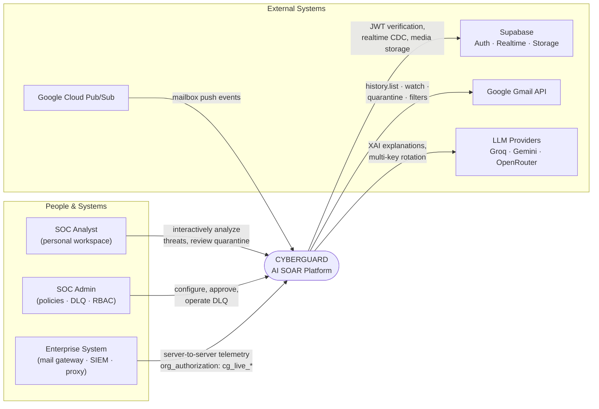

**Trust boundaries:** the browser holds only Supabase Auth JWTs; mailbox OAuth tokens never leave the backend; the service-role Supabase key exists only server-side.

---

## 3. C4 Level 2 — Container View

Nine deployable containers plus two cloud planes:

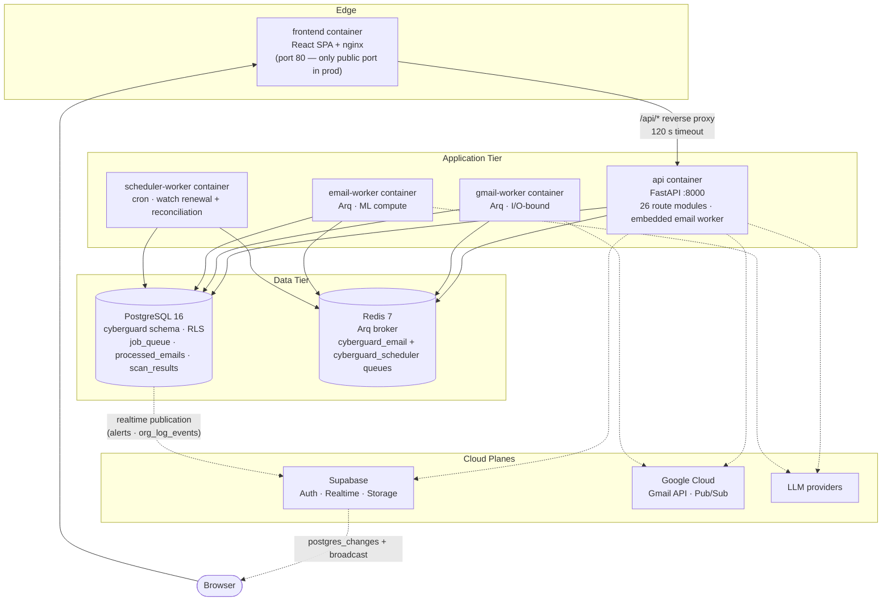

**Container responsibilities:**

| Container | Entrypoint | Concurrency | Why a Separate Process |
|---|---|---|---|
| `api` | `uvicorn app.main:app` (prod: `alembic upgrade head &&` prefix) | uvicorn event loop + **embedded email worker** | Serves the REST surface; embeds one worker so a single-container demo still processes queues |
| `gmail-worker` | `python -m arq app.workers.gmail_worker.WorkerSettings` | `ARQ_MAX_JOBS=10` | Gmail discovery is I/O-bound and Google-quota-bound; isolation prevents webhook bursts from starving analysis |
| `email-worker` | `python -m arq app.workers.email_worker.WorkerSettings` | `ARQ_MAX_JOBS=10` | MIME parsing, XGBoost/torch scoring and SOAR enforcement are compute/memory-heavy; scales horizontally independently |
| `scheduler-worker` | `python -m arq app.workers.scheduler_worker.WorkerSettings` | cron-driven | Own queue `cyberguard_scheduler`; `renew_watches` 4×/daily (`0,6,12,18`), `reconcile_stuck_accounts` 2×/hourly (`:15,:45`) |
| `postgres` | postgres:16-alpine | — | Durable authority: 37 tables, 132 RLS policies (post-0013) |
| `redis` | redis:7-alpine (prod: `requirepass` + AOF) | — | Low-latency job dispatch, idempotency against in-flight jobs |

---

## 4. C4 Level 3 — Component View (Backend)

```mermaid
flowchart TB
    subgraph API_LAYER["app/api — 26 route modules"]
        AUTH["routes_auth<br/>signup · signin · me"]
        ANALYSIS["routes_analysis<br/>6 detection modules"]
        EVENTS["routes_events<br/>raw telemetry ingestion"]
        WEBHOOK["routes_gmail_webhook<br/>thin Pub/Sub receiver"]
        ENF["routes_enforcement<br/>quarantine · blocks · trust"]
        ACTIONS["routes_actions<br/>approval control plane"]
        ORGS["routes_orgs + gateway<br/>org plane · cg_live_ keys"]
        DLQ["routes_dlq<br/>admin-only ops"]
        MORE["alerts · incidents · response · policies ·<br/>integrations · connectors · settings ·<br/>audit · dashboard · assistant · org_*"]
    end

    subgraph SERVICES["app/services — detection & SOAR core"]
        PHISH["phishing_detector"]
        URLD["url_detector"]
        IMPL["impersonation_detector"]
        ATO["account_takeover_detector"]
        NET["network_threat_detector"]
        DF["deepfake_detector +<br/>media_forensics/"]
        SCORING["scoring_service<br/>severity weights + bands"]
        MLINF["ml_inference<br/>model cache + monotonic blend"]
        ACTENGINE["action_engine<br/>corroboration-gated enforcement"]
        ACTEXEC["action_executor<br/>policy verbs → module actions"]
        ENGEN["enforcement_engine<br/>thresholds + auto-execute policy"]
        SCHED["scheduler<br/>5-min expiry loop"]
        NOTIF["notification_service<br/>db_log / SMTP"]
        RTNOT["realtime_notifier<br/>email_analyzed broadcast"]
        HIST["security_history_service<br/>dual-write ledger"]
        TRUST["trusted_senders<br/>feedback loop"]
    end

    subgraph AI["app/ai — XAI layer"]
        ROT["key_rotator<br/>per-provider pools · circuit breaker"]
        LLMC["llm_client<br/>provider chain · severity consistency"]
        PROMPTS["prompt_templates<br/>7 system prompts"]
    end

    subgraph CORE["app/core"]
        SEC["security<br/>Supabase JWT verify · TenantContext"]
        CFG["config<br/>pydantic-settings"]
        RLSN["session GUC stamping (db/)"]
        METRICS["metrics<br/>10 Prometheus families"]
        RETRY["retry_policy<br/>categorization + backoff"]
        CRYPTO["crypto<br/>Fernet token vault"]
        CAL["calibration<br/>hot-reloaded thresholds"]
    end

    subgraph WORKERS["app/workers — Arq"]
        GWJ["gmail_sync_job"]
        EFJ["email_fetch_job"]
        EAJ["email_analysis_job<br/>+ auto-SOAR hook"]
        CRONS["renew_watches · reconcile_stuck_accounts"]
    end

    API_LAYER --> SERVICES
    SERVICES --> AI
    SERVICES --> CORE
    WORKERS --> SERVICES
    WORKERS --> CORE
```

### Component Responsibility Matrix

| Component | Input | Output | Key Invariant |
|---|---|---|---|
| `phishing_detector` | sender, subject, body, channel | indicators (severity-tagged) | leet-tolerant brand regexes; SMS-only heuristics gated by `channel=="sms"` |
| `url_detector` | URL string | indicators | top-1M whitelist suppresses FP-prone hygiene signals |
| `impersonation_detector` | message, claimed identity | indicators | 4 checks: authority, pressure, unusual request, secrecy |
| `account_takeover_detector` | auth event stream (per user) | indicators | impossible travel window 60 min; burst threshold 3 |
| `network_threat_detector` | flows + api_logs | indicators | max flow ML probability drives the ML indicator |
| `deepfake_detector` | media file | ELA stats + CNN probability | CNN-vs-ELA disagreement policy (see §6.6) |
| `ml_inference` | indicators + raw text/url | `(heuristic, hybrid, ml_prob)` | `final = max(heur, round(0.45·heur + 0.55·ml·100))` |
| `scoring_service` | indicators | 0–100 score + band | weights critical 25 / high 15 / medium 5; capped at 100 |
| `action_engine` | ScanResult + connector | real Gmail operations | corroboration gate: critical AND ≥2 engines high/critical |
| `enforcement_engine` | risk score + policy + mode | decision (approve/pending/skip) | client mode never auto-executes |
| `llm_client` | verdict + indicators | `{explanation, mitre[], actions[]}` | `safe` verdicts have MITRE wiped (severity consistency) |
| `key_rotator` | HTTP outcomes | healthy-key round-robin | 429/401/402/403 → key down; 30 s health probes |
| `job_state_service` | worker transitions | validated job state | `queued→running→completed/failed/dead_letter` only |

---

## 5. C4 Level 4 — Code-Level Patterns

Four patterns repeat across the codebase; recognizing them makes any module legible:

### Pattern 1 — RLS GUC Stamping (per-transaction tenancy)

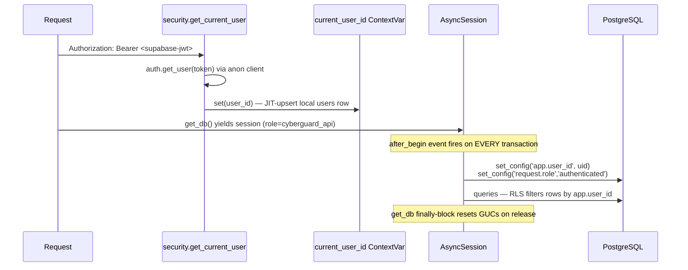

**Why lazy, per-transaction?** `get_current_user` depends on `get_db`, so the session exists *before* the user is known; an acquire-time `set_config` would always see NULL. The `after_begin` hook applies the GUC at the first execution of every transaction (ADR, Phase -1 deviation #1).

### Pattern 2 — Deterministic Idempotency

Every queue operation uses a content-derived ID so at-least-once delivery becomes exactly-once processing:

| Job Type | Deterministic ID | Dedup Layers |
|---|---|---|
| `gmail_sync` | `gmail_sync:{owner_user_id}:{history_id}` | Redis in-flight + `job_queue.job_id` UNIQUE |
| `email_fetch` | `email_fetch:{owner_user_id}:{message_id}` | same |
| `email_analysis` | `email_analysis:{owner_user_id}:{message_id}` | same |
| `email_scan` | `email_scan:{owner_user_id}:{message_id}` | same |
| Processed mail | — | `UNIQUE(owner_user_id, gmail_message_id)` on `processed_emails` (IntegrityError → return existing) |

### Pattern 3 — Honest Provider Contract

The 14-method `EmailProvider` interface exposes `capabilities` flags (`supports_quarantine`, `supports_sender_rules`, …). Callers consult capabilities before acting and surface `unsupported` / `insufficient_scope` / `reauth_required` as first-class statuses instead of pretending success. The `MockEmailProvider` with configurable failure flags proves the engine is Gmail-independent.

### Pattern 4 — Dual-Write History

`security_history_service.record_event(event, audit_entry)` writes one `security_events` row AND a matching `audit_logs` row with the same `actor_type` (`user | system | scheduler`), so the two ledgers can never disagree about who acted. Writers must pass the real provider operation outcome; defaults are success-free.

---

## 6. Per-Engine Data Flows

All six engines share the skeleton from README ("Threat Detection Pipeline"); the diagrams below show what is unique per engine. Full heuristic catalogs and thresholds: [THREAT_DETECTION_ENGINES.md](THREAT_DETECTION_ENGINES.md).

### 6.1 Phishing Detection Engine

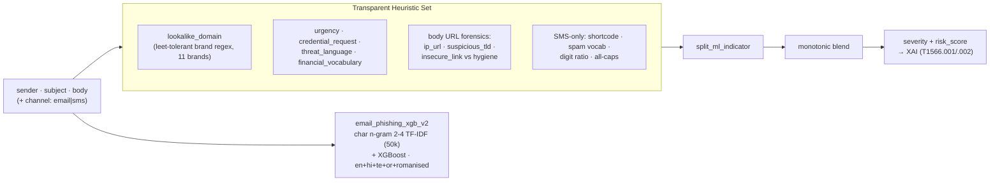

### 6.2 URL Forensics Engine

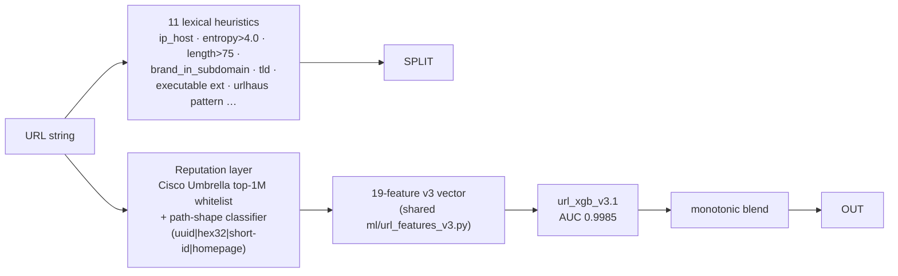

### 6.3 BEC & Impersonation Engine

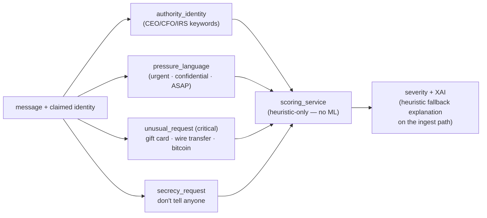

### 6.4 ATO & Identity Defense Engine

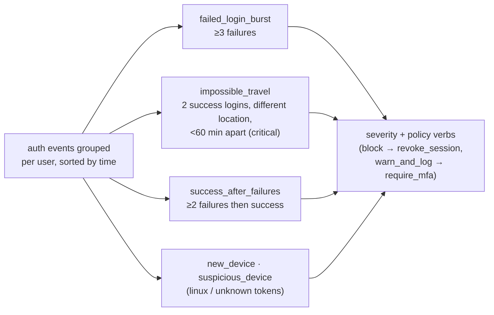

### 6.5 Network Flow & API Abuse Engine

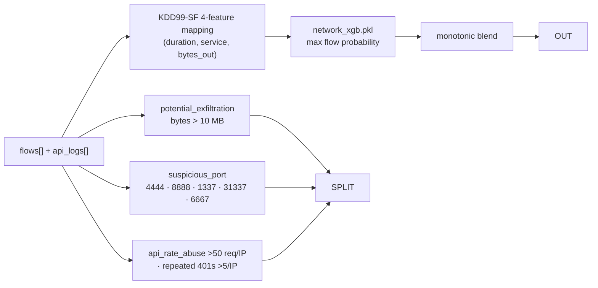

### 6.6 Deepfake & Media Forensics Engine

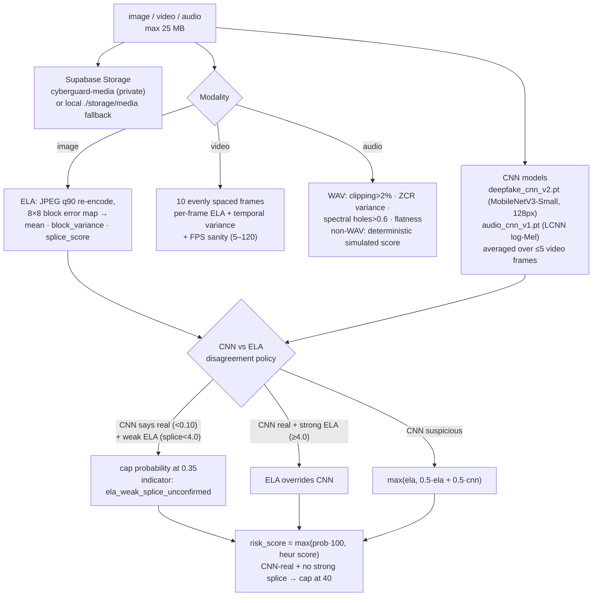

---

## 7. Microservices Communication Patterns

CYBERGUARD is a **modular monolith plus dedicated workers**: one FastAPI process, three Arq worker processes, communicating via Redis and PostgreSQL only (no service-to-service HTTP).

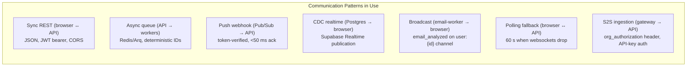

| Pattern | Technology | Delivery Guarantee | Failure Mode & Mitigation |
|---|---|---|---|
| REST | FastAPI + Pydantic v2 | at-most-once | typed error envelopes (`{error, message, details?}`) |
| Job queue | Redis + Arq | at-least-once | deterministic IDs + DB UNIQUE → exactly-once effect; retry matrix + DLQ |
| Push webhook | GCP Pub/Sub push | at-least-once | deterministic `gmail_sync:{user}:{history_id}`; token bucket defers 5 s under burst |
| Realtime | Supabase Realtime (WAL) | at-most-once push | 60 s polling fallback, silent (no error toasts) |
| S2S gateway | FastAPI + API-key middleware | at-most-once | SHA-256 key validation before identity exists |

**Why no direct worker↔API HTTP?** Worker state transitions go through PostgreSQL (`job_queue`), which is the durable authority; Redis only coordinates *who runs what next*. This is what lets any worker die and be replaced without losing jobs.

---

## 8. Request Lifecycle Walkthroughs

### 8.1 Interactive Phishing Analysis (`POST /api/v1/analysis/email`)

1. JWT verified → `TenantContext` resolved (personal workspace → role `admin`).
2. `Event` row inserted (status `analyzing`).
3. `analyze_email_heuristics` produces indicators; `predict_email` appends the ML indicator.
4. `score_with_ml` → `(heuristic, hybrid, prob)`; `get_severity` bands the score.
5. `call_openrouter` generates the XAI explanation (provider chain → rule fallback).
6. `create_alert` persists `Alert` + `RecommendedAction` rows; Event → `completed`.
7. Response: `AlertResponse` with verdict, indicators, MITRE techniques, actions.

### 8.2 Real-Time Gmail Threat (worker path)

1. Pub/Sub push → thin webhook → deterministic `gmail_sync` job (<50 ms ack).
2. gmail-worker: `history.list` delta → row-locked checkpoint → enqueue `email_fetch`.
3. email-worker: fetch raw MIME (metadata-only attachments), normalize to `NormalizedMessage`.
4. Enqueue `email_analysis` → engines + ML blend + XAI → `ScanResult` + `processed_emails.analyzed`.
5. Auto-SOAR: `classification=="phishing"` or `risk_score>=0.7` → `enforce_scan_result` (corroboration-gated quarantine + sender block).
6. `realtime_notifier` → `email_analyzed` broadcast → UI prepends with highlight animation (<3 s end-to-end).

### 8.3 Organization Gateway Ingestion (`POST /api/v1/org/{org_id}/gateway`)

1. `org_authorization: <cg_live_…>` header → SHA-256 lookup (before any identity exists).
2. Actions: `scan_email | scan_url | ingest_log` → same detection pipelines under a synthetic org tenant.
3. Lookalike-domain / display-name-spoof indicators trigger the impersonation notification group (ORG-4).
4. Log findings at medium+ are promoted to the alert plane (Event + Alert) so dashboards and realtime see them.

---

## 9. Database Schema Visualization

37 tables in the `cyberguard` schema, grouped into five domains. Every row carries `owner_user_id` and/or `organization_id`; RLS (132 policies) filters on those columns. Full column-level detail: [DATA_MODEL.md](DATA_MODEL.md).

```mermaid
erDiagram
    %% Identity & tenancy domain
    users ||--o{ organizations : "owns (owner_id)"
    users ||--o{ organization_members : "joins"
    organizations ||--o{ organization_members : "has"
    organizations ||--o{ organization_api_keys : "issues"
    organizations ||--o{ org_log_events : "receives"
    organizations ||--o{ org_mail_servers : "manages"
    organizations ||--o{ org_notification_emails : "routes"
    organizations ||--o{ org_notification_settings : "configures"
    organizations ||--o{ org_notification_logs : "records"
    organizations ||--o{ organization_settings : "stores"
    org_mail_servers ||--o{ org_mail_server_settings : ""
    org_mail_servers ||--o{ org_mail_server_logs : ""

    %% Detection domain
    users ||--o{ events : "owns"
    events ||--o{ media_files : "carries"
    events ||--o{ alerts : "produces"
    alerts ||--o{ recommended_actions : "suggests"
    alerts }o--o{ incidents : "incident_alerts"
    incidents ||--o{ incident_events : "timeline"

    %% Connectors & enforcement domain
    users ||--o{ email_connector_accounts : "connects"
    users ||--o{ gmail_accounts : "watches"
    gmail_accounts ||--o{ job_queue : "drives"
    users ||--o{ quarantined_items : "holds"
    users ||--o{ blocked_senders : "blocks"
    users ||--o{ trusted_senders : "trusts"
    users ||--o{ connector_settings : "configures"
    users ||--o{ connector_operation_logs : "audits"
    users ||--o{ connector_oauth_states : "authorizes"

    %% Real-time pipeline domain
    users ||--o{ processed_emails : "ingests"
    processed_emails }o--o| scan_results : "scan_result_id"
    users ||--o{ scan_results : "verdicts"
    users ||--o{ job_queue : "jobs"

    %% History & ops domain
    users ||--o{ security_events : "records"
    users ||--o{ audit_logs : "records"
    users ||--o{ notification_logs : "sends"
    users ||--o{ action_executions : "executes"
    users ||--o{ enforcement_policies : "governs"
    response_catalog ||--o{ response_executions : "instantiates"
```

**Schema domains:** identity & tenancy (12 tables) · detection (7) · connectors & enforcement (8) · real-time pipeline (4) · history & operations (6). The legacy `backend/db/schema.sql` (Supabase-editor bootstrap, 15 `public` tables) is superseded by the Alembic chain — treat `alembic/versions/` as the source of truth.

---

## 10. Frontend Architecture Map

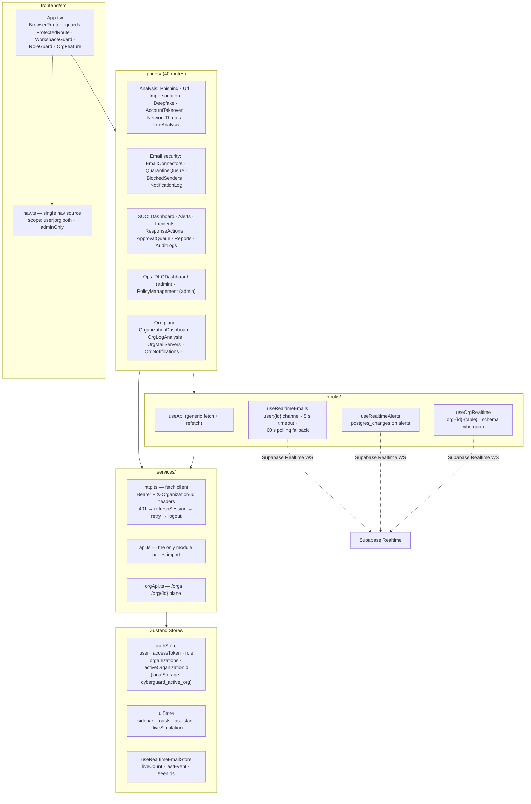

Details (component hierarchy, lifecycle, testing): [FRONTEND_ARCHITECTURE.md](FRONTEND_ARCHITECTURE.md).

---

## 11. Design Rationale ("Why")

| Decision | Alternative Considered | Why This Won |
|---|---|---|
| Modular monolith + worker processes | Microservices per engine | Engines share in-process model caches (XGBoost/torch load is expensive); a separate service per engine would multiply memory 6× for zero isolation benefit. Workers give the *operational* isolation that matters (I/O vs compute). |
| PostgreSQL as job authority | Redis persistence only | Redis AOF can still lose the tail and offers no queryable audit; `job_queue` gives RLS-isolated dashboards, retry history, and DLQ forensics for free (RT-2). |
| Supabase Auth + local `users` mirror | Custom JWT issuance | Supabase provides managed JWT rotation, OAuth providers, and — critically — Realtime channels whose RLS visibility reuses the same row-ownership model. |
| Monotonic fusion instead of pure ML | ML-only scoring | The evaluation harness measured heuristic AUC ≈ 0.77 vs blended ≈ 0.97 on OpenPhish-over-legit-platforms — but pure heuristics had recall gaps and pure ML had top-1m FPs. `max()` fusion keeps the transparency of rules and the recall of models (DECISIONS, eval harness). |
| Corroboration gate before auto-quarantine | Auto-act on any critical score | One engine can be confidently wrong; two independent engines scoring high+ is the cheapest strong signal that enforcement (a real mailbox write) is justified. |
| Polling fallback instead of reconnect storms | Aggressive WS retry | Corporate firewalls and offline dev would toast-loop; 60 s polling is silent, fresh-enough, and self-heals on reconnect (RT-7). |
| Dedicated `cyberguard` schema | `public` schema | Clean separation from Supabase's `auth`/`storage` schemas; schema-level grants make "app role cannot touch platform tables" a database fact. |

---

## 12. FAQ

**Q: Is there a WebSocket endpoint on the backend?**
No. Real-time is delivered by Supabase Realtime (Postgres CDC publications + a broadcast channel) directly from browser to Supabase, with a 60 s polling fallback against REST endpoints. The backend never holds user websocket connections.

**Q: Where does the "embedded worker" live?**
`app/main.py` lifespan boots one Arq email-worker inside the API process (`create_worker(EmailWorkerSettings)`), so a single-container deployment still drains queues. Docker Compose deployments run dedicated worker containers and the embedded instance simply competes for the same jobs.

**Q: How do I add a 7th detection engine?**
(1) implement the indicator-producing analyzer in `app/services/`, (2) register a route in `routes_analysis.py` calling `_run_analysis_pipeline` with a new module name, (3) add `MODULE_DEFAULT_THREAT_TYPES` + enforcement threshold entries, (4) extend the nav + analysis page. The pipeline (fusion, severity, XAI, alerting) is engine-agnostic.

**Q: What happens when Supabase is completely unreachable?**
Auth fails (no JWT verification), realtime degrades to polling, and media storage falls back to local disk. Postgres itself can be self-hosted — Supabase is only the auth/CDC/storage plane, not the database engine.

**Q: How does the org gateway differ from the personal analysis API?**
Authentication (SHA-256 API key vs user JWT), tenancy (org row scope vs `owner_user_id`), and notification routing (role groups vs `notification_email`). Detection logic is byte-identical — same engines, same blend, same severity bands.

**Q: Where do latency budgets come from?**
Heuristic evaluation is p95 <10 ms per message; hybrid URL classification p95 ≈ 3.7 ms and network ≈ 34 ms (evaluation report). The webhook budget of 50 ms is enforced by design: the handler only validates and enqueues. LLM explanation latency (10–20 s timeout) is off the critical enforcement path — enforcement proceeds on heuristic/ML verdicts.
