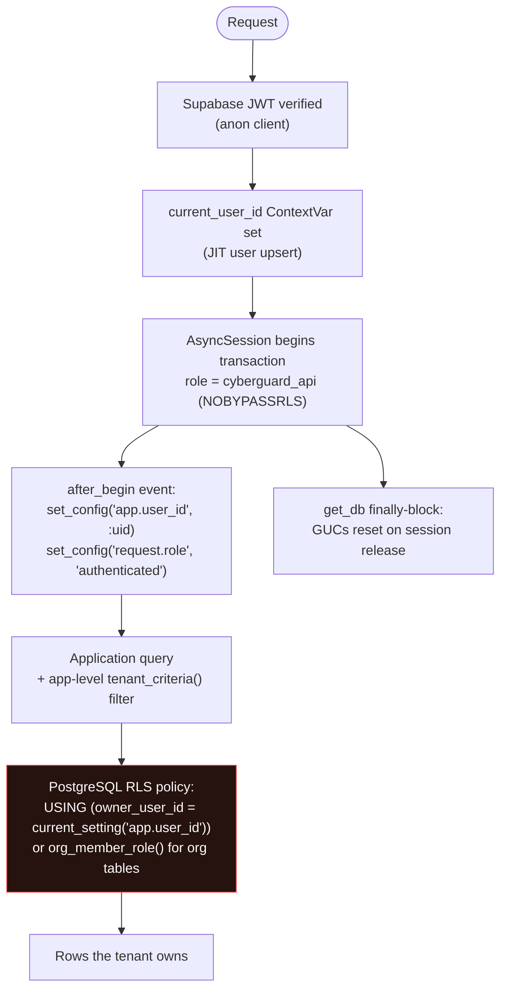
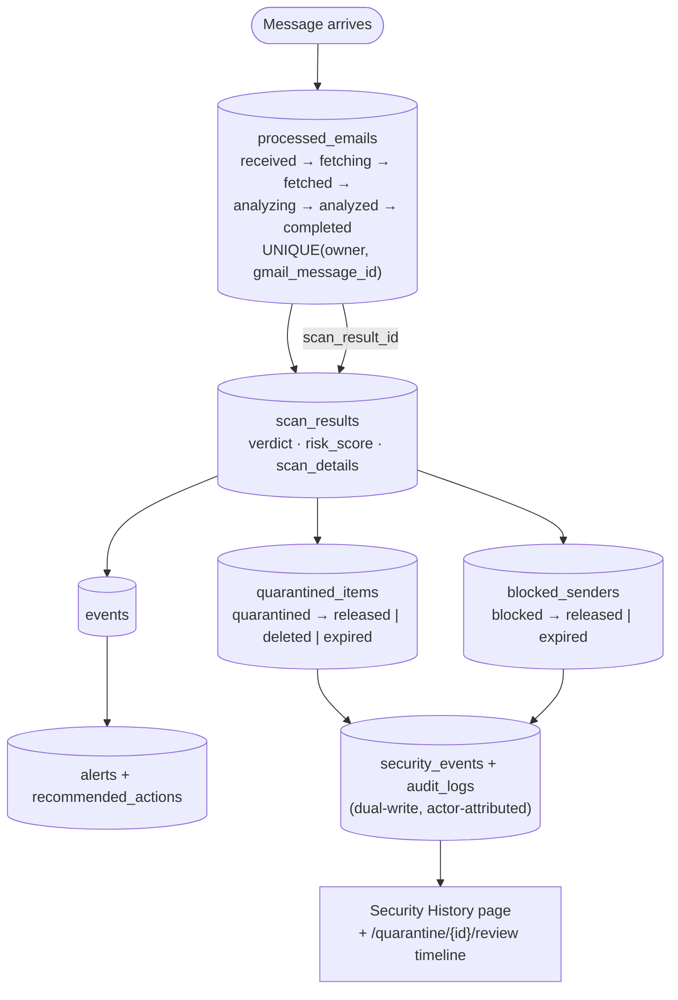
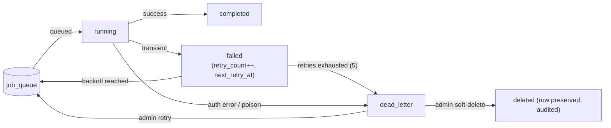

# CYBERGUARD — Data Model

**Schema:** `cyberguard` (PostgreSQL) · **Tables:** 37 · **RLS Policies:** 132 (post-migration `0013_rt_pipeline_models`) · **ORM:** SQLAlchemy 2.0 async · **Migrations:** Alembic (7 versions, `0001` → `0013`)

This document is the authoritative reference for the database: design conventions, the full entity-relationship diagram, table-by-table reference, Row-Level Security mechanics, data lifecycle flows, and retention policy.

**Related documents:** [ARCHITECTURE.md](ARCHITECTURE.md) · [SECURITY_MODEL.md](SECURITY_MODEL.md) · [WORKER_ARCHITECTURE.md](WORKER_ARCHITECTURE.md) · [API_DOCUMENTATION.md](API_DOCUMENTATION.md) · [backend/docs/DATABASE_DESIGN.md](backend/docs/DATABASE_DESIGN.md)

## Table of Contents

1. [Design Principles & Conventions](#1-design-principles--conventions)
2. [Entity-Relationship Diagram](#2-entity-relationship-diagram)
3. [Table Reference by Domain](#3-table-reference-by-domain)
4. [Row-Level Security (RLS)](#4-row-level-security-rls)
5. [Data Lifecycle Flows](#5-data-lifecycle-flows)
6. [State Machines](#6-state-machines)
7. [Retention & Deletion Policy](#7-retention--deletion-policy)
8. [Migration Chain](#8-migration-chain)
9. [Operational Queries](#9-operational-queries)
10. [FAQ](#10-faq)

---

## 1. Design Principles & Conventions

| Principle | Implementation | Why |
|---|---|---|
| Tenant scoping on every row | `owner_user_id` (personal) and/or `organization_id` (org) columns on all application tables | RLS predicates reference these columns directly; app-level `tenant_criteria()` mirrors them |
| Portable JSON | `PortableJSON` type: JSONB on PostgreSQL, JSON on SQLite | The test suite and local dev run on SQLite without schema forks |
| UUID primary keys | `VARCHAR(36)` string UUIDs (users mirror Supabase Auth UUIDs directly) | Cross-system identity without a join to an auth provider |
| No CHECK constraints | Severity/status validated in Pydantic + state-machine code | Keeps Alembic migrations edit-tolerant; the `job_queue.can_transition` model method is the enforcement point |
| Dedicated schema | Everything in `cyberguard`, never `public` (except `alembic_version`) | Clean separation from Supabase `auth`/`storage` schemas; schema-level grants |
| Denormalized owner keys | e.g. `quarantined_items.owner_user_id` despite the connector chain | Required for the owner-policy RLS pattern on child tables |
| JSONB signal caches | `processed_emails.signals`, `alerts.indicators`, `scan_results.scan_details` | Analytical payloads without joins; reproducible verdicts |

**Legacy note:** `backend/db/schema.sql` (15 `public` tables for the Supabase SQL editor, 7 enum types, `handle_new_user()` trigger) is the original "Part 1" bootstrap and is **superseded by the Alembic chain** — treat `backend/alembic/versions/` as the source of truth.

---

## 2. Entity-Relationship Diagram

```mermaid
erDiagram
    %% ─── Identity & Tenancy ───
    users ||--o{ organizations : "owner_id"
    users ||--o{ organization_members : "user_id"
    organizations ||--o{ organization_members : ""
    organizations ||--o{ organization_api_keys : ""
    organizations ||--o{ org_log_events : ""
    organizations ||--o{ org_mail_servers : ""
    organizations ||--o{ org_notification_emails : ""
    organizations ||--o{ org_notification_settings : ""
    organizations ||--o{ org_notification_logs : ""
    organizations ||--o{ organization_settings : ""
    org_mail_servers ||--o{ org_mail_server_settings : ""
    org_mail_servers ||--o{ org_mail_server_logs : ""

    %% ─── Detection ───
    users ||--o{ events : "owner_user_id"
    events ||--o{ media_files : "event_id (CASCADE)"
    events ||--o{ alerts : "event_id (SET NULL)"
    alerts ||--o{ recommended_actions : "alert_id (CASCADE)"
    alerts }o--o{ incidents : "incident_alerts"
    incidents ||--o{ incident_events : "timeline"

    %% ─── Connectors & Enforcement ───
    users ||--o{ email_connector_accounts : ""
    users ||--o{ gmail_accounts : ""
    users ||--o{ connector_settings : ""
    users ||--o{ connector_oauth_states : ""
    users ||--o{ connector_operation_logs : ""
    users ||--o{ quarantined_items : ""
    users ||--o{ blocked_senders : ""
    users ||--o{ trusted_senders : ""

    %% ─── Real-Time Pipeline ───
    users ||--o{ processed_emails : ""
    users ||--o{ scan_results : ""
    processed_emails }o--o| scan_results : "scan_result_id (SET NULL)"
    users ||--o{ job_queue : ""
    gmail_accounts ||--o{ job_queue : "drives sync jobs"

    %% ─── History & Operations ───
    users ||--o{ security_events : ""
    users ||--o{ audit_logs : ""
    users ||--o{ notification_logs : ""
    users ||--o{ action_executions : ""
    users ||--o{ enforcement_policies : ""
    response_catalog ||--o{ response_executions : "catalog_id"
```



---

## 3. Table Reference by Domain

### 3.1 Identity & Tenancy (12 tables)

| Table | Key Columns | Notes |
|---|---|---|
| `users` | id (Supabase Auth UUID PK), email, username (unique), account_type, notification_email, full_name, is_single_user, active_organization_id | Row is JIT-upserted on first authenticated request |
| `organizations` | name, display_name, slug (unique), is_personal, owner_id → users CASCADE, status | Names salted on conflict ("Acme Corp" → "Acme Corp-2") at the application layer |
| `organization_members` | unique (org, user), role (default `analyst`), joined_at | Creator gets synthetic admin membership (not persisted) |
| `organization_api_keys` | key_hash (SHA-256, unique), key_prefix (`cg_live_…`, 16 chars), name, last_used_at, expires_at, status (`active|revoked`) | Plaintext returned exactly once |
| `org_log_events` | log_type (`auth|network|app`), raw_data, analysis_result, severity, manual_action_taken, acted_by/at, created_by | Shape-based type detection; medium+ promoted to alert plane |
| `org_mail_servers` | unique (org, name), provider_type (`google_workspace|microsoft_365|imap_smtp`), status (`connected|disconnected|error`), credentials_encrypted | Fernet-encrypted JSON credential blobs |
| `org_mail_server_settings` | unique (server, key), value | Admin/analyst-readable, viewer-blocked |
| `org_mail_server_logs` | mail_server_id, log_type (`connection|scan|quarantine|error`) | Grouped strictly per server |
| `org_notification_emails` | unique (org, email), role, is_enabled | Role group: admin/analyst/viewer |
| `org_notification_settings` | unique (org, event_type), min_role, is_enabled | Event types: server_down, mail_server_down, critical_log, impersonation |
| `org_notification_logs` | recipients (JSON), subject, body_html, status (`sent|failed|skipped`) | Per-recipient outcomes persisted |
| `organization_settings` | unique (org, key), value (JSON) | Sensitive keys (`api_keys`, `billing`) viewer-blocked |

### 3.2 Detection (7 tables)

| Table | Key Columns | Notes |
|---|---|---|
| `events` | event_type, source, raw_data, status (default `received`), created_by, owner_user_id | The universal ingestion record |
| `media_files` | event_id → events CASCADE, file_name, storage_path, file_type, size_bytes, file_hash | Hash enables dedup/forensics |
| `alerts` | org_id, event_id (SET NULL), title, module, threat_type, severity, risk_score, confidence, status (default `new`), summary, indicators (JSON), explanation, mitre (JSON), target_user/service, source_ip | Module: phishing/url/impersonation/deepfake/account_takeover/network/api_abuse |
| `recommended_actions` | alert_id CASCADE, action, description, automation_level (`automatic|semi-automatic|manual`), requires_approval, priority, executed | Matched from the response catalog by action-name substring |
| `incidents` | title, status (`open|investigating|contained|closed`), assignee, severity | Lifecycle validated server-side |
| `incident_alerts` | composite PK (incident, alert) | Many-to-many link |
| `incident_events` | incident_id, event text, created_at | Append-only timeline |

### 3.3 Connectors & Enforcement (8 tables)

| Table | Key Columns | Notes |
|---|---|---|
| `email_connector_accounts` | unique (owner, provider, provider_email); provider `gmail|outlook|yahoo|icloud`; status `connected|reauth_required|revoked|error`; encrypted access/refresh tokens | Personal OAuth connectors |
| `connector_oauth_states` | state PK, expires_at | Single-use, TTL 600 s, consumed atomically via service-role helper |
| `connector_operation_logs` | operation (`authorize|callback|token_refresh|test_connection|disconnect`), status (`success|failed|unsupported|insufficient_scope|reauth_required`) | Honest capability reporting |
| `connector_settings` | quarantine_expiry_hours (default 24), permanent_delete_enabled, auto_quarantine_enabled (default true) | Gates every enforcement action |
| `quarantined_items` | status `quarantined|released|deleted|expired`, scan_result_json, last_error | Gmail label ↔ row kept in sync |
| `blocked_senders` | status `blocked|released|expired`, provider_rule_id | Gmail filter lifecycle |
| `trusted_senders` | unique (owner, sender_email) | Exempts from auto-quarantine (recommend-only + annotation) |
| `enforcement_policies` | per-module thresholds (phishing 75/40, deepfake 70/50, ATO 60/40, network 70/50, impersonation 70/40); `action_on_critical/high/medium/low`; auto_execute_* flags; notify_soc/notify_user flags | `organization_id` nullable — personal workspaces own policies directly |

### 3.4 Real-Time Pipeline (4 tables)

| Table | Key Columns | Notes |
|---|---|---|
| `gmail_accounts` | unique (owner, email); encrypted tokens; last_history_id; watch_expiration; sync_status `active|paused|error` (VALID_SYNC_TRANSITIONS) | `SELECT … FOR UPDATE` here serializes per-mailbox sync |
| `job_queue` | job_type, job_id (unique), status `queued|running|completed|failed|dead_letter|deleted`, retry_count, max_retries (5), payload, result, error, next_retry_at, started/completed_at | Durable authority behind Redis/Arq; `can_transition` state machine |
| `processed_emails` | unique (owner_user_id, gmail_message_id); processing_status `received→fetching→fetched→analyzing→analyzed→completed` (+failed); signals (JSON); scan_result_id (SET NULL) | Stateful ingestion ledger; idempotency anchor |
| `scan_results` | provider_message_id, verdict, risk_score (float), scan_details (JSON: indicators / explanation / severity / engine_results) | Uniform verdict schema shared by manual scans and real-time ingestion |

### 3.5 History & Operations (6 tables)

| Table | Key Columns | Notes |
|---|---|---|
| `security_events` | event_type (scan_verdict, quarantine, release, keep, delete, sender_block, sender_release, sender_expiry, connector_*, enforcement_decision, sender_trust/untrust, email_analyzed), actor_type, operation_status, FKs to quarantined_item/blocked_sender | The analyst-facing ledger |
| `audit_logs` | actor_type (`user|system|scheduler`), action, resource, details | The compliance-facing ledger; dual-written with security_events |
| `notification_logs` | backend (`db_log|smtp`), status (`sent|failed`), rendered content | Default backend is db_log for deterministic demos |
| `action_executions` | action_type, target (JSON), status `pending|approved|executing|success|failed|rejected|skipped|released|unblocked`, execution_mode (`client|server`), approval fields, execution_result, denormalized risk/severity/module, policy_id | The dual-mode control plane |
| `response_catalog` | action (unique), target_type, automation_level, requires_approval, description | 10 seeded actions on first boot |
| `response_executions` | catalog_id, target, approved, result | Approval-gated executions; carries `owner_user_id` |

---

## 4. Row-Level Security (RLS)

### Enforcement Chain



### Policy Patterns

| Pattern | Applies To | SQL Shape |
|---|---|---|
| Owner-scoped | Personal tables | `{table}_select/_insert/_update/_delete TO cyberguard_api USING (owner_user_id = current_setting('app.user_id'))` |
| Shared-read | `response_catalog`, `organizations` | Additional app-role policy so startup seeding and `/auth/me` work (Phase -1 deviation #2) |
| SECURITY DEFINER membership | Org child tables | `org_member_role()` function avoids infinite recursion of a direct EXISTS on `organization_members`; owner fallback (creator = admin) survives `autoflush=False` ordering |
| Realtime-gated | `org_log_events`, `alerts` | Migration `0012` replaced permissive authenticated SELECT with membership-gated predicates via `org_member_role()` keyed on `auth.uid()` (WALRUS); personal-owner branch for alerts; no-op on SQLite/vanilla PG |
| Permissive by necessity | `organization_api_keys` SELECT | Hash validation runs before any identity exists; writes are admin-gated at RLS + API layers |

**Key facts for operators:**

- The app role has **NOBYPASSRLS** and no CREATE privilege — `init_db()`'s schema bootstrap is best-effort and silently skipped without it. Only Alembic (as `postgres`) can heal schema + policies.
- A count query "returning 0" for a table you know has data is almost always RLS, not emptiness. Verify with the `postgres` role.
- The service-role/admin engine (`app/db/admin.py`, from `MIGRATION_DATABASE_URL`) bypasses RLS deliberately for pre-auth lookups (username resolution, OAuth state consumption) and cross-tenant schedulers.
- Test harness helpers (`scripts/_rls.py`): `as_user(user_id)` sets the GUC contextvar; `create_user_admin` inserts via the service role.

---

## 5. Data Lifecycle Flows

### Email Verdict Lifecycle



### Job Lifecycle



Full mechanics: [WORKER_ARCHITECTURE.md](WORKER_ARCHITECTURE.md).

---

## 6. State Machines

### `job_queue.status`

```
queued → running → completed
                  → failed → queued (retry, backoff 5s·30s·2m·10m·30m)
                  → dead_letter (auth/poison: immediate)
        failed → dead_letter (retries exhausted)
        dead_letter → queued (manual retry) | deleted (soft)
```

### `processed_emails.processing_status`

```
received → fetching → fetched → analyzing → analyzed → completed
   any stage ──────────────────────────────────────→ failed
```

### Quarantine & Block lifecycles

| Table | From → To | Trigger |
|---|---|---|
| `quarantined_items` | quarantined → released | Analyst release (Gmail INBOX restored) |
| | quarantined → deleted | Permanent delete (toggle-gated) |
| | quarantined → expired | 5-min scheduler after `quarantine_expiry_hours` |
| `blocked_senders` | blocked → released | Manual unblock (Gmail filter removed) |
| | blocked → expired | Scheduler removes aged filters |
| `action_executions.status` | pending → approved → success / failed / rejected | Approval queue (admin/analyst) |
| | success → released / unblocked | Quarantine/blocklist lifecycle endpoints |
| `gmail_accounts.sync_status` | active ↔ paused; → error (reauth_required etc.) | Watch/reconciliation workers |

---

## 7. Retention & Deletion Policy

| Data Class | Mechanism | Rationale |
|---|---|---|
| Dead-letter jobs | **Soft-delete** (`status='deleted'`): row + payload + error stack retained, `manual_dlq_delete` audited | Forensic artifacts; hard DELETE would create SOC 2 / ISO 27001 / HIPAA audit gaps (RT-10) |
| Quarantined mail | Expiry scheduler auto-releases after `quarantine_expiry_hours` (default 24 h); permanent delete only with the user toggle | User-controlled dwell time; Gmail trash holds the provider-side copy |
| Security events / audit logs | Append-only; no automated purge | Tamper-evident history is a platform invariant (I5) |
| Media files | Stored in private `cyberguard-media` bucket (or local fallback); 1-hour signed URLs; row removed with its Event (CASCADE) | Minimize standing PII/exposure surface |
| Assistant chat | sessionStorage only, per-tab key, destroyed on tab close; audit records intent class only | Chat is never permanent history (Phase 5) |
| Notification logs | Retained with per-recipient outcomes | Delivery forensics |
| Connector credentials | Retained on graceful disconnect (so reconnect needs no re-entry); removed only on connector deletion | ORG-3 graceful-disconnect design |

**Operator guidance:** define table-level retention (e.g. partitioning `org_log_events` monthly) before production scale; the schema intentionally imposes no row expiry so retention is a policy decision, not a silent behavior.

---

## 8. Migration Chain

| Revision | Name | Scope |
|---|---|---|
| `0001` | cyberguard_baseline | Consolidated from-scratch baseline: schema, all tables from live ORM metadata, roles `cyberguard_api`/`authenticated`, RLS policies, grants (replaces former 0002–0007) |
| `0008` | org_foundation | Org tables + RBAC policies, viewer-restricted `organization_settings` |
| `0009` | org_dashboards | `org_log_events` member/admin/analyst policies + realtime select |
| `0010` | org_mail_connectors | 3 org mail tables + policies |
| `0011` | org_email_groups | Notification role-group tables |
| `0012` | tighten_realtime_policies | Membership-gated realtime SELECT (WALRUS `auth.uid()`) |
| `0013` | rt_pipeline_models | gmail_accounts, processed_emails, job_queue, scan_results, security_events + owner predicates (**head**) |

Migrations run exclusively as `postgres` via `MIGRATION_DATABASE_URL`. The app runtime (`cyberguard_api`) cannot create schemas or alter policies by design. Bookkeeping lives in `public.alembic_version` (owned by `postgres`).

---

## 9. Operational Queries

```bash
# Count tables and policies in the application schema (run as postgres / admin engine)
uv run python -c "
import asyncio
from sqlalchemy import text
from app.db.admin import _get_admin_session_maker
async def verify():
    async with _get_admin_session_maker()() as s:
        t = (await s.execute(text(\"SELECT count(*) FROM information_schema.tables WHERE table_schema='cyberguard';\"))).scalar()
        p = (await s.execute(text(\"SELECT count(*) FROM pg_policies WHERE schemaname='cyberguard';\"))).scalar()
        print(f'tables={t}, policies={p}')   # post-0013 expectation: 37 / 132
asyncio.run(verify())
"
```

```sql
-- Inspect a table's RLS policies
SELECT policyname, cmd, qual FROM pg_policies WHERE schemaname='cyberguard' AND tablename='alerts';

-- Dead-letter backlog by type
SELECT job_type, count(*), min(created_at) AS oldest FROM cyberguard.job_queue
WHERE status='dead_letter' GROUP BY job_type;

-- Which rows does a given user see? (replicate the app GUC)
SET ROLE cyberguard_api;
SELECT set_config('app.user_id', '<uuid>', true);
SELECT count(*) FROM cyberguard.alerts;
RESET ROLE;
```

---

## 10. FAQ

**Q: Why do `alerts` and `org_log_events` have `TO authenticated` realtime SELECT policies?**
Supabase Realtime streams rows using its subscriber role; a publication row filter additionally requires the filtered column in REPLICA IDENTITY (and `alerts.organization_id` is nullable, which would break every UPDATE). Migration `0012` tightened these to membership-gated predicates — the demo tradeoff from ORG-2 is closed.

**Q: Where is the `profiles` table?**
It exists only in the legacy Supabase-editor bootstrap (`db/schema.sql` + `handle_new_user()` trigger). The Alembic world mirrors identity in `cyberguard.users` via the backend's JIT upsert instead.

**Q: How do I add a column?**
Add it to the SQLAlchemy model, then `alembic revision --autogenerate` under the `postgres` DSN, review the generated policy impact, and `alembic upgrade head`. SQLite test runs pick the column up via `create_all(checkfirst=True)`.

**Q: Why are `response_executions.owner_user_id` and other denormalized owner columns present?**
RLS-enabled tables without a policy are deny-all; child tables that are first-class tenant surfaces need their own owner predicates, which need the column on the row itself (Phase -1 deviations #3/#5).

**Q: What happens to org rows created by integrations without an owner?**
They stay invisible under owner-scoped RLS until an org-scoped policy covers them — the documented Phase -1 consequence, resolved by the org-phase `org_member_role()` policies.
