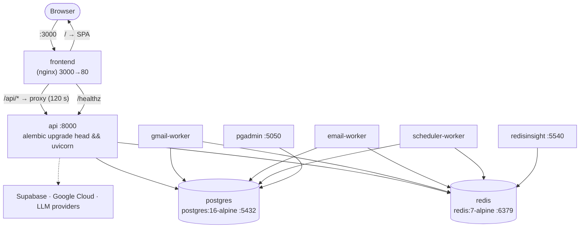
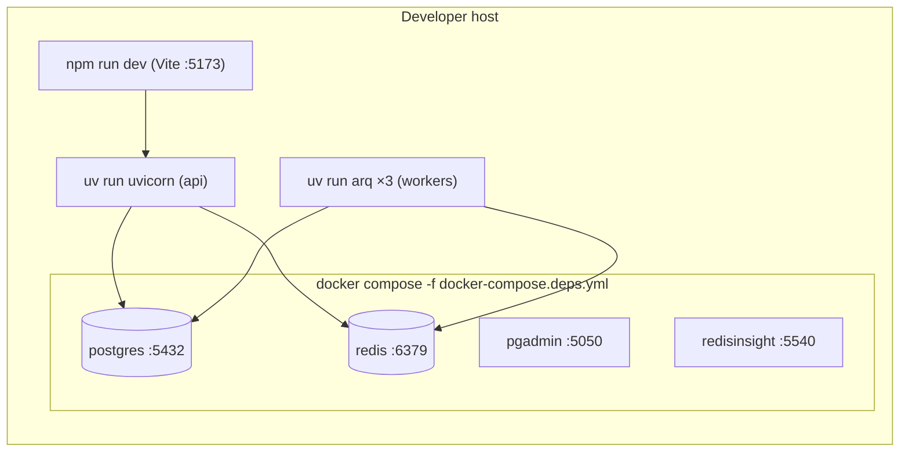
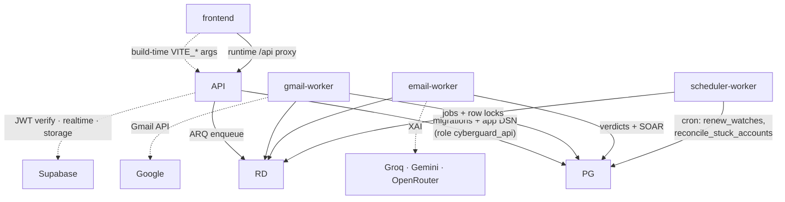
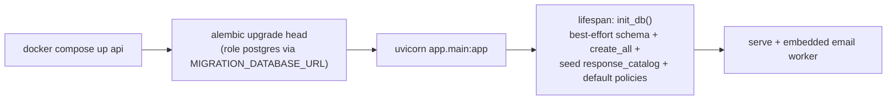
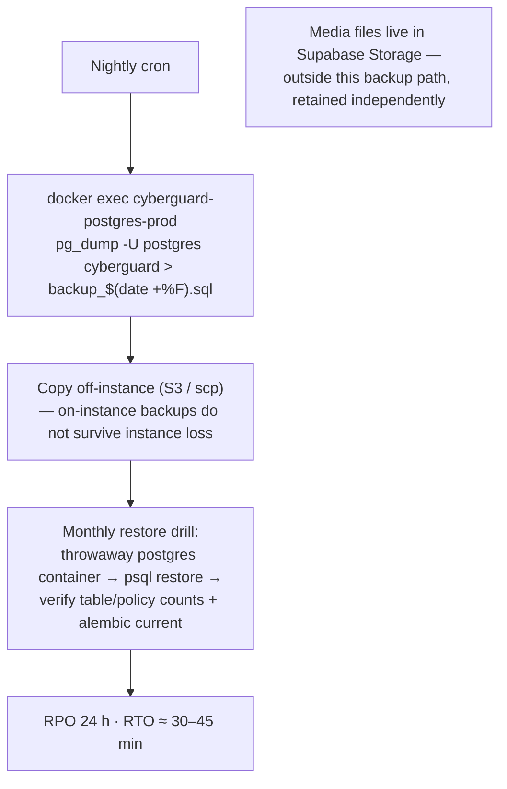
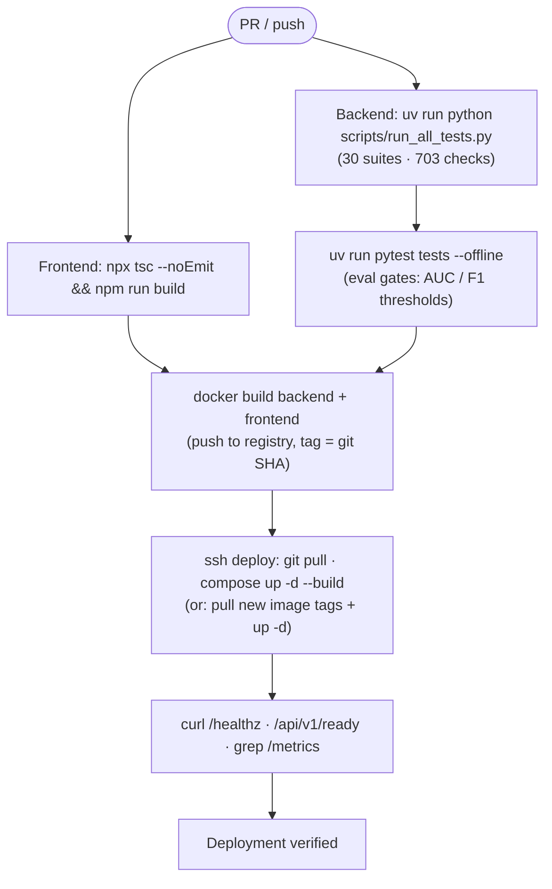

# CYBERGUARD — Deployment Guide

CYBERGUARD deploys as a **nine-container Docker Compose stack** in three topologies, plus a single-instance AWS production runbook. This guide covers every topology, container interactions, dependency graphs, CI/CD recommendations, backup/recovery, scaling, and rollback.

**Related documents:** [EC2_DEPLOY.md](EC2_DEPLOY.md) (step-by-step AWS runbook) · [WORKER_ARCHITECTURE.md](WORKER_ARCHITECTURE.md) · [RUNBOOK.md](RUNBOOK.md) (startup in every condition) · [MONITORING_OBSERVABILITY.md](MONITORING_OBSERVABILITY.md) · [ARCHITECTURE.md](ARCHITECTURE.md)

## Table of Contents

1. [Topology Overview](#1-topology-overview)
2. [Container Reference](#2-container-reference)
3. [Service Dependency Graph](#3-service-dependency-graph)
4. [Dockerfile & nginx Details](#4-dockerfile--nginx-details)
5. [Configuration Reference](#5-configuration-reference)
6. [Migration-on-Boot](#6-migration-on-boot)
7. [Health Checks & Verification](#7-health-checks--verification)
8. [Backup & Recovery](#8-backup--recovery)
9. [Scaling & High Availability](#9-scaling--high-availability)
10. [CI/CD Pipeline (Recommended)](#10-cicd-pipeline-recommended)
11. [Rollback Procedure](#11-rollback-procedure)
12. [Production Checklist](#12-production-checklist)

---

## 1. Topology Overview

### Full Stack (root `docker-compose.yml`)

All nine services on one bridge network (`cyberguard-prod-net`); frontend published on host port **3000** for convenience:



### EC2 Production (`docker-compose.prod.yml`)

Identical services with a hardened port policy: **only nginx :80 is public**; every other port binds to `127.0.0.1`; Redis runs `--requirepass "${REDIS_PASSWORD}" --appendonly yes`; workers authenticate with `redis://:${REDIS_PASSWORD}@redis:6379/0`. Full walkthrough: [EC2_DEPLOY.md](EC2_DEPLOY.md).

### Dependencies-Only (`docker-compose.deps.yml` / `.dev.yml`)

Postgres + Redis + pgAdmin + RedisInsight only (ports 5432/6379/5050/5540), for hybrid development where the API, workers, and frontend run on the host. `deps.yml` uses named volumes (`cyberguard_deps_*`); `dev.yml` is ephemeral (no volumes).



---

## 2. Container Reference

| Container | Image / Build | Ports | Command | Volumes |
|---|---|---|---|---|
| `frontend` | multi-stage: node:20-alpine build → nginx:alpine | `3000:80` (prod: `80:80` public) | nginx | — |
| `api` | build `./backend` (python:3.11-slim) | 8000 (prod: 127.0.0.1) | `alembic upgrade head && uvicorn app.main:app --host 0.0.0.0 --port 8000` | — |
| `gmail-worker` | build `./backend` | none | `python -m arq app.workers.gmail_worker.WorkerSettings` | — |
| `email-worker` | build `./backend` | none | `python -m arq app.workers.email_worker.WorkerSettings` | — |
| `scheduler-worker` | build `./backend` | none | `python -m arq app.workers.scheduler_worker.WorkerSettings` | — |
| `postgres` | postgres:16-alpine | 5432 (prod: 127.0.0.1) | — | `cyberguard_prod_postgres_data` |
| `redis` | redis:7-alpine | 6379 (prod: 127.0.0.1) | prod: `--requirepass ${REDIS_PASSWORD} --appendonly yes` | `cyberguard_prod_redis_data` |
| `pgadmin` | dpage/pgadmin4:latest | 5050 | `SERVER_MODE False` | `cyberguard_prod_pgadmin_data` |
| `redisinsight` | redis/redisinsight:latest | 5540 | — | `cyberguard_prod_redisinsight_data` |

All containers share healthchecks: postgres `pg_isready`, redis `redis-cli ping`, api `curl /api/v1/health` (15 s interval, 25 s start period). Workers depend on `api: condition: service_healthy`.

**Hardware floor:** 4 GB RAM (t3.medium) — the email worker loads XGBoost + torch + opencv per process; smaller instances will OOM. 20 GB disk.

---

## 3. Service Dependency Graph



**Startup order matters:** compose enforces `worker → depends_on(api: healthy)`; the API's lifespan boots `init_db()` (best-effort schema + seeds) before serving traffic, and the embedded email worker begins draining the queue immediately.

---

## 4. Dockerfile & nginx Details

**backend/Dockerfile** — `python:3.11-slim`, installs `curl` (healthcheck) and `libglib2.0-0` (opencv runtime), `pip install -r requirements.txt`, exposes 8000.

**frontend/Dockerfile** — multi-stage: `node:20-alpine` runs `npm ci && npm run build` with `VITE_API_BASE_URL=/api/v1` (and Supabase keys) **baked in at build time**; output copied into `nginx:alpine`.

**frontend/nginx.conf** —

```nginx
listen 80;
client_max_body_size 25m;                # media forensic uploads
gzip on;
location /            { try_files $uri $uri/ /index.html; }   # SPA fallback
location /assets/     { expires 7d; add_header Cache-Control "immutable"; }
location /api/        { proxy_pass http://api:8000;            # 120 s timeout — LLM calls
                        proxy_read_timeout 120s; proxy_send_timeout 120s; }
location = /healthz   { proxy_pass http://api:8000/api/v1/health; }
```

**Why the SPA calls relative `/api/v1`:** the same image works behind any host/port (localhost:3000, EC2 :80, a TLS domain) with zero frontend changes — adding HTTPS later requires no rebuild.

---

## 5. Configuration Reference

| File | Sets | Notes |
|---|---|---|
| root `.env` | `POSTGRES_PASSWORD`, `REDIS_PASSWORD` (`openssl rand -hex 24`), `VITE_SUPABASE_URL`, `VITE_SUPABASE_ANON_KEY`, `PGADMIN_EMAIL/PASSWORD` | prod compose fails fast (`:?Set ... in .env`) if missing |
| `backend/.env` | `DATABASE_URL`, `MIGRATION_DATABASE_URL`, `REDIS_URL`, `SUPABASE_*`, `GOOGLE_GMAIL_*`, `GMAIL_PUBSUB_TOPIC`, `CONNECTOR_TOKEN_KEY`, `LLM_PROVIDERS` + provider keys, `ORG_ENABLED`, `CORS_ORIGINS`, retry + worker tuning | compose **overrides** DB/Redis URLs to point at the internal containers with root passwords; never commit real values |
| `frontend/.env` | `VITE_API_BASE_URL`, `VITE_SUPABASE_URL`, `VITE_SUPABASE_ANON_KEY`, `VITE_USE_MOCK` | build args in compose; defaults in Dockerfile |

Critical rules: never regenerate `CONNECTOR_TOKEN_KEY` on an existing deployment (it orphans encrypted tokens); keep `CORS_ORIGINS` aligned with the frontend origin; `ORG_ENABLED=true` on production EC2.

---

## 6. Migration-on-Boot



The chain is idempotent and error-tolerant (`checkfirst=True` everywhere). Migrations are the *only* writer of schema + RLS (app role is NOBYPASSRLS, no CREATE). Head revision: `0013_rt_pipeline_models` (7 migration files; the baseline consolidated former 0002–0007).

---

## 7. Health Checks & Verification

```bash
docker compose -f docker-compose.prod.yml ps        # all services healthy
curl -s http://localhost/healthz                    # via nginx → api
curl -s http://localhost:8000/api/v1/health  # {"status":"ok","database_connected":true}
curl -s http://localhost:8000/api/v1/ready   # Postgres + Redis probes; 503 with details
curl -s http://localhost:8000/metrics | grep gmail_events
```

Degradation notes: `supabase_connected:false` refers to Storage and does not block the API; `/ready` is the authoritative dependency probe. Full checklist: [MONITORING_OBSERVABILITY.md](MONITORING_OBSERVABILITY.md).

---

## 8. Backup & Recovery



Restore procedure after total loss: relaunch instance → install Docker → clone repo → restore **all three env files** (including `POSTGRES_PASSWORD`, `REDIS_PASSWORD`, `CONNECTOR_TOKEN_KEY`) → `docker compose -f docker-compose.prod.yml up -d --build` → `psql` restore of the latest dump → verify `/healthz`, table count (37), policies (132), `alembic current`.

---

## 9. Scaling & High Availability

Scale in this order (cheapest, least stateful first):

| Step | Action | Bound / Caveat |
|---|---|---|
| 1 | `docker compose up -d --scale email-worker=3` | Workers are stateless and compete on Redis; deterministic IDs keep it safe |
| 2 | Raise `ARQ_MAX_JOBS` / `WORKER_CONCURRENCY` | RAM-bound: each process loads its own model set |
| 3 | Vertical resize (t3.medium → t3.large) | XGBoost + torch + opencv per email-worker process |
| 4 | Managed data plane (RDS Postgres, ElastiCache Redis) | Removes the EC2-local backup story; update DSNs only |
| 5 | Horizontal API tier behind an ALB (ECS/EKS) | Keep exactly **one** migration-running entrypoint (or a dedicated migrate job) to avoid concurrent DDL |

High-availability notes: Pub/Sub push retries absorb brief API restarts; the 2×-hourly reconciliation cron heals any delivery gap; realtime degrades to polling during Supabase incidents; the LLM explanation path has a deterministic fallback. Single-instance compose is *not* HA by design — HA begins at step 4/5.

---

## 10. CI/CD Pipeline (Recommended)

The repository currently ships no pipeline definition; the test harness is built for one. Recommended GitHub Actions flow:



Gate rationale: the 30-suite harness guards *behavior*, the pytest eval harness guards *quality* (P/R/AUC bands); both are offline-capable (`--offline`) so CI needs no dataset network access.

---

## 11. Rollback Procedure

1. `git checkout <previous-tag>` (or re-pull previous image tags).
2. `docker compose -f docker-compose.prod.yml up -d --build` — the rebuild reuses named volumes; data survives.
3. **Database caution:** only roll back migrations if the newer revision was additive. Check `alembic history` first; when in doubt, restore the pre-upgrade dump instead of `alembic downgrade`.
4. Verify `/healthz` + smoke-test one analysis request.
5. The served ML model can be rolled back *without* a deploy: edit `url_model_version`/`*_model_version` in `ml/calibration.json` (hot-reloaded).

---

## 12. Production Checklist

- [ ] `t3.medium` (4 GB) or larger; 20 GB disk
- [ ] Security group: 22 (your IP), 80, 443 only — never 5432/6379/8000
- [ ] Root `.env`: `openssl rand -hex 24` passwords for Postgres + Redis
- [ ] `backend/.env`: `ORG_ENABLED=true`, Supabase keys, Google OAuth + redirect URI with public host, `CONNECTOR_TOKEN_KEY` carried over (not regenerated)
- [ ] `CORS_ORIGINS` matches the public origin
- [ ] `/healthz` + `/ready` green; `docker compose ps` all healthy
- [ ] Nightly `pg_dump` cron + off-site copy + monthly restore drill
- [ ] Prometheus scraping `/metrics`; DLQ dashboard checked; watch renewal logs green (4× daily)
- [ ] For real-time Gmail: HTTPS in front (Caddy/domain or Cloudflare Tunnel) before creating the Pub/Sub push subscription
