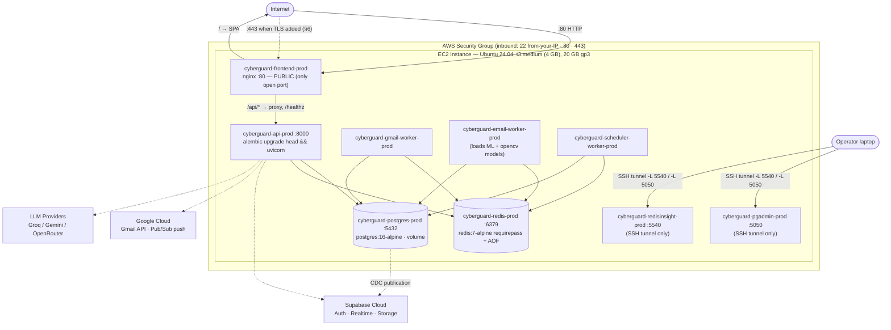
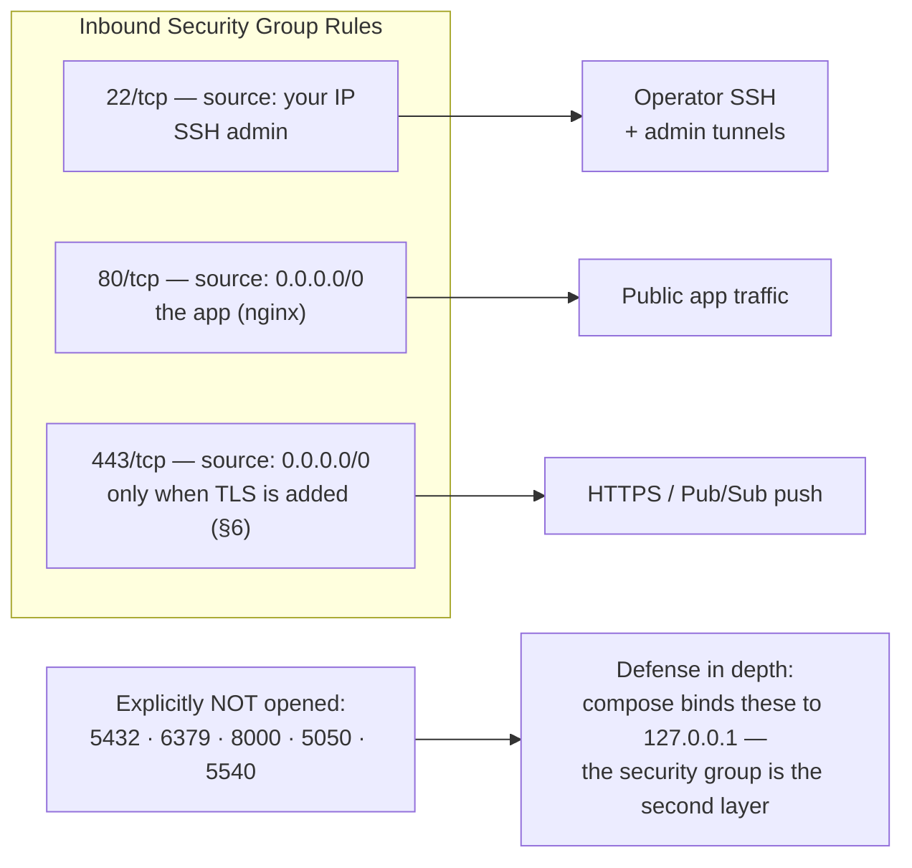
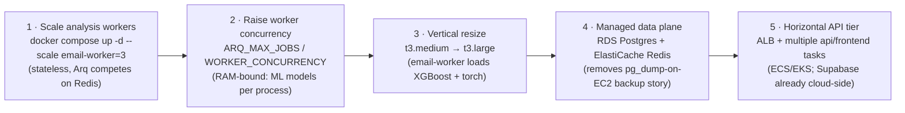
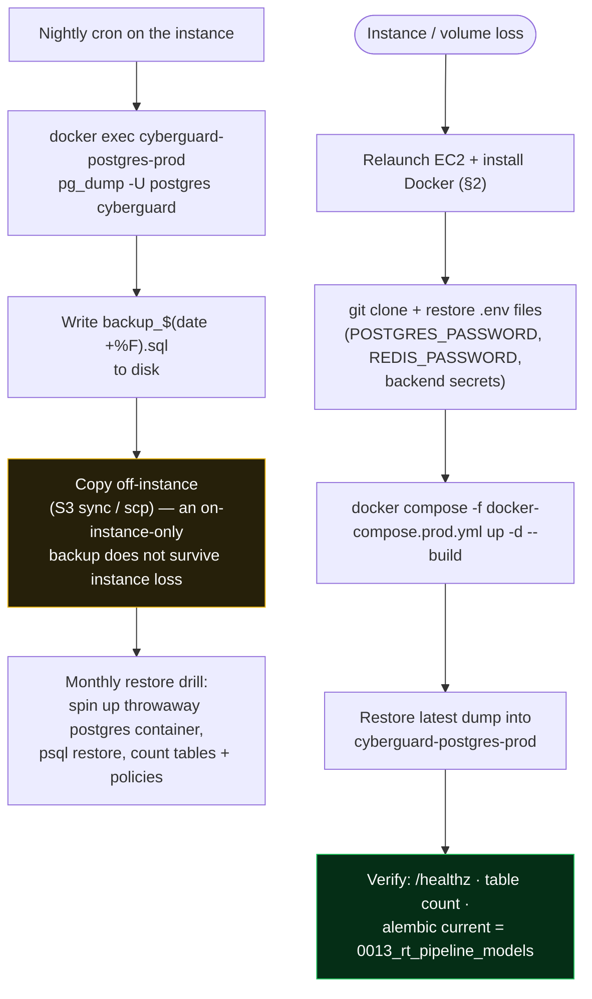

# CYBERGUARD — Production Deployment on EC2

Runbook for a single EC2 instance running the full stack with Docker Compose.
One public door: **nginx on port 80** serves the React app at `/` and
reverse-proxies `/api/*` to FastAPI. Postgres, Redis, and the admin GUIs stay
on the instance's localhost.

```
                        EC2 (Ubuntu 24.04)
  internet ──:80──>  nginx (frontend container)
                      ├── /            →  React SPA (static)
                      ├── /api/*       →  api:8000      (FastAPI + auto-migrations)
                      └── /healthz     →  api health
  localhost-only:  api:8000  postgres:5432  redis:6379  pgadmin:5050  redisinsight:5540
  internal workers: gmail-worker, email-worker, scheduler-worker (arq / Redis queue)
  external SaaS:    Supabase (Auth + Realtime, frontend talks to it directly)
```

### Infrastructure Topology (Mermaid)

The same topology, rendered as a diagram — note the single public door and the
localhost-only data plane:



### Security Group Flow



> **Why one public port?** nginx is the single entry point; the FastAPI API,
> Postgres, Redis, and the admin GUIs are reachable only from inside the
> instance network (or through an SSH tunnel). This halves the attack surface
> compared with exposing `:8000` directly.

## 1. EC2 prerequisites

- **Instance:** Ubuntu 24.04, `t3.medium` minimum (4 GB RAM — the email worker
  loads ML/opencv models; `t2.micro` will OOM). 20 GB gp3 disk.
- **Security Group — inbound:**

  | Port | Source      | Purpose                          |
  |------|-------------|----------------------------------|
  | 22   | your IP     | ssh admin                        |
  | 80   | 0.0.0.0/0   | the app (nginx)                  |
  | 443  | 0.0.0.0/0   | only when you add TLS (§7)       |

  Do **not** open 5432/6379/8000 — compose binds them to `127.0.0.1` and the
  security group is the second layer of that.

## 2. Install Docker on the instance

```bash
sudo apt update && sudo apt install -y docker.io docker-compose-v2
sudo usermod -aG docker $USER   # log out & back in for this to take effect
docker --version && docker compose version
```

## 3. Get the code + configure

```bash
git clone <your-repo-url> cyberguard && cd cyberguard
```

**Root `.env`** (compose-level: DB/Redis passwords + frontend build args):

```bash
cp .env.example .env
openssl rand -hex 24   # paste as POSTGRES_PASSWORD
openssl rand -hex 24   # paste as REDIS_PASSWORD
# Fill VITE_SUPABASE_URL + VITE_SUPABASE_ANON_KEY (same values as your local
# frontend/.env.local — the SPA talks to Supabase directly for auth/realtime)
```

**Backend `.env`** (loaded by the api and worker containers):

```bash
cp backend/.env.example backend/.env
```

Edit `backend/.env` — the ones that matter in production:

| Variable | Value |
|---|---|
| `ORG_ENABLED` | `true` |
| `SUPABASE_URL` / `SUPABASE_ANON_KEY` / `SUPABASE_SERVICE_ROLE_KEY` | your Supabase project values |
| `DATABASE_URL` / `REDIS_URL` | **leave as-is** — compose overrides both to point at the internal containers with the passwords from root `.env` |
| `FRONTEND_CONNECTORS_URL` | `http://<EC2_PUBLIC_IP>/email-connectors` (Gmail OAuth redirect target) |
| `GOOGLE_GMAIL_CLIENT_ID` / `SECRET` | from Google Cloud OAuth client |
| `GOOGLE_GMAIL_REDIRECT_URI` | `http://<EC2_PUBLIC_IP>/api/v1/connectors/gmail/callback` |
| `CONNECTOR_TOKEN_KEY` | Fernet key — `openssl rand` is **not** valid here; reuse the existing value from your local `backend/.env` (regenerating it orphans already-encrypted tokens) |
| `LLM_PROVIDERS` / `GROQ_API_KEY` / … | optional; heuristic fallback works without them |

> In the Google Cloud OAuth client, add
> `http://<EC2_PUBLIC_IP>/api/v1/connectors/gmail/callback` to the **Authorized
> redirect URIs**.

## 4. Build & start

```bash
docker compose -f docker-compose.prod.yml up -d --build
docker compose -f docker-compose.prod.yml ps      # all healthy = good
```

First `api` start runs `alembic upgrade head` automatically before uvicorn.

Verify:

```bash
curl -s http://localhost/healthz                  # {"status":"ok",...} — via nginx → api
curl -sI http://localhost/                        # 200, the SPA
docker compose -f docker-compose.prod.yml logs -f api
```

From your laptop: `http://<EC2_PUBLIC_IP>/` — register an account and sign in.

## 5. Day-2 operations

```bash
# Logs
docker compose -f docker-compose.prod.yml logs -f                  # everything
docker compose -f docker-compose.prod.yml logs -f api email-worker # follow subset

# Update to a new commit
git pull
docker compose -f docker-compose.prod.yml up -d --build

# Restart one service
docker compose -f docker-compose.prod.yml restart api

# DLQ / queue inspection: ssh tunnel, then open locally
ssh -L 5540:localhost:5540 -L 5050:localhost:5050 ubuntu@<EC2_PUBLIC_IP>
#   RedisInsight → http://localhost:5540 , pgAdmin → http://localhost:5050

# Backups (app data lives in the cyberguard_prod_postgres_data volume)
docker exec cyberguard-postgres-prod pg_dump -U postgres cyberguard > backup_$(date +%F).sql
```

## 6. Real-time Gmail ingestion (Pub/Sub webhook) — needs HTTPS

Google Pub/Sub **push** subscriptions require a public **HTTPS** endpoint, so
on plain `http://<IP>` everything works *except* live push. Two options:

1. **Domain + TLS (recommended).** Point a DNS A record at the EC2 IP, open
   port 443, and put Caddy (auto-HTTPS) in front instead of exposing nginx
   directly — a 10-line addition to the compose file. The app itself needs
   **zero changes** because the SPA already calls relative `/api/v1`; just move
   the `FRONTEND_CONNECTORS_URL` / `GOOGLE_GMAIL_REDIRECT_URI` values to
   `https://`.
2. **Cloudflare Tunnel** — `cloudflared` on the EC2 box maps a hostname to
   `http://localhost:80`; no open inbound ports at all.

Once HTTPS exists, create the Pub/Sub push subscription to
`https://<your-domain>/api/v1/webhooks/gmail` and the real-time pipeline goes
live end-to-end (see `REALTIME_GMAIL_SETUP_GUIDE.md` for the Google-side setup).

## 7. What runs where (quick reference)

| Container | Image | Public? |
|---|---|---|
| cyberguard-frontend-prod | built SPA + nginx | **yes — port 80, the only entry** |
| cyberguard-api-prod | backend Dockerfile | 127.0.0.1:8000 |
| cyberguard-gmail-worker-prod | backend Dockerfile | no |
| cyberguard-email-worker-prod | backend Dockerfile | no |
| cyberguard-scheduler-worker-prod | backend Dockerfile | no |
| cyberguard-postgres-prod | postgres:16-alpine | 127.0.0.1:5432 |
| cyberguard-redis-prod | redis:7-alpine (requirepass) | 127.0.0.1:6379 |
| cyberguard-pgadmin-prod | dpage/pgadmin4 | 127.0.0.1:5050 (ssh tunnel) |
| cyberguard-redisinsight-prod | redis/redisinsight | 127.0.0.1:5540 (ssh tunnel) |

## 8. Scaling & High-Availability Notes

The single-instance compose stack is intentionally simple. When load grows,
scale in this order (cheapest, least stateful first):



Constraints to know before scaling:

* **Workers are horizontally scalable by design** — jobs are pulled from the
  shared Redis queue with deterministic IDs, so N email-worker containers can
  run concurrently with no coordination beyond the database state machine.
* **The API container runs migrations on boot** (`alembic upgrade head`).
  With multiple API replicas, keep exactly one migration-running entrypoint
  (or a dedicated migrate job) to avoid concurrent DDL.
* **`ARQ_MAX_JOBS=10`** per worker process bounds memory; XGBoost/torch model
  loads are per-process, which is why `t3.medium` (4 GB) is the floor.
* Pub/Sub push retries automatically on non-2xx webhook responses; a brief
  API restart is absorbed by Google's delivery retry, and any gap is healed
  by the 2×-hourly reconciliation cron.

## 9. Backup & Recovery Workflow



Recovery objectives with this procedure: **RPO = 24 h** (nightly dump; tighten
with `pg_dump` cron frequency or WAL archiving via RDS), **RTO ≈ 30–45 min**
(instance relaunch + image build + restore). Media forensics files in Supabase
Storage are external to this backup path and persist independently.
