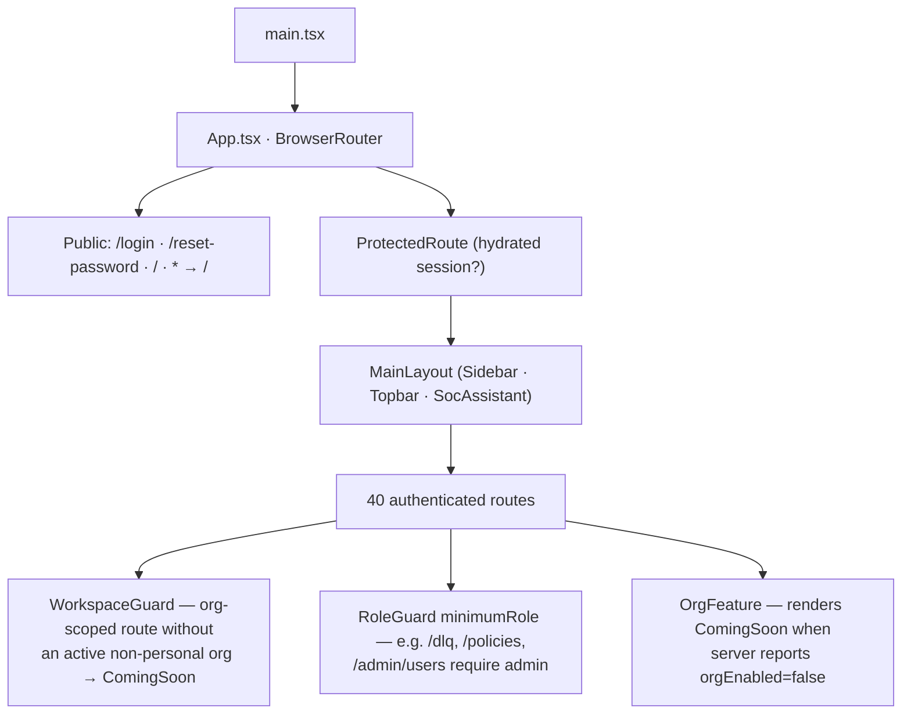
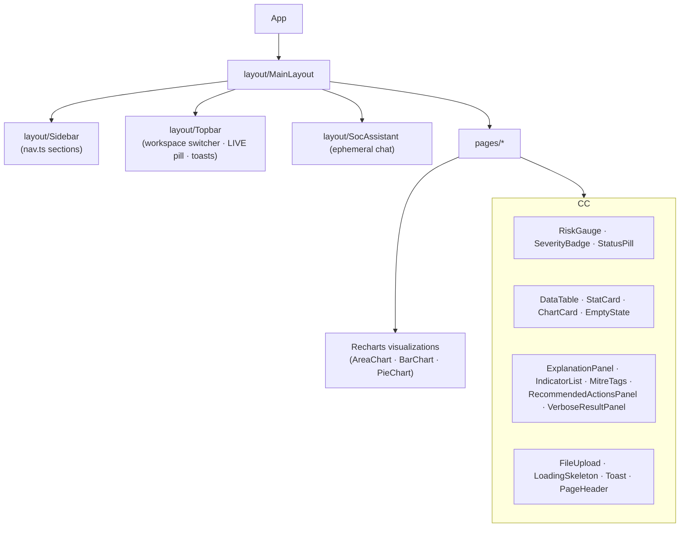
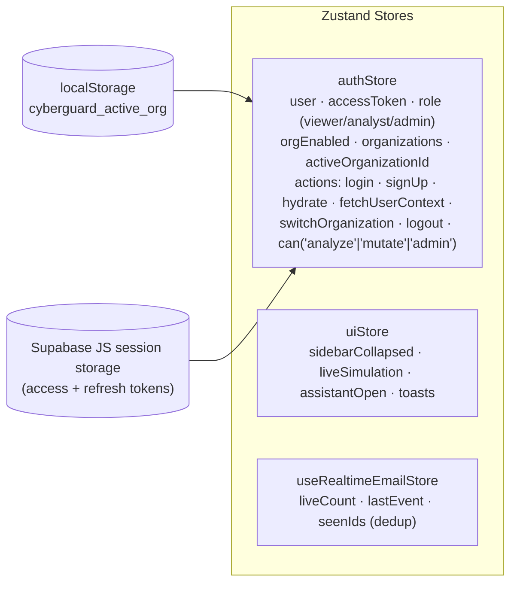
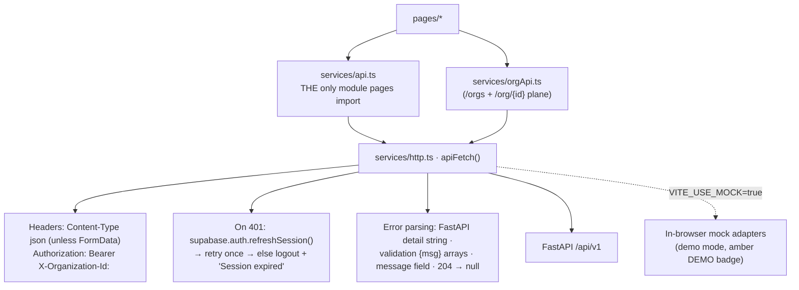
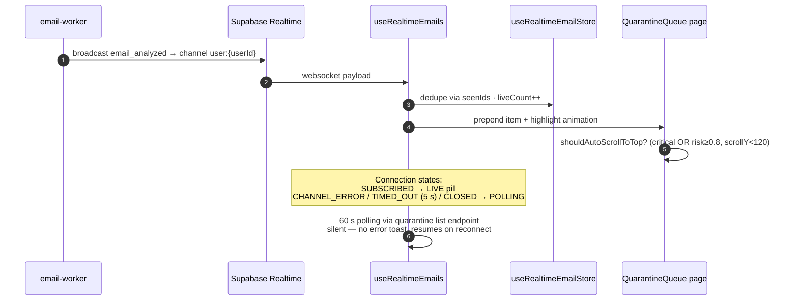
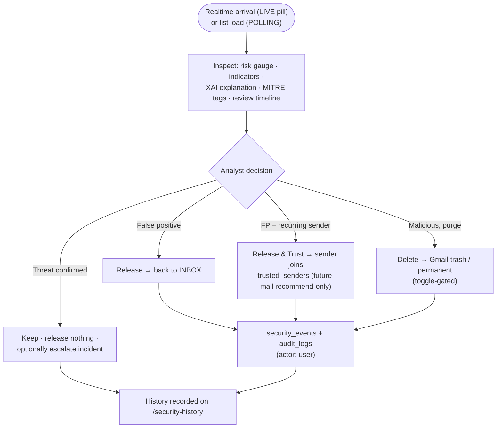
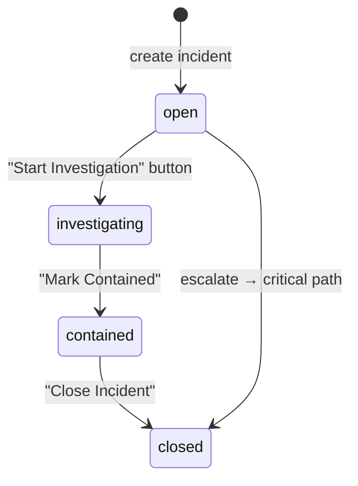

# CYBERGUARD — Frontend Architecture

**Stack:** React 18.3 · TypeScript 5.2 · Vite · react-router-dom 7.18 · Zustand 4.4 · Recharts 2.9 · Tailwind CSS 3.3 · lucide-react · Supabase JS 2.45

The frontend is a hand-built (no component library) dark SOC console: a monochrome black/white/red design system, realtime-driven quarantine queue, six forensic analysis pages, a dual personal/organization workspace model, and an admin operations plane (DLQ, policies, approvals).

**Related documents:** [API_DOCUMENTATION.md](API_DOCUMENTATION.md) · [ARCHITECTURE.md](ARCHITECTURE.md) · [INTEGRATION_GUIDE.md](INTEGRATION_GUIDE.md) · [MONITORING_OBSERVABILITY.md](MONITORING_OBSERVABILITY.md)

## Table of Contents

1. [Application Bootstrap & Routing](#1-application-bootstrap--routing)
2. [Component Hierarchy](#2-component-hierarchy)
3. [State Management (Zustand)](#3-state-management-zustand)
4. [API Integration Patterns](#4-api-integration-patterns)
5. [Real-Time Subscriptions](#5-real-time-subscriptions)
6. [UI/UX Workflows](#6-uiux-workflows)
7. [Design System](#7-design-system)
8. [Testing & Verification](#8-testing--verification)
9. [FAQ](#9-faq)

---

## 1. Application Bootstrap & Routing

`App.tsx` mounts `BrowserRouter`, renders public routes, then wraps every authenticated route in `ProtectedRoute → MainLayout`:

### Route Map

| Scope | Routes |
|---|---|
| Analysis (personal + org) | `/dashboard` · `/phishing` · `/url-analysis` · `/impersonation` · `/deepfake` · `/log-analysis` |
| Email security | `/email-connectors` · `/quarantine` · `/blocked-senders` · `/notification-log` · `/security-history` |
| SOC plane (org) | `/alerts` (+`/:id`) · `/incidents` (+`/:id`) · `/response-actions` · `/approvals` · `/blocklist` · `/action-log` · `/audit-logs` · `/reports` · `/account-takeover` · `/network-threats` |
| Administration (org + admin) | `/policies` · `/admin/users` · `/dlq` |
| Organization plane | `/organization` · `/org/create` · `/org/:orgId/settings` · `/org/:orgId/dashboard(/:feature)` · `/org/:orgId/logs` · `/org/:orgId/account-takeover` · `/org/:orgId/mail-servers(/:serverId/logs|settings)` · `/org/:orgId/notifications(/logs)` |
| Misc | `/settings` · `/docs` |

**Why guards render placeholders instead of redirecting:** `WorkspaceGuard` renders a `ComingSoon` panel rather than bouncing the URL — the backend's 501/403 responses remain the second line of defense, and the address bar stays honest.

### Single Nav Source

`nav.ts` is the only navigation list: each `NavItem` carries `to, label, icon, scope ('user'|'org'|'both'), section ('analyze'|'mailbox'|'history'|'org'|'system'), adminOnly?`. `Sidebar`, `WorkspaceGuard`, and `isOrgScopeRoute()` all consume it, so moving a feature between scopes is a one-line change (ADR: workspace-scoped navigation).

---

## 2. Component Hierarchy

---

## 3. State Management (Zustand)

Three small stores — no global data cache, no Redux-style normalization:

**Persistence model:** the only custom persisted value is `activeOrganizationId` (localStorage `cyberguard_active_org`). The auth session itself lives in Supabase's own localStorage; `hydrate()` restores it on boot and re-fetches `/auth/me`. There is deliberately no `zustand/persist` middleware keeping tokens in app-managed stores.

**Login flow:** `login()` posts `{identifier, password}` to `/auth/signin`, then installs the returned session with `supabase.auth.setSession` — keeping Supabase-managed refresh and the realtime websocket auth in sync with the backend session.

---

## 4. API Integration Patterns

- **`mappers.ts`** normalizes backend payloads into the strict domain types in `types/index.ts` (626 lines: `Alert`, `AnalysisResult`, `QuarantinedItem`, `DlqJob`, …).
- **`severity.ts`** derives the UI band from a 0–100 score: safe ≤20 · low ≤40 · medium ≤60 · high ≤80 · critical >80.
- **Why a facade?** One import boundary for every endpoint means auth headers, refresh-on-401, and error shaping are applied exactly once.

---

## 5. Real-Time Subscriptions

All realtime runs through **Supabase Realtime** (the backend holds no websockets):

| Hook | Channel | Mechanism | Filter |
|---|---|---|---|
| `useRealtimeEmails` | `user:{userId}` | broadcast `email_analyzed` | — (5 s timeout → 60 s polling fallback) |
| `useRealtimeAlerts` | `cyberguard-alerts` | `postgres_changes INSERT` on `public.alerts` | toast + refresh |
| `useOrgRealtime` | `org-{orgId}-{table}` | `postgres_changes *`, schema `cyberguard` | `organization_id=eq.{orgId}` (client-side filter because a publication row filter on a nullable column breaks UPDATEs) |
| `useApi` | — | generic `useApi<T>(apiCall, deps)` → `{data, loading, error, refetch}` with cancellation | — |

**Why polling fallback instead of reconnect storms?** Corporate firewalls, offline dev, and missing Supabase keys would otherwise toast-loop; the 60 s fallback is silent, keeps data fresh, and disposes cleanly when the socket returns (RT-7).

---

## 6. UI/UX Workflows

### Quarantine Triage Workflow

### Incident Lifecycle (state-driven UI)

`IncidentDetail.tsx` renders the next action from the current status (`NEXT_ACTION` map) and enforces `can('mutate')` + viewer read-only.

### Analysis Page Pattern (all six engines)

Every analysis page follows the same contract: pre-loaded **safe** and **malicious** sample fixtures (e.g. PhishingAnalysis ships `security-alert@micr0soft-verify.xyz` + `http://185.220.101.7/login`; UrlAnalysis contrasts a GitHub deep link with a lookalike domain), input editor → `api.analyze*()` → `RiskGauge` + `IndicatorList` + `ExplanationPanel` + `MitreTags` + `RecommendedActionsPanel`. LogAnalysis adds honest format auto-detection (`detectLogKind`: auth vs network flow) and never auto-fills samples.

---

## 7. Design System

Monochrome SOC aesthetic defined in `theme.ts`:

| Token | Value | Use |
|---|---|---|
| `ACCENT.bg / panel / card` | `#050505 / #0a0a0a / #101010` | Layered dark surfaces |
| `ACCENT.primary / hover` | `#dc2626 / #ef4444` | Actions, active states |
| `ACCENT.border / textPrimary / textSecondary` | `#262626 / #fafafa / #a3a3a3` | Chrome |
| `SEVERITY_RAMP` | safe `#e4e4e7` (dark text) → low `#71717a` → medium `#f87171` (dark text) → high `#dc2626` → critical `#ef4444` (white text + pulse) | Badges, gauges, pills |
| `CHART_COLORS.series` | 6-color red/white/gray ramp | Recharts |

Tailwind 3.3 with custom tokens; icons are lucide-react. Severity color is *always* derived from the score, never hard-coded per page.

---

## 8. Testing & Verification

| Layer | Command | What It Verifies |
|---|---|---|
| Type safety | `npx tsc --noEmit` | Strict compilation of all 40+ pages/services |
| Production build | `npm run build` (`tsc && vite build`) | Optimized asset bundle |
| Unit tests | `npm test` (node test runner, `src/__tests__/realtimeEmails.test.ts`) | Realtime helper logic (dedup, fallback decisions, status chips) |
| In-app docs integrity | `node scripts/check-docs.mjs` (build-time) | 4 invariants: every feature guide carries an example, anchors resolve, audience/minRole tags valid, **every api-reference row matches a real backend route** (43 rows parsed from routers) |
| Manual E2E | RUNBOOK §12 | Live pipeline, LIVE pill, DLQ dashboard |

The realtime store is extracted as a pure, testable unit precisely because the fallback state machine is the riskiest client logic.

---

## 9. FAQ

**Q: Why `fetch` instead of axios?**
The client is 79 lines: auth header injection, one-shot refresh-on-401, and envelope parsing. axios adds bundle weight and an interceptor abstraction the team would not use.

**Q: How does demo/mock mode work?**
`VITE_USE_MOCK=true` swaps `api.ts`'s transport for in-browser mock adapters with pre-calibrated forensic datasets; the topbar shows an amber `DEMO MODE` badge and enforcement actions are disabled/labelled. No backend is required.

**Q: How does the frontend know about org context?**
Every request carries `X-Organization-Id` (from `activeOrganizationId`) when a non-personal org is active; `authStore.can()` gates UI affordances while the backend re-checks every permission.

**Q: Where do Supabase env vars come in?**
`lib/supabaseClient.ts` lazily creates the client only when `VITE_SUPABASE_URL` and `VITE_SUPABASE_ANON_KEY` are both set; hooks no-op silently without them (the polling fallback then always engages).

**Q: Is the route list duplicated anywhere?**
No — `nav.ts` plus the guard components are the single source; the sidebar, `isOrgScopeRoute`, and `ORG_ONLY_ROUTES` all derive from it.
