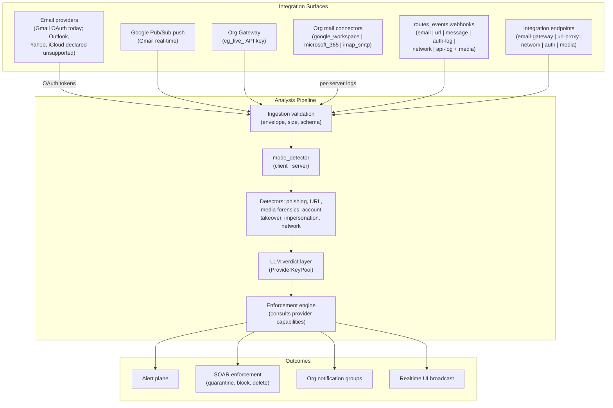
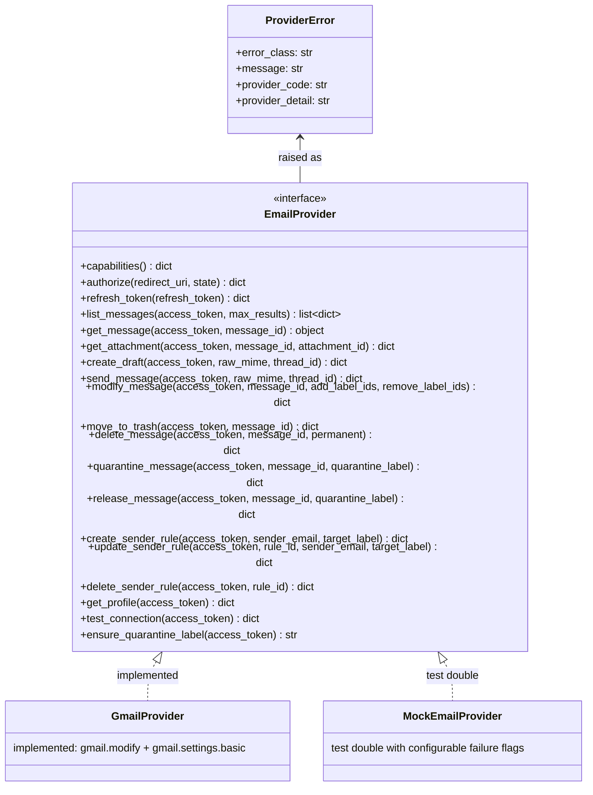
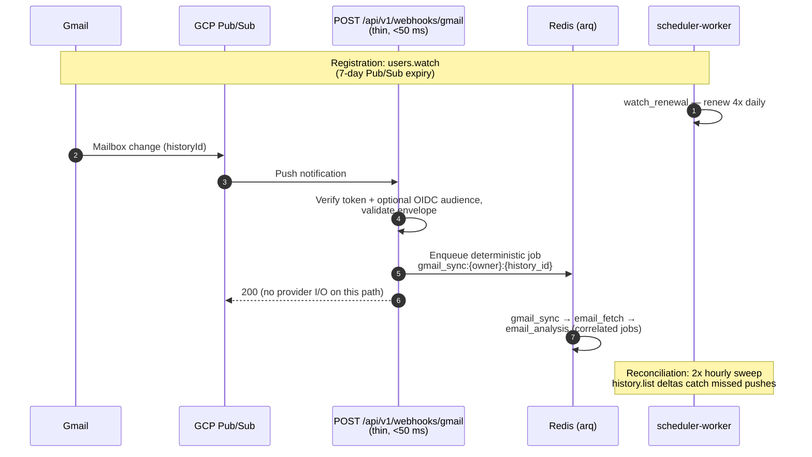
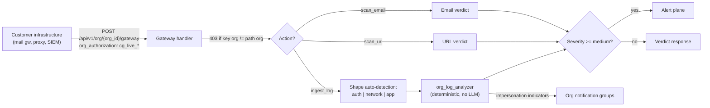
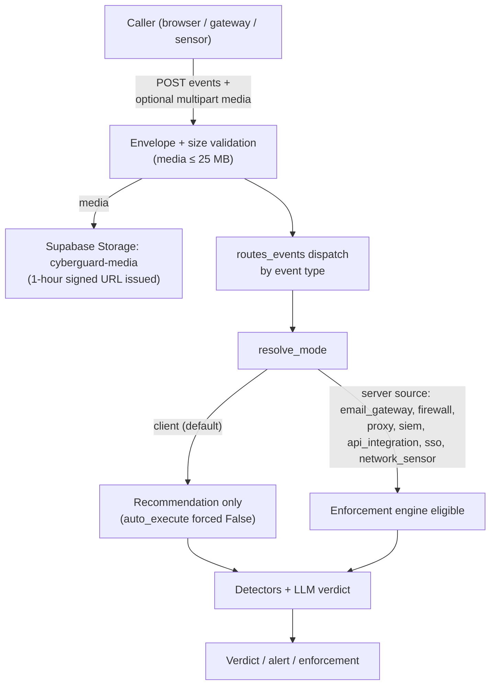

# CYBERGUARD — Integration Guide

**Audience:** engineers connecting mail systems, security gateways, or custom telemetry sources to CYBERGUARD, and contributors adding a new email provider or transport.

This guide covers every supported integration surface: the email-provider contract, Gmail OAuth and real-time synchronization, enforcement actions against Gmail, the organization gateway (server-to-server API), org mail connectors, general webhook ingestion, the server-mode integration endpoints, and notification delivery. Each section states what is implemented today and what is explicitly not — CYBERGUARD has a **"no fake provider success anywhere"** policy: a provider that is not fully wired reports `unsupported` or `coming_soon` with an explicit reason, never a simulated success.

> **Related documents:** [README.md](README.md) (product overview), [ARCHITECTURE.md](ARCHITECTURE.md) (system architecture), [API_DOCUMENTATION.md](API_DOCUMENTATION.md) (full endpoint reference), [DATA_MODEL.md](DATA_MODEL.md) (schema), [RUNBOOK.md](RUNBOOK.md) (operational procedures), [DECISIONS.md](DECISIONS.md) (architecture decision records), [WORKER_ARCHITECTURE.md](WORKER_ARCHITECTURE.md) (background jobs), [ML_MODELS.md](ML_MODELS.md) (detection models), [SECURITY_MODEL.md](SECURITY_MODEL.md) (token encryption, API-key handling, OAuth state security).

---

## Table of Contents

1. [Integration Architecture Overview](#1-integration-architecture-overview)
2. [The EmailProvider Contract](#2-the-emailprovider-contract)
3. [Gmail Integration](#3-gmail-integration)
4. [Gmail Real-Time Synchronization](#4-gmail-real-time-synchronization)
5. [Enforcement Actions via Gmail](#5-enforcement-actions-via-gmail)
6. [Organization Gateway (Server-to-Server)](#6-organization-gateway-server-to-server)
7. [Org Mail Connectors](#7-org-mail-connectors)
8. [Webhook Ingestion (General)](#8-webhook-ingestion-general)
9. [Server-Mode Integration Endpoints](#9-server-mode-integration-endpoints)
10. [Notifications](#10-notifications)
11. [Adding a New Provider: Step-by-Step](#11-adding-a-new-provider-step-by-step)
12. [Quick Reference: Endpoints and Examples](#12-quick-reference-endpoints-and-examples)

---

## 1. Integration Architecture Overview

CYBERGUARD accepts telemetry through four families of integrations, all converging on the same analysis → decision → enforcement pipeline.



**Why one pipeline for every source?** A finding from a gateway `scan_email` call and a phishing verdict from a synced Gmail message flow through the same detectors, scoring, and enforcement engine. This guarantees identical verdicts for identical content regardless of how it arrived, and it means new sources inherit enforcement and alerting for free.

---

## 2. The EmailProvider Contract

All email providers implement the `EmailProvider` interface (`app/services/email_providers/base.py`): a **14-method core contract** (authorization lifecycle, reading, composing, message actions, sender rules) plus three operational extensions (`get_profile`, `test_connection`, `ensure_quarantine_label`) and a capability flag structure. The contract is intentionally wide enough to cover quarantine-capable enterprise systems and narrow enough that the enforcement engine can be written once, against capabilities.

### 2.1 Capability flags

| Flag | Meaning |
|---|---|
| `supports_read` | Can list/read messages. |
| `supports_attachments` | Can fetch attachment payloads. |
| `supports_modify` | Can modify message labels/metadata. |
| `supports_quarantine` | Can add/remove a quarantine label. |
| `supports_trash` | Can move messages to trash. |
| `supports_permanent_delete` | Can hard-delete messages. |
| `supports_sender_rules` | Can create/update/delete sender rules (filters). |
| `supports_send` | Can send mail / create drafts. |

`capabilities()` returns these as a `dict` via `to_dict()`/`flags()`. **Enforcement consults capabilities before acting** — the engine never assumes a provider can quarantine.

### 2.2 Interface methods



### 2.3 Provider registry

The registry (`app/services/email_providers/registry.py`) declares:

| Provider | Status | Notes |
|---|---|---|
| **Gmail** | Enabled when configured | Full OAuth + real-time + enforcement path. |
| Outlook | Coming soon | Declared with explicit reason — no half-working stub. |
| Yahoo | Coming soon | Same. |
| iCloud | Coming soon | Same. |

Providers are resolved at call time via `get_provider(connector.provider)`. **No fake provider success anywhere:** if a provider cannot perform an action, the result is a typed `ProviderError` (carrying `provider_code`/`provider_detail`) or an explicit `unsupported` status — never a fabricated 200-style success.

### 2.4 MockEmailProvider

The mock provider implements the same interface with **configurable failure flags**, so tests and local development can exercise every branch — success, quota errors, auth errors, unsupported capabilities — without touching Google.

---

## 3. Gmail Integration

### 3.1 OAuth setup

- CYBERGUARD uses its **own Google OAuth client**, deliberately separate from the Google IdP configured in Supabase for sign-in (see [SECURITY_MODEL.md](SECURITY_MODEL.md), Section 6).
- Scopes: `gmail.modify` + `gmail.settings.basic`. `gmail.modify` is sufficient for quarantine/block/release (no full `gmail` scope is requested).
- Authorization state rows are single-use with a 600 s TTL and consumed atomically.
- Tokens are stored **Fernet-encrypted**; plaintext is never persisted, logged, or returned to the browser.

### 3.2 Endpoints and lifecycle

| Step | Endpoint / component | Notes |
|---|---|---|
| Authorize | `GET /api/v1/connectors/gmail/authorize` | Creates state row, redirects to Google consent. |
| Callback | `GET /api/v1/connectors/gmail/callback` | Consumes state atomically, exchanges code, encrypts and stores tokens. |
| Refresh | `token_manager` | Refreshes access tokens using the encrypted refresh token. |
| Lifecycle audit | `connector_operation_logs` | Records `authorize` \| `callback` \| `token_refresh` \| `test_connection` \| `disconnect` with status `success` \| `failed` \| `unsupported` \| `insufficient_scope` \| `reauth_required`. |

Disconnect is graceful: the connector record and its history remain; token refresh simply stops until re-authorization (`reauth_required`).

---

## 4. Gmail Real-Time Synchronization

Gmail changes reach CYBERGUARD through Google Cloud Pub/Sub push, with periodic reconciliation as a safety net.



Design points:

- **Thin webhook.** The handler validates, enqueues, and returns in under 50 ms — all provider I/O happens in workers (see [WORKER_ARCHITECTURE.md](WORKER_ARCHITECTURE.md)).
- **Deterministic job IDs** make duplicate pushes idempotent.
- **Rate limiting** protects the Google quota: token bucket per `(owner_user_id, job_type)` at 250 req/s with 5 s defer ([SECURITY_MODEL.md](SECURITY_MODEL.md), Section 11).
- **Watch renewal 4x daily** against the 7-day expiry means a missed renewal can never silently disable real-time for more than a few hours.
- **Reconciliation 2x hourly** using `history.list` deltas guarantees eventual completeness even if Pub/Sub drops an event.

Real-time setup details (GCP project, topic, push subscription): see `REALTIME_GMAIL_SETUP_GUIDE.md` and `backend/docs/gmail_webhook.md`.

---

## 5. Enforcement Actions via Gmail

When the enforcement engine decides to act on a Gmail message, actions map to Gmail primitives:

| Enforcement action | Gmail mechanism | Reversal |
|---|---|---|
| **Quarantine** | Add label `CYBERGUARD-Quarantine` + remove `INBOX` | Release reverses both. |
| **Sender block** | Gmail filters (sender rules via `create_sender_rule`) | Delete the rule. |
| **Expiry auto-release** | Scheduler loop runs **every 5 minutes** and auto-releases quarantined messages whose hold has expired | — |
| **Permanent delete** | Gated behind a `permanent_delete` toggle | Irreversible (by definition) |
| **Trusted senders** | Senders the user previously released are **exempted**; enforcement becomes recommend-only, with the annotation: *"You previously released a message from this sender."* | — |

Every action is audited to `security_events` + `audit_logs` ([SECURITY_MODEL.md](SECURITY_MODEL.md), Section 10).

**Why a label-based quarantine instead of moving to trash?** Labels are visible and reversible in the Gmail UI, the user can see *why* mail vanished from the inbox, and release is a symmetrical two-label operation. Trash hides the mail and invites confusion; permanent delete is reserved behind an explicit toggle.

---

## 6. Organization Gateway (Server-to-Server)

The gateway lets an organization's existing infrastructure (mail gateways, proxies, SIEM pipelines) push telemetry and request verdicts with a single authenticated call.

### 6.1 Contract

- **Endpoint:** `POST /api/v1/org/{org_id}/gateway`
- **Auth header:** `org_authorization: <cg_live_...>` (see [SECURITY_MODEL.md](SECURITY_MODEL.md), Section 5: SHA-256 hashed, plaintext shown once)
- **Actions:** `scan_email` | `scan_url` | `ingest_log` (in the `action` field; payload in `data`)
- **Org mismatch:** a valid key for a *different* organization returns `403` — the key's org must match the path `org_id`.
- **Log ingestion:** shape-based auto-detection classifies each log as `auth`, `network`, or `app` — **no LLM on the ingest path** (deterministic, fast, and immune to prompt injection from log content).
- **Promotion:** `medium`+ severity findings are promoted to the alert plane.
- **Impersonation:** indicators of executive/brand impersonation trigger the org's notification groups (Section 10).



### 6.2 curl examples

```bash
# Scan an email (verdict request)
curl -s -X POST "https://api.example.com/api/v1/org/8f3c.../gateway" \
  -H "org_authorization: cg_live_Xk2mQ7..." \
  -H "Content-Type: application/json" \
  -d '{
        "action": "scan_email",
        "data": {"sender": "ceo@brand-helper.net", "subject": "Urgent wire", "body": "..."}
      }'

# Scan a URL
curl -s -X POST "https://api.example.com/api/v1/org/8f3c.../gateway" \
  -H "org_authorization: cg_live_Xk2mQ7..." \
  -H "Content-Type: application/json" \
  -d '{"action": "scan_url", "data": {"url": "https://secure-login.example-team.ru/"}}'

# Ingest a log line (shape auto-detected as auth | network | app)
curl -s -X POST "https://api.example.com/api/v1/org/8f3c.../gateway" \
  -H "org_authorization: cg_live_Xk2mQ7..." \
  -H "Content-Type: application/json" \
  -d '{"action": "ingest_log", "data": {"raw": "Failed password for admin from 203.0.113.9"}}'
```

**Why API keys instead of per-user JWTs for the gateway?** The gateway is called by machines, before/without any human session. Key validation is an indexed hash lookup that resolves the organization directly (identity from the key), and revocation is a single database row — no token expiry choreography on the customer's side.

---

## 7. Org Mail Connectors

Org mail connectors (design doc: `backend/docs/org_mail_connectors.md`) let an organization connect whole mail domains rather than individual mailboxes.

### 7.1 Provider types and credential schemas

| Provider type | Required credential fields |
|---|---|
| `google_workspace` | `service_account_key`, `delegated_user` |
| `microsoft_365` | `client_id`, `client_secret`, `tenant_id` |
| `imap_smtp` | `host`, `port`, `username`, `password` |

`CREDENTIAL_SCHEMAS` validates the exact field set per provider **before** anything is stored. Credentials are stored as a **Fernet-encrypted JSON blob** under `CONNECTOR_TOKEN_KEY` ([SECURITY_MODEL.md](SECURITY_MODEL.md), Section 4).

### 7.2 Pluggable transport registry

The service maintains a transport registry (`ORG_MAIL_TRANSPORTS`), keyed by provider type. The shipped transport is **`SimulationTransport`** for all three types:

- It performs **real credential validation** (schema completeness, format checks) — so bad credentials fail loudly.
- Its scan results are **clearly flagged as simulated** (`"simulated": true`) in every response — a simulated quarantine can never be mistaken for a real one.
- Transport registration is the extension point: adding a real driver is a registry change with **zero product-code changes**.

**Why a simulation transport at all?** Because the alternative is either pretending connectivity (forbidden by the "no fake success" policy) or shipping an integration that cannot be demonstrated. SimulationTransport does the real validation work and labels its results honestly, which is the only way to be both demonstrable and truthful.

**Why stdlib-first?** An `imap_smtp` transport can be implemented with Python's stdlib `imaplib`/`smtplib` — no new dependencies. Real drivers (`google-api-python-client`, `msal`) are pure transport registrations.

### 7.3 Server logs and lifecycle

- Per-server operation logs are stored in `org_mail_server_logs` with event kinds: `connection` | `scan` | `quarantine` | `error`.
- **Graceful disconnect** retains stored credentials so the connection can be re-enabled.
- **Deletion** removes the server record and its credentials entirely.

---

## 8. Webhook Ingestion (General)

`routes_events` is the generic ingestion front door for arbitrary security events.

### 8.1 Event types

| Event type | Use |
|---|---|
| `email` | Email telemetry from external systems. |
| `url` | URL observations from proxies/scanners. |
| `message` | Chat/messaging content. |
| `auth-log` | Authentication events (logins, MFA, password resets). |
| `network` | Flow/netlink events. |
| `api-log` | Application API audit lines. |
| **Media** | Multipart upload, **25 MB max** (`MAX_MEDIA_SIZE_BYTES`), stored in Supabase Storage bucket `cyberguard-media`, served back as **1-hour signed URLs**. |

### 8.2 Ingestion flow



Mode semantics: `resolve_mode` ([SECURITY_MODEL.md](SECURITY_MODEL.md), Section 12) forces `auto_execute=False` in client mode and treats the infrastructure sources listed above as implicit server mode.

---

## 9. Server-Mode Integration Endpoints

The integrations router (`/api/v1/integrations`, prefix `"/integrations"`) exposes the SOAR entrypoints for infrastructure callers. Each endpoint runs the full pipeline — `resolve_mode` → detectors → LLM verdict → enforcement engine — and returns an `IntegrationDecisionResponse` (decision, rationale, and any actions taken).

| Endpoint | Purpose |
|---|---|
| `POST /api/v1/integrations/email-gateway/analyze` | Analyze a message at the mail-gateway boundary. |
| `POST /api/v1/integrations/url-proxy/analyze` | Analyze a URL observed by a proxy. |
| `POST /api/v1/integrations/network/analyze-flow` | Analyze a network flow record. |
| `POST /api/v1/integrations/auth/analyze-login` | Analyze a login/auth event (account-takeover signals). |
| `POST /api/v1/integrations/media/analyze` | Analyze uploaded media (25 MB limit). |

```bash
curl -s -X POST "https://api.example.com/api/v1/integrations/email-gateway/analyze" \
  -H "Authorization: Bearer <supabase-jwt>" \
  -H "Content-Type: application/json" \
  -d '{
        "mode": "server",
        "source": "email_gateway",
        "email": {"sender": "billing@paypa1-support.com", "subject": "Invoice overdue", "body": "..."}
      }'
```

Note: `source: "email_gateway"` implies server mode even if `mode` were omitted ([SECURITY_MODEL.md](SECURITY_MODEL.md), Section 12).

---

## 10. Notifications

### 10.1 Personal notifications

- Personal notifications go **only** to `users.notification_email` — the user's explicitly configured address. CYBERGUARD **never** sends personal notifications to connected mailboxes (the OAuth connection is read/triage scope, not an outbound channel).
- Delivery backends: `db_log` (default, records notification rows) or best-effort SMTP with **STARTTLS**, a **10 s timeout**, and automatic fallback to `db_log` on failure.

**Why never notify to connected mailboxes?** If the mailbox is compromised — precisely the scenario that triggers the notification — mail delivered into it is attacker-readable. A separately configured address keeps the alert channel out of the blast radius.

### 10.2 Organization notifications

Org notifications are **role-grouped**: each event type declares a minimum role (`admin` | `analyst` | `viewer`), and notification groups receive events at or above their role.

| Event | Default minimum role |
|---|---|
| `server_down` | analyst |
| `mail_server_down` | analyst |
| `critical_log` | analyst |
| Impersonation indicators | **admin** |

---

## 11. Adding a New Provider: Step-by-Step

Follow these steps to add, say, Outlook as an email provider. Nothing outside `app/services/email_providers/` (plus registry wiring) should need to change.

1. **Implement the interface.** Create `app/services/email_providers/outlook.py` implementing all core `EmailProvider` methods plus the operational extensions and `capabilities()`. Map provider-native errors to `ProviderError` with `provider_code`/`provider_detail` — never swallow or fabricate success.

2. **Declare capabilities honestly.** Set only the flags the provider truly supports (e.g. Microsoft Graph can quarantine via junk-move rules; set `supports_quarantine=True` only if you implement `quarantine_message`/`release_message` fully). The enforcement engine checks these flags before every action.

3. **Handle OAuth.** Implement `authorize()` (consent URL + state passthrough) and `refresh_token()`. Reuse the existing patterns: single-use state rows (TTL 600 s), Fernet-encrypted tokens, `connector_operation_logs` entries for every lifecycle step. Add the connector routes if the provider needs a callback path.

4. **Register in the registry.** Update `app/services/email_providers/registry.py`: `Gmail` stays enabled-when-configured; set the new provider to **enabled** only when steps 1–3 are complete. Until then it must remain `coming_soon` **with an explicit reason** — a disabled provider must never present a working-looking flow.

5. **Capability-gated enforcement.** Verify the enforcement engine behaves correctly for the new capability matrix: actions requiring unsupported flags must produce typed "unsupported" outcomes, not exceptions or silent no-ops.

6. **Tests with MockEmailProvider.** Add mock-provider cases for each failure flag (quota, auth, unsupported capability) and for every enforcement branch the provider claims. All tests must pass without network access.

7. **Optional: real-time sync.** If the provider supports push notifications, wire them into `routes_events`/webhook routes following the Gmail pattern: verification token, thin handler, deterministic job IDs, rate limiting, plus reconciliation polling ([WORKER_ARCHITECTURE.md](WORKER_ARCHITECTURE.md)).

8. **Observability.** Emit the standard metrics (`*_jobs_total{status,...}`, `job_processing_duration_seconds{job_type}`) and structured logs with correlation IDs so the new provider appears in existing dashboards and alerts ([MONITORING_OBSERVABILITY.md](MONITORING_OBSERVABILITY.md), Section 6).

9. **Security review.** Walk the new surface through the threat model checklist in [SECURITY_MODEL.md](SECURITY_MODEL.md) (Section 13): webhook abuse, prompt injection, payload limits, token storage.

10. **Document.** Add the provider to this guide's registry table (Section 2.3) and to [API_DOCUMENTATION.md](API_DOCUMENTATION.md); record the decision in [DECISIONS.md](DECISIONS.md).

### Org mail transports

For **org mail connectors** the path is shorter: implement a transport class, register it in `ORG_MAIL_TRANSPORTS` for the provider type. The transport performs real credential validation and must flag any simulated results with `"simulated": true`. `imap_smtp` can be built entirely on stdlib (`imaplib`); Google/Microsoft real drivers are transport registrations only.

---

## 12. Quick Reference: Endpoints and Examples

| Surface | Endpoint | Auth |
|---|---|---|
| Gmail authorize | `GET /api/v1/connectors/gmail/authorize` | Bearer JWT |
| Gmail callback | `GET /api/v1/connectors/gmail/callback` | (state-verified) |
| Gmail push webhook | `POST /api/v1/webhooks/gmail` | Verification token (+ optional OIDC audience) |
| Org gateway | `POST /api/v1/org/{org_id}/gateway` | `org_authorization: cg_live_*` |
| Org log ingest | `POST /api/v1/org/{org_id}/logs/ingest` | API key (gateway) |
| Event ingestion | `POST` routes_events (email \| url \| message \| auth-log \| network \| api-log) | Bearer JWT |
| Media ingestion | routes_events media (multipart, ≤ 25 MB) | Bearer JWT |
| SOAR entrypoints | `POST /api/v1/integrations/{email-gateway,url-proxy,network,auth,media}/...` | Bearer JWT |
| Metrics | `GET /metrics`, `GET /api/v1/metrics` | — |
| Health | `GET /health`, `GET /ready`, `GET /api/v1/health` | — |

```bash
# Health check
curl -s http://localhost:8000/ready

# Metrics scrape
curl -s http://localhost:8000/metrics | grep -E "gmail_events_received_total|queue_depth"

# Authorize a Gmail connector (browser flow begins)
curl -s -H "Authorization: Bearer <supabase-jwt>" \
  "http://localhost:8000/api/v1/connectors/gmail/authorize?redirect_uri=http://localhost:5173/connectors"
```

For the complete request/response schemas of every endpoint, see [API_DOCUMENTATION.md](API_DOCUMENTATION.md); for operational procedures (token rotation, DLQ, watch renewal), see [RUNBOOK.md](RUNBOOK.md).
