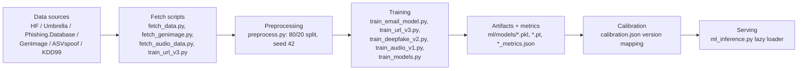
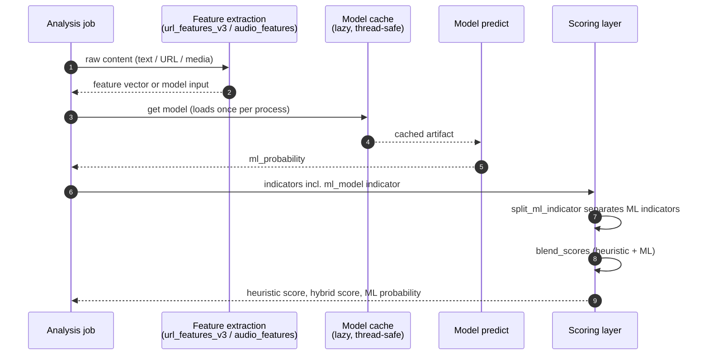

# ML MODELS

> CYBERGUARD SOC/SOAR Platform — Model Inventory, Training Pipelines, Inference, Calibration, and Evaluation

This document is the reference for every machine-learning artifact served by CYBERGUARD: what each model is, how it was trained, how it is versioned and selected at runtime, how its scores are blended with heuristic scores, and how it is evaluated and monitored.

**Related documentation:** [README.md](README.md) · [ARCHITECTURE.md](ARCHITECTURE.md) · [API_DOCUMENTATION.md](API_DOCUMENTATION.md) · [THREAT_DETECTION_ENGINES.md](THREAT_DETECTION_ENGINES.md) · [WORKER_ARCHITECTURE.md](WORKER_ARCHITECTURE.md) · [DECISIONS.md](DECISIONS.md) · [RUNBOOK.md](RUNBOOK.md)

---

## Table of Contents

1. [Overview](#1-overview)
2. [Model Inventory](#2-model-inventory)
3. [Model Cards](#3-model-cards)
   - 3.1 [Email Phishing (Text)](#31-email-phishing-text)
   - 3.2 [URL Phishing](#32-url-phishing)
   - 3.3 [Image Deepfake Detection](#33-image-deepfake-detection)
   - 3.4 [Audio Anti-Spoofing](#34-audio-anti-spoofing)
   - 3.5 [Network Intrusion](#35-network-intrusion)
4. [Training Pipeline](#4-training-pipeline)
5. [Inference Pipeline](#5-inference-pipeline)
6. [Calibration and Hot Reload](#6-calibration-and-hot-reload)
7. [Versioning and Rollback](#7-versioning-and-rollback)
8. [Evaluation and Monitoring](#8-evaluation-and-monitoring)
9. [Feature Store: An Honest Account](#9-feature-store-an-honest-account)
10. [Retraining Runbook](#10-retraining-runbook)
11. [Known Limitations](#11-known-limitations)

---

## 1. Overview

CYBERGUARD combines deterministic heuristic engines with supervised ML models inside the `email_analysis` worker job (see [WORKER_ARCHITECTURE.md](WORKER_ARCHITECTURE.md), Section 8). Model artifacts live in `backend/ml/models/`; training scripts live in `backend/ml/` and `backend/ml/scripts/`; inference glue lives in `backend/app/services/ml_inference.py`.

Runtime configuration:

| Variable | Default | Purpose |
| --- | --- | --- |
| `ML_ENABLED` | `True` | Enables the `ml_model` engine in the analysis pipeline |
| `ML_MODELS_DIR` | `ml/models` | Directory scanned for artifact files |

Models are loaded lazily into a **thread-safe in-process cache** on first use and stay resident; there is no external model server. The `ml_model` engine contributes a typed indicator (`type: "ml_model"`) carrying the model probability, which the scoring layer blends with heuristic output (Section 5).

---

## 2. Model Inventory

| Domain | Active artifacts | Version | Algorithm | Selected by |
| --- | --- | --- | --- | --- |
| Email phishing (text) | `email_tfidf_v2.pkl`, `email_phishing_xgb_v2.pkl` | v2 (fallback v1: `email_tfidf.pkl`, `email_phishing_xgb.pkl`) | Multilingual char-n-gram TF-IDF + XGBoost | `email_model_version` |
| URL phishing | `url_xgb_v3.1.pkl` (also kept: `url_xgb_v3.pkl`, `url_xgb_v2.pkl`, `url_xgb.pkl`) | v3.1 (fallback v3 → v2 → v1) | XGBoost on 19 structural + reputation features | `url_model_version` |
| Image deepfake | `deepfake_cnn_v2.pt` | v2 | MobileNetV3-Small transfer learning, 128px | `deepfake_model_version` |
| Audio anti-spoofing | `audio_cnn_v1.pt` | v1 | LCNN/MFM CNN + handcrafted-statistics fusion | `audio_model_version` |
| Network anomaly | `network_xgb.pkl`, `network_scaler.pkl` | v1 | XGBoost on scaled KDD99-SF features | Served directly |

All artifacts are committed under `backend/ml/models/` together with their training-time metric snapshots (`*_metrics.json`) and a `calibration.json` describing the artifact mapping.

---

## 3. Model Cards

### 3.1 Email Phishing (Text)

| Property | Value |
| --- | --- |
| Artifacts | `email_tfidf_v2.pkl` + `email_phishing_xgb_v2.pkl` |
| Vectorizer | Character n-gram TF-IDF — `analyzer='char'`, `ngram_range=(2,4)`, `max_features=50000`, `sublinear_tf=True` |
| Classifier | `XGBClassifier(n_estimators=200, max_depth=6, learning_rate=0.1, scale_pos_weight=..., eval_metric='logloss', tree_method='hist')` |
| Languages | English + Hindi + Telugu + Odia + romanised Indic text |
| Fallback | v1 (`email_tfidf.pkl` + `email_phishing_xgb.pkl`), word-level TF-IDF, English-only |

**Why char n-grams:** character-level features survive code-switching, obfuscation, and romanisation (for example, "aapka account band ho jayega") that word tokenizers miss. The multilingual corpus is produced by `ml/build_indic_corpus.py` with keyword lists from `ml/indic_keywords.json`. The training script **exits with code 2 if any language's F1 falls below 0.85** — a hard quality gate that prevents shipping a model that quietly discriminates against one language.

### 3.2 URL Phishing

The URL model has the most iterative history: v1/v2 (base features), v3 (real-data retraining with reputation features), and v3.1 (false-positive hardening).

**Feature sets**

- **v1/v2:** 8 base features (v2 adds 7 reputation/path-shape features, 14 total).
- **v3 / v3.1:** 19 features defined in `ml/url_features_v3.py::FEATURE_COLUMNS_V3`:

| # | Feature |
| --- | --- |
| 1 | `is_top_1m` |
| 2 | `domain_entropy` |
| 3 | `path_entropy` |
| 4 | `query_entropy` |
| 5 | `domain_length` |
| 6 | `path_length` |
| 7 | `query_length` |
| 8 | `total_length` |
| 9 | `has_tracking_params` |
| 10 | `num_query_params` |
| 11 | `has_ip` |
| 12 | `num_dots` |
| 13 | `num_subdomains` |
| 14 | `has_at_symbol` |
| 15 | `suspicious_tld` (tk/ml/ga/cf/gq/xyz/top/work/loan/click/rest) |
| 16 | `http_only` |
| 17 | `domain_digit_ratio` |
| 18 | `domain_hyphens` |
| 19 | `has_suspicious_path_keyword` |

**Training data (v3)**

| Class | Source |
| --- | --- |
| Benign | 50,000 real domains from the Cisco Umbrella top-1M list, plus 10,000 tracking-parameter augmentations |
| Phishing | `mitchellkrogza/Phishing.Database` ACTIVE feed (~780k entries, cached locally), with OpenPhish as fallback, plus 20,000 synthetic lookalikes |

**v3.1** additionally augments the benign class with brand-secondary token-query URLs (59,000 benign total), targeting false positives on legitimate high-entropy token links on secondary brand domains (the "mediumday.com-style" event-registration pattern).

**Metrics**

| Version | n | AUC | F1 | Accuracy |
| --- | --- | --- | --- | --- |
| v3 | 100,000 | 0.9987 | 0.9830 | 0.9831 |
| v3.1 | 109,000 | 0.9985 | 0.9795 | 0.9812 |

The v3.1 hardening trades a marginal F1 decrease (0.9830 → 0.9795) for eliminating a concrete false-positive family — the deliberate trade is recorded in [DECISIONS.md](DECISIONS.md).

### 3.3 Image Deepfake Detection

| Property | Value |
| --- | --- |
| Artifact | `deepfake_cnn_v2.pt` |
| Architecture | MobileNetV3-Small, ImageNet-pretrained backbone, 128px input, binary head |
| Training data | GenImage (Stable Diffusion v1.4 + Midjourney), capped at 20,000 images per class via `ml/fetch_genimage.py` (Hugging Face mirror `nebula/GenImage-arrow`) |
| Hardening | **Messenger-degraded real images** (`ml/degrade_messenger.py`): reals resized to ≤1600px, re-encoded JPEG q70–85, EXIF stripped — so the model does not learn "compression artifact = fake" |
| Loss / schedule | Class-weighted loss; early stopping with patience 3 on validation F1; 10 epochs |

| Metric | Value |
| --- | --- |
| Best validation F1 | 0.9052 |
| FPR, clean real images (n=479) | 3.76% |
| FPR, messenger-degraded reals (n=1000) | 2.2% |
| Recall, Stable Diffusion fakes (n=347) | 91.9% |
| Recall, Midjourney fakes (n=136) | 74.3% |

**Why the degraded-real augmentation matters:** without it, models trained on GenImage learn JPEG-and-resize fingerprints of *real* social-media images as "fake evidence". Evaluating FPR separately on clean versus messenger-degraded reals makes this failure mode measurable — and the degraded reals actually show the *lower* FPR, confirming the augmentation worked.

### 3.4 Audio Anti-Spoofing

| Property | Value |
| --- | --- |
| Artifact | `audio_cnn_v1.pt` — class `AudioLCNNV1` (`ml/audio_model.py`) |
| CNN branch | Input `[1, 80, T]`; 5 blocks of (Conv2d → MFM → MaxPool); BatchNorm; global mean+std pooling → 128-dim embedding |
| Helper branch | 6 handcrafted statistics → `Linear(6→32)` |
| Fusion head | 160 → 64 → 1 logit |
| Loss | Class-weighted `BCEWithLogitsLoss` (pos_weight 0.6537) |
| Features | Per 3-second crop (16 kHz, 50% overlap): 80-bin log-Mel spectrogram (`n_fft=1024`, `hop=256`) plus 6 statistics — spectral flatness, centroid std, 85% rolloff, silence ratio, F0 std, frame-energy kurtosis |
| Training data | ASVspoof 2019 LA — sourced from `datashare.ed.ac.uk` with Hugging Face mirror `Bisher/ASVspoof_2019_LA` and wavefake/espeak fallback chain (`ml/fetch_audio_data.py`) |

| Metric | Value |
| --- | --- |
| Train / dev sizes | 6,582 / 6,550 |
| Best dev F1 | 0.8517 |
| Dev accuracy | 0.8249 |
| Dev AUC | 0.9138 |
| ElevenLabs-gate recall | 1.0 |
| Real-speech FPR | 0.0 |

### 3.5 Network Intrusion

| Property | Value |
| --- | --- |
| Artifacts | `network_xgb.pkl` + `network_scaler.pkl` (StandardScaler) |
| Features | 4 — log duration, label-encoded service, log src_bytes, log dst_bytes |
| Training data | KDD99-SF subset via `sklearn.datasets.fetch_kddcup99(subset="SF")` |

This is deliberately minimal: it flags coarse traffic-shape anomalies (very long connections, extreme byte asymmetry), complementing the heuristic engine. Its known blind spot — low-and-slow beaconing — is documented in Section 11.

---

## 4. Training Pipeline

All trainers follow the same shape: fetch raw data, preprocess with deterministic splits, train, emit metrics and artifacts, and register the artifact mapping in calibration.



Domain-specific notes:

- **Email:** `build_indic_corpus.py` + `indic_keywords.json` construct the multilingual corpus before `train_email_model.py`; a per-language F1 gate (≥ 0.85, else exit 2) sits between training and artifact emission.
- **URL:** `train_url_v3.py` performs dataset assembly, feature extraction via the *shared* `url_features_v3.py` module (see Section 9), training, and metric writing (`url_v3_metrics.json`, `url_v31_metrics.json`).
- **Deepfake:** `fetch_genimage.py` (capped classes) → `degrade_messenger.py` (real-image hardening) → `train_deepfake_v2.py` (class-weighted, early-stopped) → `deepfake_v2_metrics.json`.
- **Audio:** the fetch chain degrades gracefully (`datashare.ed.ac.uk` → HF mirror → wavefake → espeak-synthesized fallback) so the pipeline is reproducible even when the primary source is unavailable.
- **Provenance:** `datasets/provenance.json` records each dataset as `fetched`, `synthetic_fallback`, or `synthetic` — no training run can silently claim real data it did not use.

**Why seed 42 and fixed 80/20 splits:** every metrics number in this document is reproducible from a clean checkout; there is no hidden data-order dependence.

---

## 5. Inference Pipeline

Inference runs inside the `email_analysis` job (and the on-demand scan path). `app/services/ml_inference.py` owns a **thread-safe lazy model cache**: artifacts load on first use, are cached per process, and are shared across concurrent jobs.



### 5.1 Score blending

For text and URL engines the blend is monotonic in both inputs:

```python
final_score = max(heuristic_score, round(0.45 * heuristic_score + 0.55 * ml_probability * 100))
```

`score_with_ml(indicators)` returns the `(heuristic_score, hybrid_score, ml_probability)` triple: `split_ml_indicator` strips `type: "ml_model"` indicators out of the heuristic sum (so ML evidence is never double-counted as heuristic evidence), and `ml_indicator` constructs the typed indicator carrying the model probability and artifact name.

**Why `max(...)` matters:** the blended score can never be *lower* than what the heuristics alone would say. ML evidence can raise a suspicion score but never silently downgrade a high-confidence heuristic match. This makes the hybrid layer a strict refinement rather than a replacement, which keeps behavior predictable for SOC analysts tuning thresholds.

### 5.2 Audio blending

Audio uses a domain-specific pre-blend before the monotonic blend:

```text
model_contribution = 0.6 * model_score + 0.4 * heuristic_score      # for WAV input
if non-speech tone: model_contribution is capped at 0.35           # model demoted
final = monotonic blend as in 5.1
```

**Why the tone cap:** the model was trained on speech spoofing (ASVspoof LA). A pure sine tone or DTMF stream is out of domain — the model's opinion on it is unreliable, so its contribution is capped and the deterministic heuristic evidence dominates.

---

## 6. Calibration and Hot Reload

`app/core/calibration.py` loads `ml/calibration.json` and **hot-reloads it by checking the file's mtime on every read** — no restart required. If the file is missing or unreadable, it falls back to `DEFAULT_CALIBRATION` compiled into the code, so a bad deploy of the calibration file can never take the scoring engine down.

The calibration file carries both model-version keys and non-ML scoring constants (impersonation indicator keyword lists, deepfake heuristic thresholds, severity weights and risk bands, and explanation-provider settings). Version keys:

| Key | Selects |
| --- | --- |
| `email_model_version` | Email TF-IDF + XGBoost artifact pair (currently `v2`) |
| `url_model_version` | URL XGBoost artifact (currently `v2` in the serving calibration) |
| `deepfake_model_version` | Deepfake neural artifact (currently `v2`) |
| `url_model_version` / others missing | Loader falls back gracefully down the version chain (v3 → v2 → v1 for URL) |

**Why hot reload:** version flips and threshold tuning are operational actions that should not require a rolling restart of worker containers. Editing `ml/calibration.json` takes effect on the next analysis job, and the mtime check makes the cost negligible.

---

## 7. Versioning and Rollback

Rollback is a **one-line calibration edit plus zero downtime**:

```json
{ "url_model_version": "v2" }
```

Mechanics:

1. Multiple artifact generations coexist on disk (`url_xgb.pkl` → `url_xgb_v2.pkl` → `url_xgb_v3.pkl` → `url_xgb_v3.1.pkl`; email v1/v2 pairs).
2. `calibration.json` names the *active* generation per domain.
3. The loader walks a defined fallback chain when a selected artifact file is missing — for URL, v3 → v2 → v1 — logging a warning rather than raising.
4. Because calibration is mtime-hot-reloaded (Section 6), rollback propagates to running workers within one calibration read.

**Why file-presence fallback chains instead of hard failure:** a partially-copied artifact directory during a deploy degrades the engine to the previous generation (and the heuristic floor) rather than breaking analysis outright. The degradation is always visible in logs.

---

## 8. Evaluation and Monitoring

### 8.1 Offline evaluation report

`evidence/reports/evaluation.md` (dated 2026-09-07) records the hybrid (heuristic + ML) system metrics:

| Domain | F1 | Notes |
| --- | --- | --- |
| Email | 0.9842 | Precision 0.9929 / Recall 0.9756 |
| URL | 1.0 | On the evaluation suite |
| Message | 0.6826 | Broader message-level classification |
| ATO (account takeover) | 0.8462 | |
| Network | 0.8148 | |
| Deepfake | 0.6667 | |

Latency p95: URL 3.735 ms, network 33.949 ms.

### 8.2 pytest evaluation harness

The `backend/tests` harness re-derives component metrics and, importantly, **compares ML-augmented scoring against heuristic-only scoring**:

| Harness check | Result |
| --- | --- |
| Phishing text | Precision 1.0 / Recall 0.37 / AUC 0.91 |
| URL blended | AUC 0.955 vs heuristic-only 0.766 |
| Media | AUC 0.935 |
| Network | Precision 1.0 / Recall 0.666 |

The harness follows an **A/B-style discipline: it never fixes application code to make a test pass.** When a test surfaces a genuine weakness, the outcome is a *recorded finding*, not a threshold hack — this keeps the evaluation honest and the findings list actionable.

### 8.3 Runtime monitoring

- `worker_jobs_total{worker_name, job_type, status}` counters cover analysis execution health (see [WORKER_ARCHITECTURE.md](WORKER_ARCHITECTURE.md), Section 14).
- Metric snapshots ship next to artifacts (`ml/models/*_metrics.json`), so the exact training-time numbers are auditable alongside the binaries.
- `datasets/provenance.json` closes the data-provenance loop.

---

## 9. Feature Store: An Honest Account

**There is no external feature store.** No Feast, no Redis feature registry, no offline/online feature duplication. Feature vectors are computed **at inference time** by shared modules inside the serving process.

This is a deliberate, documented design choice, and its risks are managed by one mechanism: **training-serving skew prevention by shared code, not by a feature store.**

- `ml/url_features_v3.py` defines `FEATURE_COLUMNS_V3` and the extraction logic, and is imported by **both** `ml/scripts/train_url_v3.py` (training) and the serving path (inference). There is exactly one implementation of each feature.
- `ml/url_reputation.py` shares the Umbrella top-1M whitelist between training-time labeling and inference-time `is_top_1m` computation.
- Audio shares `ml/audio_features.py`; email shares the vectorizer artifact itself (the fitted TF-IDF is persisted, not re-derived).

**Why this is honest engineering:** a feature store solves skew and reuse at organizational scale (many teams, many models, many consumers). CYBERGUARD is a single-team platform with five models; adding a feature store would add a stateful distributed component — new failure modes, new consistency questions — without solving a problem this codebase actually has. The residual risk (a shared module changing under a deployed model between retrains) is bounded by retraining artifacts versioned together with metrics, and by the version-fallback chain in Section 7.

---

## 10. Retraining Runbook

All commands run from `backend/` with `uv`. End-to-end steps per model:

```bash
# 1. Refresh datasets (sources degrade gracefully; provenance is recorded)
uv run python ml/fetch_data.py

# 2. Email phishing (multilingual; hard gate: any language F1 < 0.85 exits 2)
uv run python ml/build_indic_corpus.py
uv run python ml/train_email_model.py

# 3. URL phishing — v3 or v3.1 (feature extraction + training + metrics)
uv run python ml/scripts/train_url_v3.py          # v3
uv run python ml/scripts/train_url_v3.py v3.1     # v3.1 (brand-secondary benign augmentation)

# 4. Image deepfake (GenImage fetch -> messenger degradation -> training)
uv run python ml/fetch_genimage.py
uv run python ml/degrade_messenger.py
uv run python ml/train_deepfake_v2.py

# 5. Audio anti-spoofing (ASVspoof 2019 LA chain)
uv run python ml/fetch_audio_data.py
uv run python ml/train_audio_v1.py

# 6. Network (KDD99-SF via sklearn)
uv run python ml/train_models.py
```

Post-training checklist:

1. Verify new artifacts and `*_metrics.json` in `ml/models/`.
2. Run the pytest evaluation harness in `backend/tests` and compare against the numbers in Section 8.
3. Update `ml/calibration.json` to point the relevant `*_model_version` at the new generation (hot reload applies it without restart).
4. If the new generation regresses, roll back via calibration (Section 7) — the previous artifacts are still on disk.

---

## 11. Known Limitations

Recorded findings from the evaluation harness and reports — retained deliberately rather than silently patched:

| Finding | Detail | Mitigation status |
| --- | --- | --- |
| URL v2 false positives on top-1M domains | v2 mis-scored legitimate long tracking URLs on well-known domains (for example Medium digest links) | Addressed by v3/v3.1 reputation features and benign augmentation; v2 remains selectable for rollback and carries the known issue |
| No low-and-slow beaconing detection | The network engine (4 coarse KDD99-SF features) cannot see low-rate periodic beaconing | Recorded finding; requires a dedicated beacon detector, not a threshold tweak |
| SMS corpus out-of-domain | The message classifier's training corpus does not cover SMS-style text; message F1 (0.6826) is the weakest hybrid metric | Recorded finding for future corpus expansion |
| Deepfake Midjourney recall (74.3%) | Lower than Stable Diffusion recall (91.9%); Midjourney artifacts are stylistically distinct | Class cap of 20,000/class; additional Midjourney data would help |
| No feature store | Feature skew risk is managed by shared-code extraction only (Section 9) | Accepted trade-off, documented |
| Audio model is speech-domain | Non-speech tones demoted to 0.35 contribution cap (Section 5.2) | By design; heuristic evidence dominates out-of-domain audio |

When one of these findings is fixed, the fix belongs in a new model version plus a harness re-run — never in editing the harness expectation itself.
