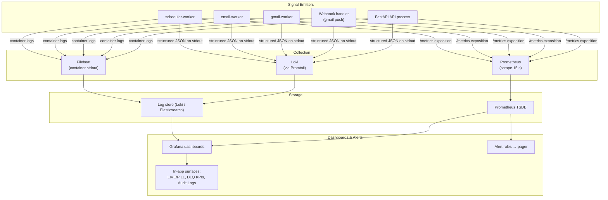
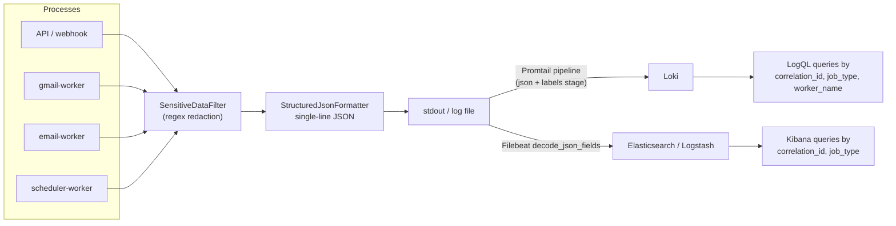
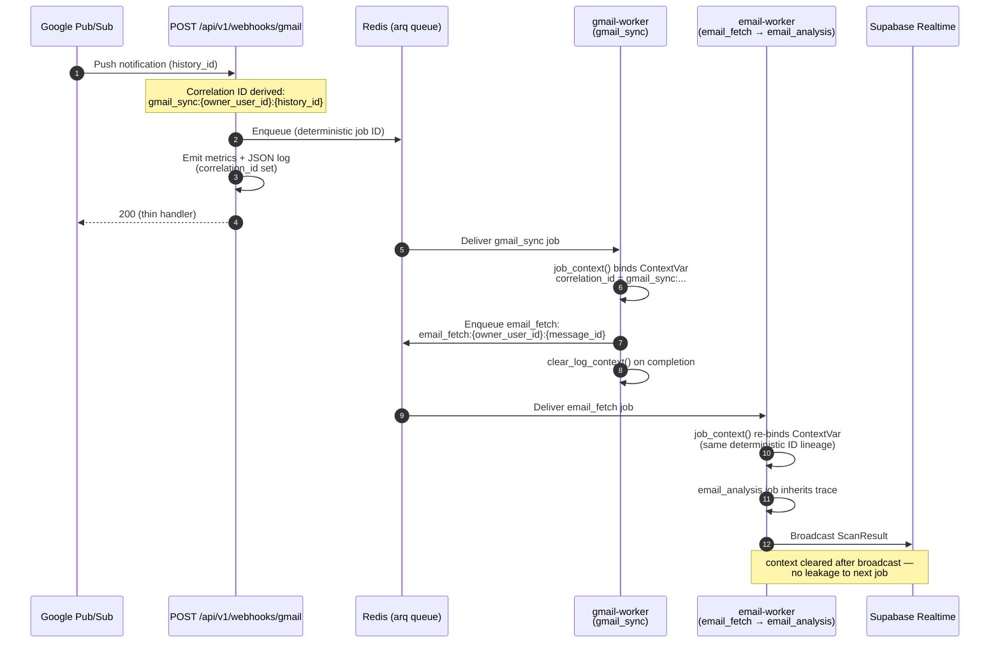

# CYBERGUARD — Monitoring & Observability

**Audience:** operators and engineers responsible for keeping the CYBERGUARD pipeline healthy, and contributors adding new instrumentation.

This document is the authoritative guide to CYBERGUARD's observability stack: structured JSON logging with correlation-ID propagation, the Prometheus metrics catalog, health check endpoints, scraping and dashboarding configuration, and alerting recommendations. It is derived from and aligned with the source specification in `backend/docs/observability.md`; where this document and operational reality diverge, that file and the code (`app/core/logging_config.py`, `app/core/metrics.py`) are ground truth.

> **Related documents:** [README.md](README.md) (product overview), [ARCHITECTURE.md](ARCHITECTURE.md) (system architecture), [API_DOCUMENTATION.md](API_DOCUMENTATION.md) (endpoint reference), [DATA_MODEL.md](DATA_MODEL.md) (schema), [RUNBOOK.md](RUNBOOK.md) (operational procedures), [DECISIONS.md](DECISIONS.md) (architecture decision records), [WORKER_ARCHITECTURE.md](WORKER_ARCHITECTURE.md) (worker and DLQ design), [ML_MODELS.md](ML_MODELS.md) (detection models), [SECURITY_MODEL.md](SECURITY_MODEL.md) (redaction and audit controls).

---

## Table of Contents

1. [Observability Architecture](#1-observability-architecture)
2. [Structured JSON Logging](#2-structured-json-logging)
3. [Log Redaction Rules](#3-log-redaction-rules)
4. [Log Pipeline](#4-log-pipeline)
5. [Correlation ID Propagation](#5-correlation-id-propagation)
6. [Prometheus Metrics Catalog](#6-prometheus-metrics-catalog)
7. [Metrics Endpoints](#7-metrics-endpoints)
8. [Health Checks](#8-health-checks)
9. [Scraping and Storage Configuration](#9-scraping-and-storage-configuration)
10. [Alerting](#10-alerting)
11. [Dashboards](#11-dashboards)
12. [Frontend Health Surfaces](#12-frontend-health-surfaces)
13. [Distributed Tracing](#13-distributed-tracing)
14. [Troubleshooting Observability](#14-troubleshooting-observability)

---

## 1. Observability Architecture

Signals flow from three kinds of emitters — the API process, the background workers, and the scheduler — through collection agents into storage, and finally into dashboards and alert rules.



**Why three worker processes share the same contract?** Each worker runs in its own container but emits identical JSON log fields and identical metric families, so a single dashboard and a single alert rule set cover the whole pipeline. Correlation IDs make events traceable across process boundaries (Section 5).

---

## 2. Structured JSON Logging

Every log entry from the backend and all workers is a single-line JSON object produced by `StructuredJsonFormatter` in `app/core/logging_config.py`.

### 2.1 Log record schema

| Field | Type | Description |
|---|---|---|
| `timestamp` | string | ISO-style timestamp with millisecond precision (`YYYY-MM-DD HH:MM:SS,mmm`). |
| `level` | string | `DEBUG`, `INFO`, `WARNING`, `ERROR`, `CRITICAL`. |
| `logger` | string | Logger namespace (e.g. `cyberguard.worker`, `cyberguard.gmail.sync`). |
| `message` | string | Sanitized human-readable message (redaction applied — Section 3). |
| `correlation_id` | string \| null | Trace ID propagated across all downstream jobs for this event. |
| `job_id` | string \| null | Deterministic queue job identifier. |
| `job_type` | string \| null | `gmail_sync`, `email_fetch`, `email_analysis`, `watch_renewal`, `reconciliation`. |
| `user_id` | string \| null | Authenticated tenant / mailbox owner UUID. |
| `worker_name` | string \| null | `gmail-worker`, `email-worker`, `scheduler-worker`. |
| `exception` | string (optional) | Formatted stack trace when exception info is present. |

### 2.2 Example record

```json
{
  "timestamp": "2026-09-16 17:04:16,339",
  "level": "INFO",
  "logger": "cyberguard.worker",
  "message": "email_fetch end: correlation_id=email_fetch:user_789:msg_abc123",
  "correlation_id": "email_fetch:user_789:msg_abc123",
  "job_id": "email_fetch:user_789:msg_abc123",
  "job_type": "email_fetch",
  "user_id": "user_789",
  "worker_name": "email-worker"
}
```

### 2.3 Log level conventions

| Level | Use for |
|---|---|
| `INFO` | Lifecycle transitions, job start/end, account discovery, threat verdicts. |
| `DEBUG` | Parsing steps, header inspection, heuristic scores, cache queries. |
| `WARNING` | Transient API rate limits (429), exponential backoff retries, recoverable sync delays. |
| `ERROR` | Fatal errors, token revocation/auth failures (401), invalid schema payloads, unrecoverable exceptions. |

---

## 3. Log Redaction Rules

The `SensitiveDataFilter` runs before serialization; log messages and `extra` fields are matched against pre-compiled regexes. This enforces the zero-credential-leak policy described in [SECURITY_MODEL.md](SECURITY_MODEL.md) (Section 9).

| Pattern matched | Replacement |
|---|---|
| `ya29.<chars>` (Google access token) | `[REDACTED_TOKEN]` |
| `1//<chars>` (Google refresh token) | `[REDACTED_TOKEN]` |
| `Bearer <chars>` (Authorization header) | `Bearer [REDACTED_TOKEN]` |
| `password="…"`, `client_secret="…"` | `[REDACTED_SECRET]` |
| `body="…"`, `body_text="…"` (email bodies) | `[REDACTED_BODY]` |
| `attachment_data="…"`, `content_bytes="…"` | `[REDACTED_ATTACHMENT_DATA]` |

**Why redact at emission?** Log shippers copy data to systems with their own access-control perimeters. Redaction at the source guarantees every downstream copy (Loki, Elasticsearch, container stdout) is already clean; no downstream misconfiguration can leak a credential that never reached it.

---

## 4. Log Pipeline



Promtail extracts `correlation_id`, `job_type`, and `worker_name` as indexed labels so a single incident can be followed across workers with one label query (configuration in Section 9.2).

---

## 5. Correlation ID Propagation

Correlation IDs bind every stage of one email event's journey through independent processes. The ID is carried in a `contextvars.ContextVar` (`current_correlation_id`), set by `job_context()` when a worker picks up a job and cleared by `clear_log_context()` on completion — success or exception — so nothing leaks into the next job on the same thread.



Key properties:

- **Deterministic IDs** (`gmail_sync:{owner_user_id}:{history_id}`, `email_fetch:{owner_user_id}:{message_id}`) make replays land on the same trace and make duplicate webhook pushes idempotent.
- **Auto-clear on job completion** — `clear_log_context()` runs even on exceptions, so a poisoned job cannot contaminate subsequent log lines with a stale correlation ID.

---

## 6. Prometheus Metrics Catalog

Ten metric families are defined in `app/core/metrics.py`. All registrations go through `_get_or_create`, which makes module reloads and multi-import paths **duplicate-safe** (importing the module twice never re-registers and never panics).

### 6.1 Counters

| Metric | Labels | Meaning |
|---|---|---|
| `gmail_events_received_total` | `owner_user_id` | Total Pub/Sub push notifications received by the webhook endpoint. |
| `gmail_sync_jobs_total` | `status` (`success`, `failed`) | Mailbox history synchronization jobs executed. |
| `email_fetch_jobs_total` | `status`, `failure_reason` | Raw message fetch + MIME normalization jobs. |
| `email_analysis_jobs_total` | `status`, `classification` | Threat analysis jobs (`phishing`, `safe`, `suspicious`). |
| `dead_letter_jobs_total` | `job_type` | Unrecoverable poison-pill jobs moved directly to `dead_letter`. |
| `gmail_api_errors_total` | `error_type` (`auth`, `rate_limit`, `server`) | Google API errors by failure class. |
| `processed_emails_total` | `classification` (`safe`, `phishing`, `suspicious`) | Emails classified by the threat engines. |
| `worker_jobs_total` | `worker_name`, `job_type`, `status` | Jobs executed per worker instance (`gmail-worker`, `email-worker`, `scheduler-worker`). |

### 6.2 Histogram

| Metric | Labels | Buckets | Meaning |
|---|---|---|---|
| `job_processing_duration_seconds` | `job_type` | 0.1, 0.5, 1, 5, 10, 30, 60 (seconds) | Job execution duration distribution; use `histogram_quantile()` for p50/p95/p99. |

### 6.3 Gauge

| Metric | Labels | Meaning |
|---|---|---|
| `queue_depth` | `queue_name` | Pending jobs in the Redis queue (`cyberguard:queue`). Updated by `update_queue_depth()`, which handles both Redis **list** and **zset** (sorted-set) key shapes. |

---

## 7. Metrics Endpoints

| Endpoint | Purpose |
|---|---|
| `GET /metrics` | Primary Prometheus exposition endpoint (text format 0.0.4). |
| `GET /api/v1/metrics` | Versioned alias; both routes are registered. |

`update_queue_depth()` is called before every scrape, so the `queue_depth` gauge reflects the queue state at scrape time rather than a stale cached value.

```bash
curl -s http://localhost:8000/metrics | head -n 20
```

---

## 8. Health Checks

### 8.1 Endpoint matrix

| Endpoint | Kind | Checks | Failure behavior |
|---|---|---|---|
| `GET /health` | Liveness | None (process alive) | Always `200` with `{status, timestamp}`. |
| `GET /ready` | Readiness | Postgres `SELECT 1`; Redis `ping` with **2 s timeout** | `503` with per-dependency details on failure. |
| `GET /api/v1/health` | Info | `database_connected`; `supabase_connected` (refers to **Supabase Storage** availability only) | Storage outage does **not** block the response; reported informatively. |

**Why does Storage not gate readiness?** Supabase Storage hosts optional artifacts (e.g. media). Gating readiness on it would pull healthy API pods out of rotation for an optional dependency. The response still reports the state so operators can see degradation. Strict readiness for the two dependencies the pipeline cannot run without — Postgres and Redis — is the correct gate.

### 8.2 Example

```bash
curl -s http://localhost:8000/ready
# {"status":"unhealthy","database_connected":true,"redis_connected":false}
# HTTP 503 — drain this pod from the load balancer
```

---

## 9. Scraping and Storage Configuration

### 9.1 Prometheus scrape configuration

```yaml
scrape_configs:
  - job_name: "cyberguard-backend"
    scrape_interval: 15s
    scrape_timeout: 10s
    metrics_path: "/metrics"
    scheme: "http"
    static_configs:
      - targets: ["cyberguard-api:8000"]
        labels:
          environment: "production"
          service: "cyberguard"
```

### 9.2 Loki via Promtail

Parse the JSON logs and lift the key fields into indexed labels:

```yaml
scrape_configs:
  - job_name: "cyberguard-logs"
    static_configs:
      - targets: ["localhost"]
        labels:
          job: "cyberguard"
          __path__: "/var/log/cyberguard/*.log"
    pipeline_stages:
      - json:
          expressions:
            timestamp: timestamp
            level: level
            logger: logger
            correlation_id: correlation_id
            job_type: job_type
            worker_name: worker_name
      - labels:
          level:
          job_type:
          worker_name:
      - timestamp:
          source: timestamp
          format: "2006-01-02 15:04:05,000"
```

### 9.3 Elastic Stack (Filebeat)

```yaml
filebeat.inputs:
  - type: container
    paths:
      - /var/lib/docker/containers/*/*.log
    processors:
      - decode_json_fields:
          fields: ["message"]
          target: ""
          overwrite_keys: true
```

---

## 10. Alerting

Alerting recommendations, ordered by operational priority. Example Prometheus rules (compatible with `rule_files` in `prometheus.yml` or PrometheusRule CRDs):

```yaml
groups:
  - name: cyberguard-pipeline
    rules:
      # 1. Page: dead-letter growth — poison payloads or systemic failure
      - alert: CyberGuardDeadLetterGrowth
        expr: increase(dead_letter_jobs_total[15m]) > 5
        for: 5m
        labels:
          severity: page
        annotations:
          summary: "Dead-letter jobs growing ({{ $value }} in 15m)"
          runbook: RUNBOOK.md — DLQ section

      # 2. Page: queue depth above drain rate for 10+ minutes
      - alert: CyberGuardQueueBacklog
        expr: >-
          queue_depth{queue_name="cyberguard:queue"}
          > 1000
        for: 10m
        labels:
          severity: page
        annotations:
          summary: "Queue depth above drain rate for >10 min"
          runbook: RUNBOOK.md — backlog drain section

      # 3. Ticket: Gmail rate-limit spikes — backoff or quota exhaustion
      - alert: CyberGuardGmailRateLimitSpike
        expr: increase(gmail_api_errors_total{error_type="rate_limit"}[5m]) > 20
        for: 0m
        labels:
          severity: ticket
        annotations:
          summary: "Gmail 429 spike ({{ $value }} errors in 5m)"

      # 4. Ticket: readiness flapping (derivable from probe failure count)
      - alert: CyberGuardWorkerStall
        expr: >-
          sum(increase(worker_jobs_total{status="success"}[10m])) by (worker_name)
          < 1
        for: 15m
        labels:
          severity: ticket
        annotations:
          summary: "Worker {{ $labels.worker_name }} processed no jobs in 15m"
```

**Why these three pages?** Dead-letter growth means data is being permanently lost or parked (operator action required). A queue depth that persists above the drain rate means the pipeline is falling behind in near-real-time terms — the whole product promise degrades. Gmail 429 spikes forecast quota exhaustion and token health issues before jobs start failing. Everything else can be a ticket rather than a page.

---

## 11. Dashboards

### 11.1 Grafana panels

Recommended dashboard: **"CyberGuard Real-Time Ingestion & Threat Detection"** (dashboard JSON excerpt in `backend/docs/observability.md`).

| Panel | Type | Query |
|---|---|---|
| Queue Depth (Redis) | Gauge | `queue_depth{queue_name="cyberguard:queue"}` |
| Pipeline Ingestion Rate | Timeseries | `rate(gmail_events_received_total[1m])`, `rate(email_analysis_jobs_total[1m])` |
| Job Duration p95 | Timeseries | `histogram_quantile(0.95, sum(rate(job_processing_duration_seconds_bucket[5m])) by (le, job_type))` |
| Gmail API Errors | Timeseries | `increase(gmail_api_errors_total[5m])` by `error_type` |
| Dead Letters (recommended addition) | Timeseries | `increase(dead_letter_jobs_total[15m])` by `job_type` |
| Classification Mix (recommended addition) | Pie/Timeseries | `rate(processed_emails_total[1h])` by `classification` |

### 11.2 In-app surfaces

The frontend is itself an observability consumer:

| Surface | What it shows |
|---|---|
| **LIVE / POLLING status pill** | Supabase Realtime channel health. On channel failure the UI falls back after a **5 s timeout** to **60 s polling**. |
| **DLQ dashboard KPIs** | Total Dead Letters, Oldest Age, Breakdown by Job Type. |
| **Audit Logs page** | Dual-written audit entries (`audit_logs`). |
| **Security History page** | `security_events` timeline for the account. |
| **Notification logs** | Delivery record of backend notifications (db_log / SMTP attempts). |

---

## 12. Frontend Health Surfaces

(See table in Section 11.2 — the in-app surfaces double as operator-facing health indicators when Grafana access is unavailable, e.g. for support staff triaging a customer report.)

---

## 13. Distributed Tracing

### 13.1 Today: correlation IDs

Cross-process tracing is achieved with deterministic correlation IDs propagated through `contextvars.ContextVar` and the Redis queue payload (Section 5). This gives:

- One-query incident reconstruction: filter logs by `correlation_id` in Loki (`{job="cyberguard"} | correlation_id="gmail_sync:user_789:1234567"`) or Kibana.
- Idempotent replays (deterministic IDs) and duplicate-safe webhook handling.
- Zero infrastructure cost — no collector, no sampling, no vendor.

### 13.2 Future path: OpenTelemetry

The correlation-ID model maps directly onto OpenTelemetry when richer tracing is needed:

1. Add the OpenTelemetry SDK + FastAPI/arq instrumentation packages.
2. Map `correlation_id` → the W3C `traceparent` header / baggage attribute so existing IDs survive the migration and historical queries remain meaningful.
3. Replace the `ContextVar` binding in `job_context()` with OTel context propagation across queue boundaries (arq supports passing context in job kwargs).
4. Export spans (webhook → sync → fetch → analysis → broadcast) to a collector (Jaeger/Tempo); keep the structured JSON logs unchanged as the span-event record.

**Why not start with OTel?** The pipeline is a linear chain of five stages over two queues. Correlation IDs deliver 80% of tracing value with 0% of the operational footprint; the migration path above preserves the existing ID namespace so nothing is thrown away.

---

## 14. Troubleshooting Observability

| Symptom | Likely cause | Diagnosis |
|---|---|---|
| `/metrics` returns 200 but `gmail_events_received_total` flat | Pub/Sub push not reaching the endpoint | Check verification token / OIDC audience config; confirm the subscription push URL; test with a signed manual push. |
| `queue_depth` climbs steadily, `worker_jobs_total` flat | Workers not consuming | Verify worker containers are up (`docker compose ps`); check Redis connectivity in `/ready`; look for `ERROR` logs with `job_type` labels. |
| `email_fetch_jobs_total{status="failed"}` rising with `failure_reason` labels | Token or API failures | Check `gmail_api_errors_total{error_type="auth"}` — 401 means refresh failure; inspect `connector_operation_logs` for `reauth_required`. |
| `dead_letter_jobs_total` increasing | Poison payloads or non-retryable errors | Use the DLQ dashboard KPIs (total, oldest age, breakdown by job type); inspect payloads; retry or delete via DLQ endpoints (audited as `manual_dlq_retry` / `manual_dlq_delete` — see [SECURITY_MODEL.md](SECURITY_MODEL.md)). |
| Two copies of a metric in `/metrics` or duplicate-series warnings | A metric was registered outside `_get_or_create` | All families must register via `_get_or_create` in `app/core/metrics.py`; audit any new metric code. |
| Correlation ID missing from logs | Job ran outside `job_context()` or context cleared early | Confirm the worker wraps the job body in `job_context()`; verify `clear_log_context()` runs only in the completion path. |
| Logs contain a token-like string | Redaction regex gap | Never log raw `extra` payloads without the filter; extend `SensitiveDataFilter` patterns and add a regression test. |
| `queue_depth` gauge stuck at 0 during a backlog | Queue key shape mismatch | `update_queue_depth()` handles both list and zset keys; confirm the queue key name matches `cyberguard:queue` and that the gauge updates at scrape time. |
| Grafana shows data but `/ready` returns 503 | Postgres or Redis degraded | Read the per-dependency details in the 503 body; check the matching dependency container; Storage being down does **not** cause this. |
| LIVE pill stuck on POLLING | Realtime channel failing | Check Supabase Realtime logs; the UI recovers automatically (5 s fallback, 60 s polling), so this indicates a persistent channel problem. |
