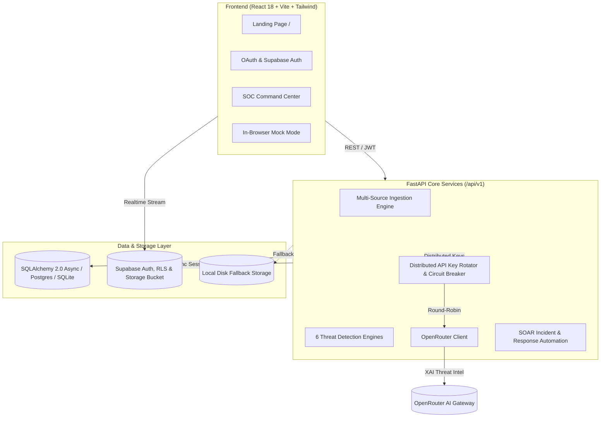

# 🛡️ CYBERGUARD — AI SOAR & Autonomous Threat Defense Platform

[](https://python.org)
[](https://fastapi.tiangolo.com)
[](https://reactjs.org)
[](https://vitejs.dev)
[](https://www.typescriptlang.org)
[](https://tailwindcss.com)
[](https://supabase.com)
[](https://openrouter.ai)
[](backend/scripts/run_all_tests.py)

**CYBERGUARD** is an enterprise-grade, next-generation Security Operations Center (SOC) and Security Orchestration, Automation, and Response (SOAR) platform. It ingests multi-vector telemetry (emails, URLs, messages, authentication telemetry, network flows, API traffic, and media files), analyzes them using a **hybrid detection engine** (transparent heuristics + ML models), produces **Explainable AI (XAI)** threat intelligence via **OpenRouter**, and enables real-time response actions through an interactive cyber defense command dashboard.

---

## ⚡ Key Capabilities & Platform Highlights

### 1. 🔍 6 Enterprise Threat Detection Engines
* **🎣 Phishing & Social Engineering**: Catches typo-squatted sender domains, high-urgency keywords, credential/banking harvesting triggers, body URL mismatches, and SMS spam patterns.
* **🔗 Malicious URL Forensics**: Identifies IP hosts, high-risk TLDs, brand-spoofing in subdomains, executable extensions, URLhaus patterns, and high-entropy randomized URLs.
* **🎭 Business Email Compromise (BEC) & Impersonation**: Pinpoints executive impersonation, wire transfer urgency, secrecy requests, and authority-claim language.
* **🔑 Account Takeover (ATO) & Identity Defense**: Flags impossible travel velocities (e.g. login from London and Tokyo within 10 minutes), credential stuffing bursts, and anomalous device fingerprints.
* **🌐 Network Flow & API Abuse**: Detects high-volume data exfiltration (>10MB), suspicious Command & Control (C2) ports (4444, 8888, 1337), burst 401s, and API token abuse.
* **🖼️ Deepfake & Media Forensics**: Evaluates image Error Level Analysis (ELA), video frame-sampling artifacts, and WAV audio signal anomalies with storage retention.

### 2. 🔄 Distributed OpenRouter API Key Rotation with Circuit Breaking
* **Distributed Round-Robin Load Balancing**: Evenly distributes LLM inference requests across up to **10 API keys** (configurable via `OPENROUTER_MAX_KEYS`), preventing hot-spotting and single-key rate exhaustion.
* **Active Circuit Breaker**: Automatically quarantines any API key that encounters an HTTP `429 Too Many Requests`, `401 Unauthorized`, `402 Payment Required`, or network timeout.
* **Free-Time Background Recovery**: Runs a non-blocking background loop that periodically probes downed keys (`GET https://openrouter.ai/api/v1/auth/key`) and seamlessly re-releases healthy keys back into the active rotation pool once cooldown expires.
* **Heuristic Offline Fallback**: Guarantees zero downtime by instantly generating deterministic heuristic explanations whenever all external LLM keys are exhausted or offline.

### 3. 🧠 Cohesive Explainable AI (XAI) Alignment
* Strict severity synchronization ensures that AI explanations never contradict the calculated risk score or severity band.
* Benign items receive verified safe status and clear indicators; high-risk alerts receive full MITRE ATT&CK mapping and step-by-step SOC mitigation steps.

### 4. 🏢 Dual-Mode Workspaces & Multi-Tenancy
* **Single-User Personal Workspace**: Users without an enterprise team seamlessly operate in their private workspace without requiring organization setup.
* **Team SOC RBAC**: Full organization multi-tenancy with Role-Based Access Control (`admin`, `analyst`, `viewer`), incident assignment, and workspace isolation.

### 5. 🛡️ Resilient Cloud & Local Media Storage
* High-availability media forensic storage utilizing Supabase Cloud Storage (`cyberguard-media` bucket) with automated runtime bucket provisioning.
* Seamless local filesystem fallback (`MEDIA_STORAGE_DIR=./uploads`) ensuring media forensics operational readiness in air-gapped or offline test environments.

### 6. 💻 Next-Gen Command Dashboard & Modern Landing Page
* **Landing Page (`/`)**: Hero showcases real-time telemetry metrics, detection capabilities, threat flow diagrams, and instant access to login.
* **SOC Command Dashboard (`/dashboard`)**: Threat distribution charts, live attack timelines, MITRE ATT&CK breakdown, incident escalation workflows, and audit logs.
* **Authentication**: Supabase Auth + OAuth (Google and GitHub sign-in) alongside password-based authentication and a standalone in-browser Mock mode.

---

## 🏗️ Architecture



---

## 🚀 Quick Start Guide

### Prerequisites
- Python 3.11+ (recommended: [`uv`](https://github.com/astral-sh/uv))
- Node.js 18+ & npm
- (Optional) Docker & Docker Compose

### 1. Backend Setup

```bash
cd backend

# Option A: With uv (ultra-fast)
uv venv
source .venv/bin/activate
uv pip install -e .

# Option B: Standard pip
python -m venv .venv && source .venv/bin/activate
pip install -r requirements.txt

# Configure environment
cp .env.example .env
# Edit .env to supply your OpenRouter key(s) and Supabase credentials

# Start backend server
uvicorn app.main:app --reload --port 8000
```
Backend API docs will be live at: [http://localhost:8000/docs](http://localhost:8000/docs)

### 2. Frontend Setup

```bash
cd frontend

# Install dependencies
npm install

# Configure environment
cp .env.example .env

# Run development server
npm run dev
```
Frontend will be live at: [http://localhost:5173](http://localhost:5173)

### 3. Docker Compose (One-Click)

```bash
docker compose up --build
```
- Frontend: [http://localhost:3000](http://localhost:3000)
- Backend: [http://localhost:8000](http://localhost:8000)

---

## 🧪 Testing & Verification

CYBERGUARD includes an end-to-end integration test runner covering database migrations, multi-tenancy, detection engines, and key rotation circuit breaking:

```bash
cd backend
uv run python scripts/run_all_tests.py
```

**Results (33/33 tests passing):**
```text
[Suite 1] Database Migrations & Multi-Tenancy
  ✔ PASS: Database tables created successfully
  ✔ PASS: Personal workspace auto-created for user without organization
  ✔ PASS: Personal workspace isolated per user
  ✔ PASS: Organization-level multi-tenancy functional

[Suite 2] Threat Ingestion & Analysis Services
  ✔ PASS: Email phishing detection flags credential harvesting
  ✔ PASS: Malicious URL detection flags IP hosts and suspicious TLDs
  ✔ PASS: Impersonation detection flags executive BEC wire transfers
  ✔ PASS: Account takeover detection flags impossible travel
  ✔ PASS: Network threat detection flags C2 ports and exfiltration
  ✔ PASS: SOAR response playbook creation and execution

[Suite 3] End-to-End API Integration
  ✔ PASS: GET /api/v1/health returns 200 Healthy
  ✔ PASS: POST /api/v1/analysis/email returns 200 with XAI explanation
  ✔ PASS: POST /api/v1/analysis/url returns 200
  ✔ PASS: POST /api/v1/analysis/impersonation returns 200
  ✔ PASS: POST /api/v1/analysis/account-takeover returns 200
  ✔ PASS: POST /api/v1/analysis/media returns 200 with storage path
  ✔ PASS: GET /api/v1/dashboard/summary returns 200 metrics

[Suite 4] API Key Rotation & Circuit Breaking
  ✔ PASS: Distributed round-robin rotation across active keys
  ✔ PASS: Circuit breaker bypasses downed key on HTTP 429
  ✔ PASS: Downed key automatically re-released after cooldown
```

Frontend production build verification:
```bash
cd frontend
npm run build
```

---

## ⚙️ Environment Configuration Reference

### Backend (`backend/.env`)

| Variable | Default | Description |
|---|---|---|
| `API_V1_PREFIX` | `/api/v1` | Root prefix for all API routes |
| `DATABASE_URL` | `sqlite+aiosqlite:///./cyberguard.db` | Async database URL (SQLite or PostgreSQL) |
| `SUPABASE_URL` | `https://YOUR-PROJECT.supabase.co` | Supabase project URL |
| `SUPABASE_ANON_KEY` | `your-anon-key` | Supabase anon key for client-scoped calls |
| `SUPABASE_SERVICE_ROLE_KEY` | `your-service-role-key` | Backend-only administrative key |
| `SUPABASE_STORAGE_BUCKET` | `cyberguard-media` | Cloud storage bucket for media analysis |
| `MEDIA_STORAGE_DIR` | `./uploads` | Local fallback storage directory |
| `OPENROUTER_API_KEY` | - | Primary OpenRouter API key |
| `OPENROUTER_API_KEYS` | - | Comma-separated list of keys for distributed rotation |
| `OPENROUTER_MAX_KEYS` | `10` | Maximum keys loaded into active rotation pool |
| `OPENROUTER_KEY_COOLDOWN_SECONDS` | `60` | Cooldown period for rate-limited keys |
| `OPENROUTER_HEALTH_CHECK_INTERVAL_SECONDS` | `30` | Interval to probe and re-release recovered keys |
| `OPENROUTER_MODEL` | `meta-llama/llama-3.1-8b-instruct:free` | LLM model for XAI generation |

### Frontend (`frontend/.env`)

| Variable | Default | Description |
|---|---|---|
| `VITE_API_BASE_URL` | `http://localhost:8000/api/v1` | Backend FastAPI endpoint |
| `VITE_USE_MOCK` | `false` | Enable/disable in-browser mock mode |
| `VITE_SUPABASE_URL` | `https://YOUR-PROJECT.supabase.co` | Supabase URL for Auth & OAuth |
| `VITE_SUPABASE_ANON_KEY` | `your-anon-key` | Supabase public anonymous key |

---

## 📁 Repository Structure

```
├── backend/
│   ├── app/
│   │   ├── ai/            # OpenRouter client, key rotator, prompt templates
│   │   ├── api/           # 12 FastAPI route modules (/api/v1)
│   │   ├── core/          # Config, security, storage, error handlers
│   │   ├── db/            # SQLAlchemy 2.0 async engine, models, migrations
│   │   ├── schemas/       # Pydantic schemas for all payloads
│   │   └── services/      # Heuristic detection engines & business logic
│   ├── docs/              # In-depth architectural & deployment guides
│   ├── ml/                # ML pipelines (XGBoost, CNN deepfake classifiers)
│   ├── scripts/           # Test suites, evaluation & demo runners
│   ├── pyproject.toml     # uv / pip dependency configuration
│   └── .env.example       # Documented backend environment variables
├── frontend/
│   ├── src/
│   │   ├── components/    # Common widgets, gauges, charts, layout
│   │   ├── pages/         # Landing Page, Dashboard, Phishing, ATO, etc.
│   │   ├── services/      # API client, HTTP interceptors, mock layer
│   │   ├── store/         # Zustand stores (Auth with OAuth, UI state)
│   │   └── types/         # TypeScript definitions
│   ├── package.json       # Frontend scripts and dependencies
│   └── .env.example       # Documented frontend environment variables
├── docker-compose.yml     # Multi-container orchestration
└── README.md              # Project documentation
```

---

## 🔒 Security & Privacy

* **Strict Key Protection**: The Supabase Service Role Key and OpenRouter API keys exist exclusively in `backend/.env` and are never returned or sent to client browsers.
* **Circuit Breakers**: Rate limit or billing errors are handled gracefully without leaking stack traces or credentials.
* **Audit Trail**: Every incident escalation and automated response action is logged with timestamp, user ID, and action parameters.

