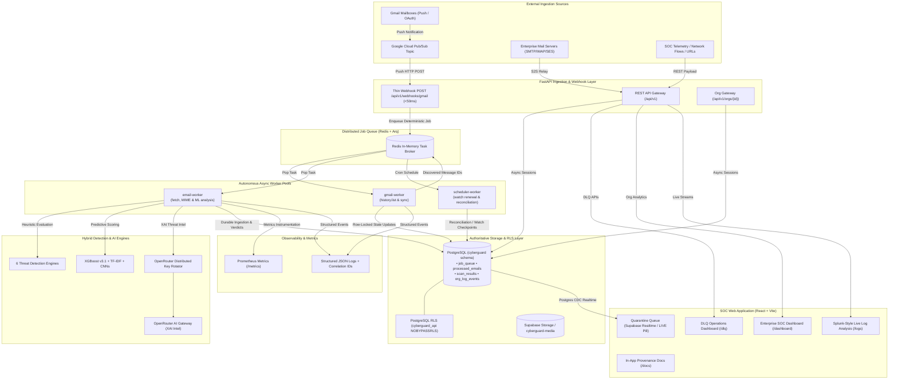
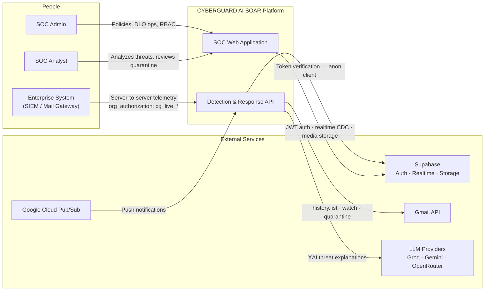
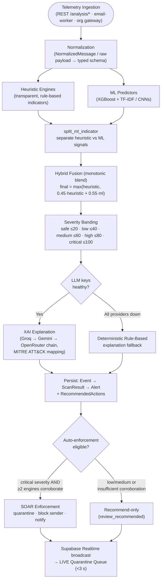
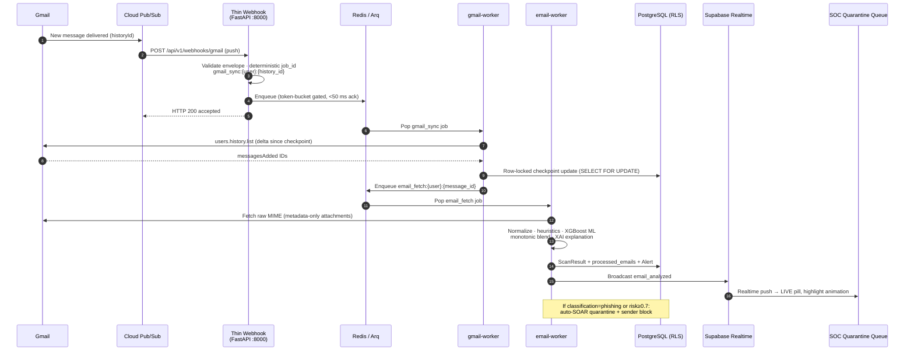
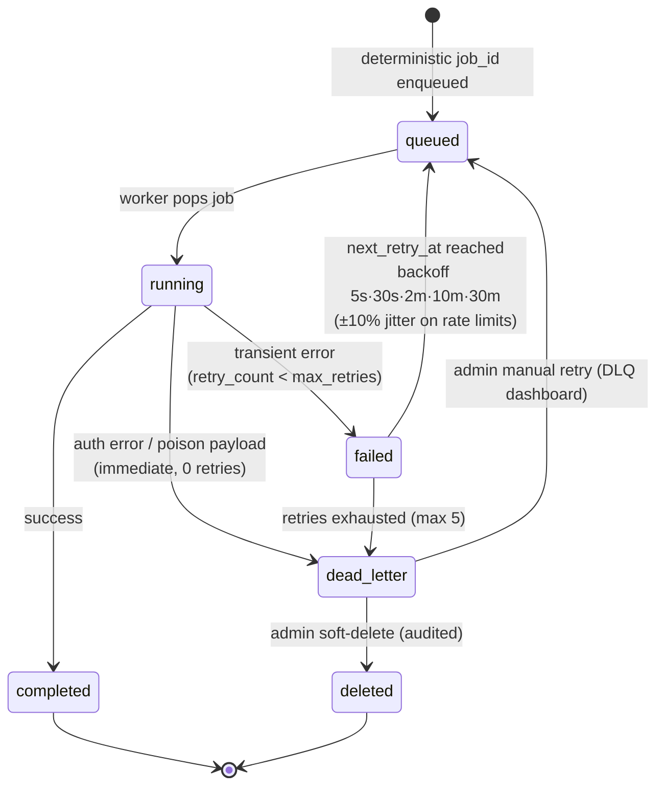
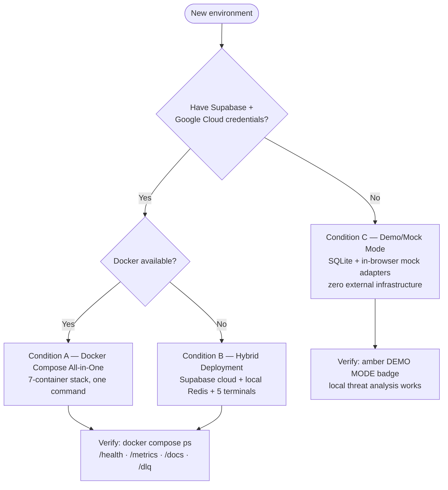
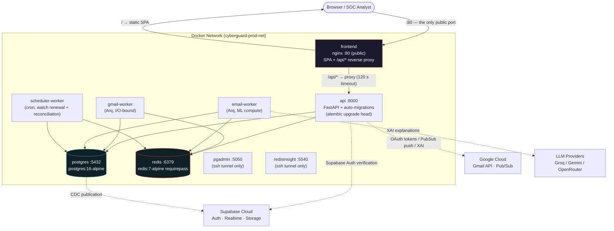

# 🛡️ CYBERGUARD — AI SOAR & Autonomous Threat Defense Platform

[](https://python.org)
[](https://fastapi.tiangolo.com)
[](https://reactjs.org)
[](https://vitejs.dev)
[](https://www.typescriptlang.org)
[](https://tailwindcss.com)
[](https://supabase.com)
[](https://redis.io)
[](https://openrouter.ai)
[](backend/scripts/run_all_tests.py)

**CYBERGUARD** is an enterprise-grade, next-generation Security Operations Center (SOC) and Security Orchestration, Automation, and Response (SOAR) platform. It ingests multi-vector telemetry (emails, URLs, messages, authentication telemetry, network flows, API traffic, and media forensics), analyzes them using a **hybrid detection engine** (transparent heuristics + high-performance ML models), produces **Explainable AI (XAI)** threat intelligence via **OpenRouter**, and executes real-time automated quarantine and response actions through an interactive cyber defense command center.

For comprehensive operational runbooks, disaster recovery, and troubleshooting, consult the [Operational Runbook (RUNBOOK.md)](RUNBOOK.md).
For a complete step-by-step walkthrough on configuring real-time Gmail inbox scanning and automated quarantine from scratch, see the [Real-Time Gmail Setup Guide (REALTIME_GMAIL_SETUP_GUIDE.md)](REALTIME_GMAIL_SETUP_GUIDE.md).

---

## 📚 Documentation Index

CYBERGUARD is documented as a linked knowledge base. Each document is the single source of truth for its domain and cross-references the others.

| Document | Audience | Purpose |
|---|---|---|
| [README.md](README.md) | Everyone | Platform overview, quickstart, verification |
| [ARCHITECTURE.md](ARCHITECTURE.md) | Engineers | Full system architecture, C4 views, component interactions, data flows |
| [THREAT_DETECTION_ENGINES.md](THREAT_DETECTION_ENGINES.md) | Detection / ML engineers | The 6 detection engines, heuristic catalogs, hybrid fusion, per-engine pipelines |
| [API_DOCUMENTATION.md](API_DOCUMENTATION.md) | Integrators, frontend devs | Complete REST surface, auth flows, error envelopes, rate limiting |
| [DATA_MODEL.md](DATA_MODEL.md) | Backend / DBA | Entity-relationship diagram, RLS policies, lifecycle & retention |
| [SECURITY_MODEL.md](SECURITY_MODEL.md) | Security / Compliance | Threat model, encryption, key rotation, audit, compliance mapping |
| [ML_MODELS.md](ML_MODELS.md) | ML engineers | Model cards, training pipelines, calibration, evaluation metrics |
| [WORKER_ARCHITECTURE.md](WORKER_ARCHITECTURE.md) | Platform / SRE | Arq worker pools, job state machine, retries, DLQ operations |
| [FRONTEND_ARCHITECTURE.md](FRONTEND_ARCHITECTURE.md) | Frontend devs | Routing, Zustand stores, realtime hooks, component hierarchy |
| [INTEGRATION_GUIDE.md](INTEGRATION_GUIDE.md) | Integrators / SOC | Gmail OAuth, Pub/Sub webhooks, org gateway, provider contract |
| [DEPLOYMENT_GUIDE.md](DEPLOYMENT_GUIDE.md) | DevOps | Docker Compose topologies, EC2 production, backup & recovery |
| [MONITORING_OBSERVABILITY.md](MONITORING_OBSERVABILITY.md) | SRE | Prometheus metrics catalog, structured logging, alerting workflows |
| [RUNBOOK.md](RUNBOOK.md) | On-call / SOC | Startup in every condition, schema recovery, troubleshooting |
| [DECISIONS.md](DECISIONS.md) | Architects | Append-only ADR log with rationale & consequences |
| [EC2_DEPLOY.md](EC2_DEPLOY.md) | DevOps | Single-instance AWS production deployment |
| [REALTIME_GMAIL_SETUP_GUIDE.md](REALTIME_GMAIL_SETUP_GUIDE.md) | Operators | Beginner-friendly Gmail real-time pipeline setup |

> Backend-specific deep dives also live in [`backend/docs/`](backend/docs/) (28 engineering documents covering RT-1..RT-10, ORG-1..ORG-5, DLQ ops, observability, and the database design), and the in-app `/docs` page renders provenance-verified operator documentation directly in the dashboard.

---

## ⚡ Key Capabilities & Platform Highlights

### 1. 🔍 6 Enterprise Threat Detection Engines + Hybrid ML
* **🎣 Phishing & Social Engineering**: Identifies typo-squatted domains, urgent call-to-actions, credential/banking harvesting forms, body URL mismatches, and SMS spam patterns using transparent heuristics blended monotonically with an XGBoost + TF-IDF email classifier (`max(heuristic, 0.45*heuristic + 0.55*ml)`).
* **🔗 Malicious URL Forensics**: High-speed forensic feature extractor evaluating IP hosts, high-risk TLDs, brand-spoofing in subdomains, executable extensions, URLhaus indicators, and randomized URL entropy paired with an **XGBoost v3.1 classifier** (trained on real phishing feeds, achieving 97%+ accuracy).
* **🎭 Business Email Compromise (BEC) & Impersonation**: Pinpoints executive impersonation, urgent wire transfer triggers, secrecy demands, and authority-claim phrasing with domain similarity analysis.
* **🔑 Account Takeover (ATO) & Identity Defense**: Flags impossible travel velocities (e.g. concurrent logins from London and Tokyo within 10 minutes), credential stuffing bursts, and anomalous device fingerprints.
* **🌐 Network Flow & API Abuse**: Detects high-volume data exfiltration (>10MB), suspicious Command & Control (C2) ports (`4444`, `8888`, `1337`), burst 401 unauthorized storms, and API token abuse.
* **🖼️ Deepfake & Media Forensics**: Evaluates image Error Level Analysis (ELA), video frame-sampling artifacts, and WAV audio spectral anomalies using custom PyTorch CNN classifiers with dual cloud/local retention.

### 2. ⚡ Real-Time Streaming Ingestion Pipeline (RT-1..RT-10)
* **Thin Webhook (<50ms acknowledgment)**: Ingests Google Cloud Pub/Sub push notifications, validates envelopes, creates deterministic job IDs, and dispatches to background queues without blocking on Gmail API calls.
* **Redis / Arq Distributed Task Processing**: Separates I/O-bound Gmail discovery (`gmail-worker`), compute-intensive forensic analysis (`email-worker`), and scheduled safety nets (`scheduler-worker`).
* **Durable Database Job Ledger**: PostgreSQL `job_queue` table acts as the durable authority alongside ephemeral Redis, tracking job lifecycle, output payloads, and retry schedules (`5s`, `30s`, `2m`, `10m`, `30m`).
* **Poison Message Isolation & DLQ**: Malformed MIME payloads or unrecoverable authentication errors route directly to `dead_letter` status without starving healthy queue workers.
* **Realtime UI + Polling Fallback**: Connects frontend Quarantine Queue to Supabase Realtime channels with an active green `LIVE` pill that gracefully degrades to 60-second polling (`POLLING`) if websockets drop.
* **Cloud-Native Observability**: Prometheus `/metrics` endpoint exports event counters, worker histograms, queue depth gauges, and DLQ tracking with structured JSON logging and correlation IDs.

### 3. 🏢 Enterprise Organization Plane (ORG-1..ORG-5)
* **Multi-Tenant Salted Organizations**: Salted organization slugs, header-based API keys (`X-Organization-Key`), and isolated organization gateway routing (`/api/v1/orgs/{org_id}`).
* **Splunk-Style Live Log Analytics**: High-density operational log viewer featuring live auto-refresh, regex/level search filtering, severity breakdowns, and analyst manual action triggers.
* **Server-to-Server Mail Connectors**: Enterprise infrastructure support for SMTP, IMAP, Microsoft Exchange, SendGrid, and Amazon SES with per-server logs and graceful disconnect workflows.
* **Role-Based Email Notification Groups**: Role-grouped recipient routing (`admin`, `analyst`, `viewer`) dynamically targeting high-severity alerts to designated on-call staff.
* **In-App Documentation & Provenance (`/docs`)**: Interactive architectural and operator documentation rendered directly within the dashboard with automated build-time provenance verification.

### 4. 🔄 Distributed OpenRouter Key Rotation with Circuit Breaking
* **Distributed Round-Robin Load Balancing**: Dispatches LLM inference requests across up to **10 API keys** (`OPENROUTER_MAX_KEYS`), preventing hot-spotting and single-key quota exhaustion.
* **Active Circuit Breaker**: Automatically quarantines any API key encountering HTTP `429 Too Many Requests`, `401 Unauthorized`, `402 Payment Required`, or network timeouts.
* **Autonomous Background Recovery**: Periodically probes downed keys (`GET https://openrouter.ai/api/v1/auth/key`) and seamlessly re-releases healthy keys back into rotation once cooldown expires.
* **Heuristic Offline Fallback**: Guarantees 100% platform availability by generating deterministic heuristic explanations whenever all external LLM keys are exhausted or offline.

### 5. 🛡️ Database Isolation & PostgreSQL Row-Level Security (RLS)
* **Dual-Role Security Architecture**: Backend runtime connects as `cyberguard_api` with `NOBYPASSRLS`, where row visibility is strictly governed by session-scoped `app.user_id` / `request.role` GUCs.
* **Migration Integrity**: Database migrations run exclusively under the administrative `postgres` role via Alembic, guaranteeing that application code can never drop schemas or bypass RLS policies.

---

## 🏗️ Platform Architecture



### System Context (C4 Level 1)

Who uses CYBERGUARD and which external systems it depends on:



### Threat Detection Pipeline (Ingestion → Analysis → Response)

Every telemetry vector — whether submitted interactively via the REST API, ingested by the real-time Gmail workers, or pushed through the organization gateway — flows through the same detection spine. This single-source-of-truth pipeline is what guarantees identical verdicts across all entry points:



> **Why monotonic fusion?** ML can raise but never lower a heuristic score. A transparent high-confidence heuristic verdict (e.g. an IP-hosted credential-harvesting URL) can never be overruled by a model's false negative, while genuine ML strength lifts weak heuristic scores. See [THREAT_DETECTION_ENGINES.md](THREAT_DETECTION_ENGINES.md).

### End-to-End Request Lifecycle (Real-Time Gmail Vector)



### Job Lifecycle State Machine



> The PostgreSQL `job_queue` table is the durable authority behind this state machine; Redis/Arq provides low-latency dispatch. Full mechanics in [WORKER_ARCHITECTURE.md](WORKER_ARCHITECTURE.md).

---

## 🚀 Quick Start Guide

CYBERGUARD supports three execution environments depending on your infrastructure requirements.

### Which Path Should I Take?



### Condition A: Docker Compose All-in-One (Recommended)

Spins up the entire ecosystem inside a unified Docker network (PostgreSQL, Redis, FastAPI backend, `gmail-worker`, `email-worker`, `scheduler-worker`, and static frontend).

```bash
# From repository root:
docker compose up -d --build

# Verify all services are healthy:
docker compose ps
# Expected services: postgres, redis, api, gmail-worker, email-worker, scheduler-worker, frontend
```

* **Frontend UI**: [http://localhost:5173](http://localhost:5173) (or [http://localhost:3000](http://localhost:3000))
* **Backend API & Swagger**: [http://localhost:8000/docs](http://localhost:8000/docs)
* **Prometheus Metrics**: [http://localhost:8000/metrics](http://localhost:8000/metrics)
* **DLQ Operations Console**: [http://localhost:5173/dlq](http://localhost:5173/dlq)

---

### Condition B: Hybrid Deployment (Supabase Cloud + Local Redis + 4 Terminals)

Connects to your Supabase Cloud PostgreSQL database while running local asynchronous workers and FastAPI development servers.

```bash
# 1. Start local Redis daemon:
redis-server --daemonize yes

# 2. Configure environment:
cp backend/.env.example backend/.env
# Supply your DATABASE_URL, MIGRATION_DATABASE_URL, SUPABASE_*, and OPENROUTER_* keys

# 3. Upgrade database schema to head:
cd backend
uv run alembic upgrade head

# 4. Terminal 1 — API Server (FastAPI):
uv run uvicorn app.main:app --host 127.0.0.1 --port 8000 --reload

# 5. Terminal 2 — Gmail Sync Worker (Discovers new messages from history deltas):
uv run arq app.workers.gmail_worker.WorkerSettings

# 6. Terminal 3 — Email Fetch & ML Analysis Worker (MIME parse + XGBoost scoring):
uv run arq app.workers.email_worker.WorkerSettings

# 7. Terminal 4 — Watch Renewal & Reconciliation Scheduled Worker:
uv run arq app.workers.scheduler_worker.WorkerSettings

# 8. Terminal 5 — Frontend Development Server:
cd ../frontend
npm install
npm run dev
```

---

### Condition C: Hackathon Demo / Mock Mode (Zero External Infrastructure)

Runs the application with zero external dependencies (no Redis, Google Cloud, or Supabase credentials required). Threat analysis operates locally with mock adapters and SQLite backend fallback.

```bash
# 1. Start backend in local SQLite mode:
cd backend
# In backend/.env: DATABASE_URL=sqlite+aiosqlite:///./cyberguard.db
uv run uvicorn app.main:app --host 127.0.0.1 --port 8000

# 2. Start frontend in mock demo mode:
cd ../frontend
# In frontend/.env: VITE_USE_MOCK=true
npm run dev
```
*The top header displays an amber `DEMO MODE` badge, and all threat analysis operates client-side with pre-calibrated forensic datasets.*

---

## 🧪 Testing & Verification

CYBERGUARD maintains a rigorous, multi-tier test suite validating database integrity, row-level security isolation, detection accuracy, and streaming worker orchestration:

### 1. Comprehensive 30-Suite Integration Test Harness (703 / 703 Green)

```bash
cd backend
uv run python scripts/run_all_tests.py
```

| Test Suite Group | Suites | Scope & Responsibilities | Passing Checks | Status |
|---|---|---|---|---|
| **Foundation Platform & Security** | Suites 1–16 | Database baseline, RLS user-plane isolation, cryptographic token vault, OAuth lifecycle, mailbox scanner, heuristic engines, SOAR response actions, and policy enforcement. | **398 / 398** | 100% Green |
| **Enterprise Organization Plane** | Suites 17–22 | Salted organization multi-tenancy (ORG-1), Splunk-style live log analytics (ORG-2), server-to-server mail connectors (ORG-3), notification groups (ORG-4), and realtime policy tightening (ORG-5). | **166 / 166** | 100% Green |
| **Real-Time Ingestion & Observability** | Suites 23–30 | Real-time models (RT-2), Pub/Sub push webhook (RT-3), sync worker (RT-4), fetch worker (RT-5), analysis worker (RT-6), realtime subscriptions (RT-7), watch renewal & reconciliation crons (RT-8), observability & Prometheus metrics (RT-9), and DLQ ops dashboard (RT-10). | **139 / 139** | 100% Green |
| **Total Comprehensive Platform** | **Suites 1–30** | **Complete end-to-end platform validation** | **703 / 703** | **100% Green** |

---

### 2. Pytest Forensic Evaluation Suite

Validates machine learning model calibrations, monotonic heuristic blends, and honeypot token security. Supports offline mode for disconnected evaluation:

```bash
# Standard evaluation suite (20 tests passed):
uv run pytest tests -v

# Air-gapped offline venue proof (zero network calls, 20 tests passed):
uv run pytest tests --offline -v
```

---

### 3. Frontend Production Build Verification

Ensures strict TypeScript compilation and production asset optimization:

```bash
cd frontend
npx tsc --noEmit && npm run build
```

---

## ⚡ Real-Time Email Security Pipeline (RT-1..RT-10)

CYBERGUARD features an asynchronous, event-driven streaming ingestion pipeline for enterprise email security, processing incoming messages with sub-second latency from initial Gmail delivery to SOC threat quarantine.

### Architecture & Data Flow

```text
  +-------------------+
  |   Gmail Mailbox   |  (Google Workspace / Personal Gmail)
  +---------+---------+
            | Push Notification (historyId)
            v
  +-------------------+
  |  Cloud Pub/Sub    |  (GCP Pub/Sub Topic)
  +---------+---------+
            | Push Webhook (<50ms acknowledgment)
            v
  +-------------------+
  |   Thin Webhook    |  POST /api/v1/webhooks/gmail (FastAPI)
  +---------+---------+
            | Enqueue Job (Deterministic ID)
            v
  +-------------------+
  |    Redis / Arq    |  (Distributed Async Job Broker)
  +---------+---------+
            |
      +-----+-----------------------+
      |                             |
      v                             v
+-------------+              +--------------+
| gmail-worker|              | email-worker |
| (Sync/List) |              | (Fetch/ML)   |
+------+------+              +-------+------+
       |                             |
       +--------------+--------------+
                      |
                      v
             +-----------------+
             | scheduler-worker| (Watch Renewal / Reconciliation)
             +--------+--------+
                      |
                      v
             +-----------------+
             |   PostgreSQL    | (Cyberguard Schema + RLS)
             +--------+--------+
                      | Postgres CDC
                      v
             +-----------------+
             |   Realtime UI   | (Supabase Realtime Channel + Live Pill)
             +-----------------+
```

### Core Features

* **Thin Webhook (<50ms)**: Fast-path receiver immediately validates Google Pub/Sub push envelopes, generates deterministic job IDs, and enqueues to Redis without blocking on Gmail API calls.
* **Deterministic Job IDs**: Prevents duplicate processing during concurrent Pub/Sub redeliveries (`gmail_sync:{account_id}:{history_id}` and `email_fetch:{account_id}:{message_id}`).
* **Poison Message Isolation → Dead Letter Queue (DLQ)**: Catches unrecoverable errors (e.g., malformed payloads, 401 unrecoverable OAuth revoke) and routes them straight to `dead_letter` status with full diagnostic error payloads.
* **Granular Retry Matrix**: Automated exponential backoff (5s, 30s, 2m, 10m, 30m) with jitter for transient network or rate-limit issues, preventing thundering herds.
* **Realtime UI + Polling Fallback**: Connects frontend Quarantine Queue via Supabase Realtime websocket subscriptions (`postgres_changes`), featuring an active `LIVE` indicator that gracefully degrades to a 60-second polling fallback (`POLLING`) if websockets drop.
* **Observability & Prometheus Metrics (`/metrics`)**: Production-grade Prometheus instrumentation exposing event counters, worker job histograms, queue depth gauges, and DLQ counters.
* **DLQ Operations Dashboard (`/dlq`)**: Administrator-restricted console providing KPI analytics, payload inspection, single-click retry re-enqueueing, and soft-delete capabilities.

### Deployment Architecture (Docker Compose)

How the 9 containers of the all-in-one stack relate — including which ports are public versus localhost-only:



> On EC2 production (`docker-compose.prod.yml`) every port except nginx :80 is bound to `127.0.0.1`; pgAdmin and RedisInsight are reachable only through an SSH tunnel. See [EC2_DEPLOY.md](EC2_DEPLOY.md) and [DEPLOYMENT_GUIDE.md](DEPLOYMENT_GUIDE.md).

---

## ⚙️ Environment Configuration Reference

### Backend (`backend/.env`)

| Variable | Default | Description |
|---|---|---|
| `API_V1_PREFIX` | `/api/v1` | Root prefix for all API routes |
| `DATABASE_URL` | `postgresql+asyncpg://cyberguard_api:...` | Application DSN connecting as `cyberguard_api` role (`NOBYPASSRLS`) |
| `MIGRATION_DATABASE_URL` | `postgresql+asyncpg://postgres:...` | Administrative DSN connecting as `postgres` for Alembic migrations |
| `REDIS_URL` | `redis://localhost:6379/0` | Redis connection URL for Arq distributed task queues |
| `SUPABASE_URL` | `https://YOUR-PROJECT.supabase.co` | Supabase project URL |
| `SUPABASE_ANON_KEY` | `your-anon-key` | Supabase anon key for client-scoped calls |
| `SUPABASE_SERVICE_ROLE_KEY` | `your-service-role-key` | Backend administrative key for auth lookup and storage provisioning |
| `SUPABASE_STORAGE_BUCKET` | `cyberguard-media` | Cloud storage bucket for media forensic analysis |
| `MEDIA_STORAGE_DIR` | `./uploads` | Local fallback storage directory for media forensics |
| `GOOGLE_GMAIL_CLIENT_ID` | - | Google Cloud OAuth Client ID for Gmail API mailbox access |
| `GOOGLE_GMAIL_CLIENT_SECRET` | - | Google Cloud OAuth Client Secret |
| `GMAIL_PUBSUB_TOPIC` | `projects/PROJECT/topics/cyberguard-gmail-events` | GCP Pub/Sub topic for mailbox push notifications |
| `CONNECTOR_TOKEN_KEY` | - | Fernet key for encrypting mailbox OAuth tokens at rest |
| `OPENROUTER_API_KEY` | - | Primary OpenRouter API key |
| `OPENROUTER_API_KEYS` | - | Comma-separated list of keys for distributed round-robin rotation |
| `OPENROUTER_MAX_KEYS` | `10` | Maximum keys loaded into active rotation pool |
| `OPENROUTER_KEY_COOLDOWN_SECONDS` | `60` | Cooldown period for rate-limited keys (HTTP 429) |
| `OPENROUTER_HEALTH_CHECK_INTERVAL_SECONDS` | `30` | Interval to probe and re-release recovered keys |
| `OPENROUTER_MODEL` | `liquid/lfm-2.5-2.6b:free` | Primary LLM model for XAI threat explanations |

### Frontend (`frontend/.env`)

| Variable | Default | Description |
|---|---|---|
| `VITE_API_BASE_URL` | `http://localhost:8000/api/v1` | Backend FastAPI endpoint |
| `VITE_USE_MOCK` | `false` | Enable/disable in-browser standalone demo mode |
| `VITE_SUPABASE_URL` | `https://YOUR-PROJECT.supabase.co` | Supabase project URL for Auth & Realtime websockets |
| `VITE_SUPABASE_ANON_KEY` | `your-anon-key` | Supabase public anonymous key |

---

## 📁 Repository Structure

```
├── backend/
│   ├── alembic/           # 7 versioned migrations (0001 consolidated baseline → 0013 rt models)
│   ├── app/
│   │   ├── ai/            # OpenRouter/Groq/Gemini client, distributed key rotator & prompts
│   │   ├── api/           # 26 registered FastAPI route modules (auth, analysis, orgs, dlq, webhooks)
│   │   ├── core/          # Security, crypto, retry policies, metrics & structured logging
│   │   ├── db/            # SQLAlchemy 2.0 async engine, models & admin sessionmaker
│   │   ├── schemas/       # Strict Pydantic v2 schemas for all payloads
│   │   ├── services/      # Threat detection engines, ML predictors & SOAR automation
│   │   └── workers/       # Asynchronous Arq worker definitions (gmail, email, scheduler)
│   ├── docs/              # Comprehensive engineering docs & RUNBOOK.md
│   ├── ml/                # ML pipelines (XGBoost v3.1, TF-IDF, PyTorch CNNs & calibration)
│   ├── scripts/           # 30-suite integration runner (run_all_tests.py) & DB utilities
│   ├── tests/             # Pytest evaluation suite (test_eval_*.py, reports & datasets)
│   ├── pyproject.toml     # uv / pip dependency configuration
│   └── .env.example       # Documented backend environment variables
├── frontend/
│   ├── src/
│   │   ├── components/    # Reusable widgets, threat gauges, MITRE matrix & live badges
│   │   ├── docs/          # In-app documentation provenance & markdown content
│   │   ├── hooks/         # Realtime subscription hooks (useRealtimeEmails, useOrgRealtime)
│   │   ├── pages/         # Landing, SOC Dashboard, DLQ, Log Analysis, Orgs & Connectors
│   │   ├── services/      # HTTP clients, interceptors & mock adapters
│   │   ├── store/         # Zustand stores (Auth, active org context, UI state)
│   │   └── types/         # Strict TypeScript domain interfaces
│   ├── package.json       # Frontend scripts and dependencies
│   └── .env.example       # Documented frontend environment variables
├── datasets/              # Forensic evaluation samples (phishing, URLs, media)
├── docker-compose.yml     # 7-container orchestration (postgres, redis, api, 3 workers, ui)
├── DECISIONS.md           # Append-only architectural decision log (ADRs)
├── RUNBOOK.md             # Single source of truth operational runbook
└── README.md              # Project overview, quickstart & verification guide
```

---

## 🔒 Security & Compliance Architecture

* **Database-Enforced Row-Level Security (RLS)**: User-plane isolation is enforced at the database layer via PostgreSQL RLS on the dedicated `cyberguard` schema. The backend application connects strictly as `cyberguard_api` (`NOBYPASSRLS`), preventing data leakage across workspaces even in the event of application-level query bugs.
* **Cryptographic Token Vault**: Google OAuth mailbox tokens are encrypted at rest using AES-256-GCM / Fernet cryptography (`CONNECTOR_TOKEN_KEY`) and are never exposed to client browsers.
* **Sensitive Telemetry Sanitization**: Structured JSON loggers intercept and mask OAuth access/refresh tokens (`ya29.*`, `1//*`), raw email bodies, and attachments before telemetry is emitted to central sinks.
* **Tamper-Evident Audit Logging**: Every incident escalation, automated SOAR action, manual analyst triage, and DLQ retry/delete is immutably logged with actor attribution (`user` vs `system`), timestamps, and parameters.
