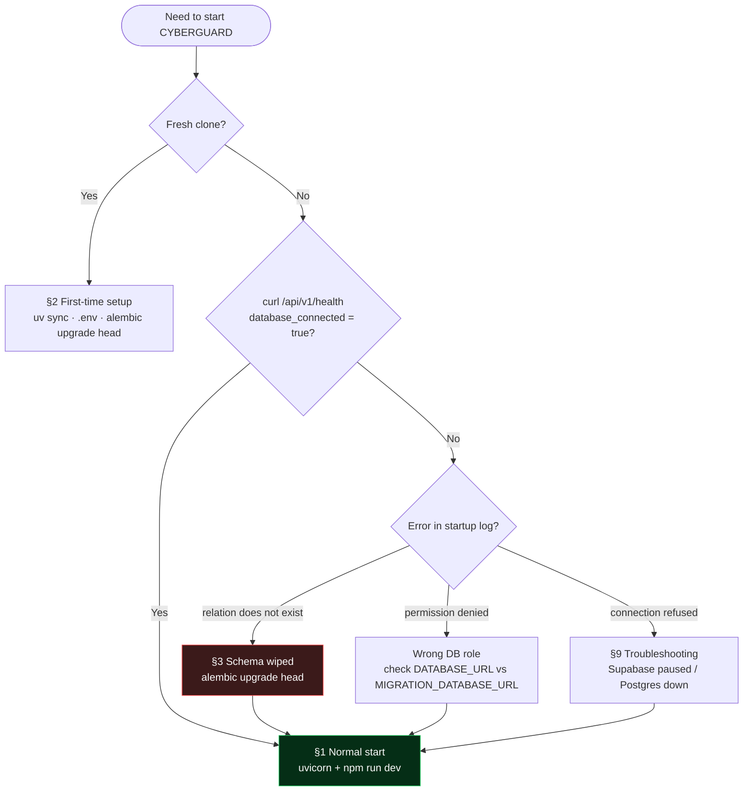
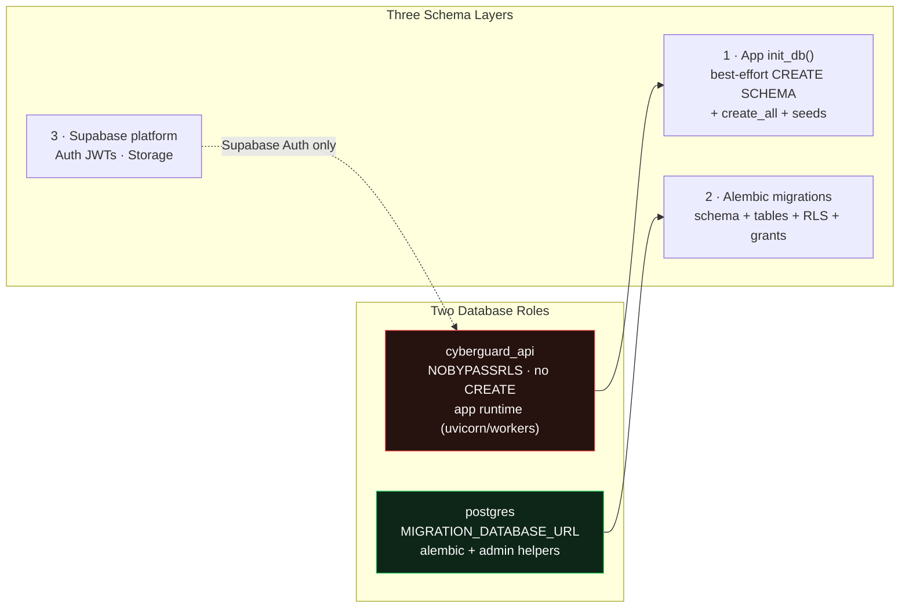
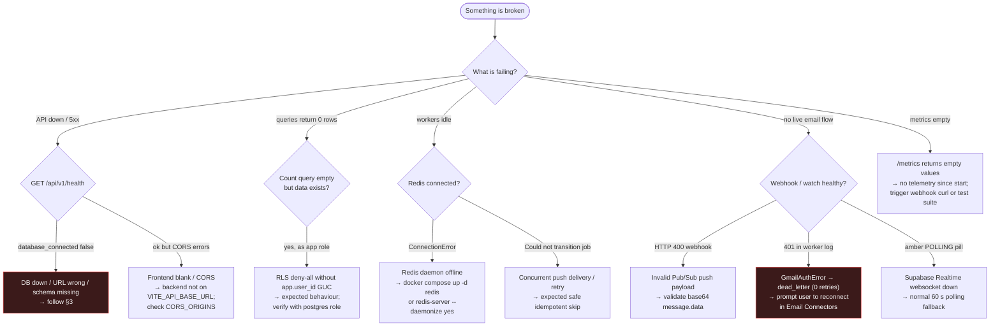
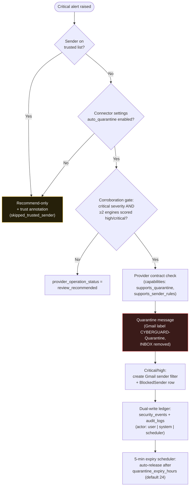
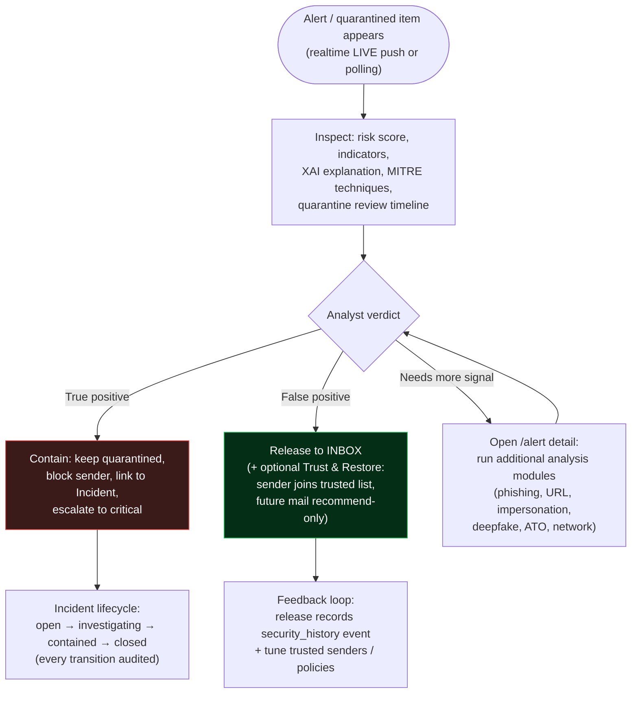
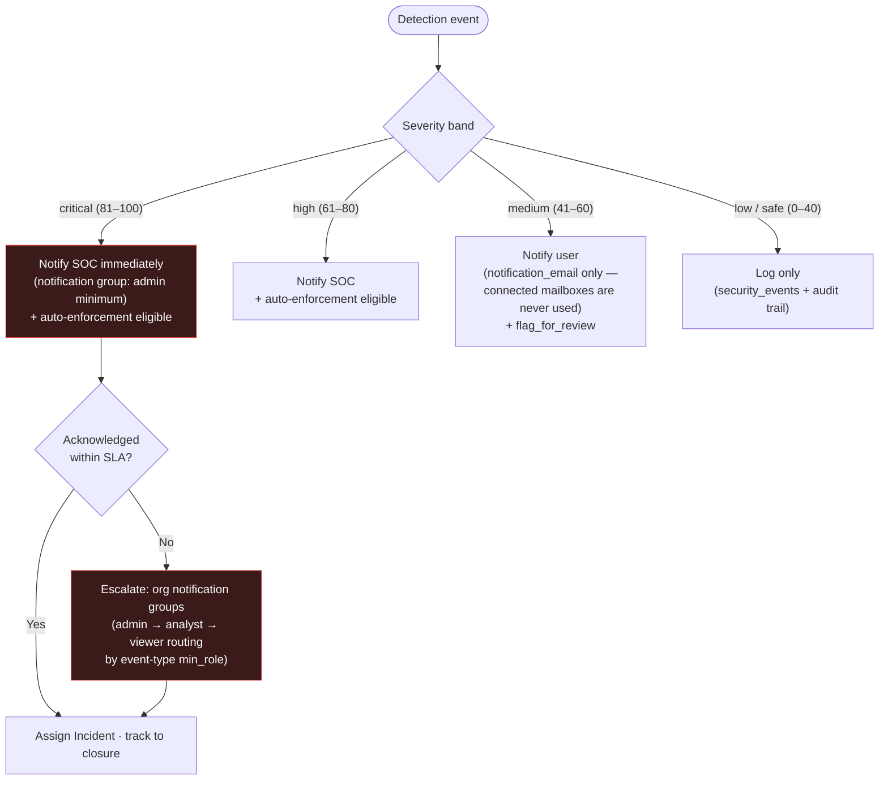
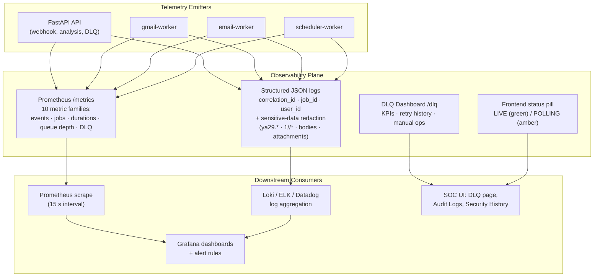

# CYBERGUARD Runbook — How to Start the App in Every Condition

This is the single source of truth for starting CYBERGUARD against any state
of the database — healthy, empty, freshly-wiped, or wrong-role. It reflects
the **from-scratch baseline migration** (`alembic/versions/0001_cyberguard_baseline.py`)
and the self-healing bootstrap in `app/db/session.py` + `alembic/env.py`.

## Table of Contents

| § | Section | Purpose |
|---|---|---|
| 0 | The mental model | Two DB roles, three schema layers, key facts |
| 1 | Normal start | Day-to-day startup (backend + frontend) |
| 2 | First-time setup | Fresh clone → running stack |
| 3 | Schema was deleted / wiped | The RLS/schema recovery incident |
| 4 | Full reset from scratch | Drop everything, rebuild |
| 5 | Local-only mode without Supabase | SQLite local mode |
| 6 | Demo / mock mode | Frontend-only hackathon mode |
| 7 | Tests / evaluation harness | pytest + offline mode |
| 8 | Retraining the URL model | v3 / v3.1 pipelines |
| 9 | Troubleshooting quick reference | Symptom → cause → action table + decision tree |
| 10 | Real-Time Pipeline Startup | Conditions A/B/C for the RT stack |
| 11 | Database Reset | Clean-slate procedure with verification |
| 12 | Real-Time Pipeline Verification | End-to-end health checks |
| 13 | Test Metrics & Suite Verification Summary | 30-suite harness results |
| 14 | Incident Response Workflow | Detection → triage → containment → closure flowcharts |
| 15 | Escalation Procedure | Severity-based escalation paths |
| 16 | Monitoring Architecture | Health, metrics, logs, and alert routing overview |

---

## 0. The mental model (read this once)

There are **two database roles** and **three layers of schema creation**:

| Layer | Role | What it does |
|---|---|---|
| App runtime (`uvicorn`) | `cyberguard_api` (NOBYPASSRLS, no CREATE priv) | `init_db()` → best-effort `CREATE SCHEMA IF NOT EXISTS cyberguard` (skipped silently if the role lacks CREATE), then `create_all()` from ORM metadata + seeds the response catalog |
| Migrations (`alembic`) | `postgres` (MIGRATION_DATABASE_URL) | `env.py` ensures the schema exists, then `0001_cyberguard_baseline` creates **all tables from the live ORM metadata** (baseline + `0008_org_foundation`), installs roles, **RLS policies**, and grants |
| Google Supabase | — | Auth (JWTs), storage. The Postgres DB itself is a plain Postgres database |

**Rule of thumb:** the app can heal *tables* by itself; only alembic can heal
*schema + RLS*. If the schema was wiped, run alembic (section 3).

Key facts you will need:

- Backend venv & commands always run from `backend/` with `uv run …`.
- `DATABASE_URL` (app, role `cyberguard_api`) and `MIGRATION_DATABASE_URL`
  (migrations, role `postgres`) both live in `backend/.env`.
- The migration bookkeeping table is `public.alembic_version` (owned by
  `postgres`). If migrations were reset, drop it first (section 3).
- If a count query "returns 0" for a table you know has data, it is almost
  always **RLS**, not emptiness — `cyberguard_api` is NOBYPASSRLS and sees
  nothing without the `app.user_id` GUC. Verify with the `postgres` role.

Health check: `curl http://127.0.0.1:8000/api/v1/health` →
`{"status":"ok","database_connected":true,...}`.
(`supabase_connected:false` refers to Storage and does not block the API.)

### Startup Decision Tree

Which startup path applies to your current situation:



### Database Role & Access Model



> **Rule of thumb:** the app can heal *tables* by itself; only alembic can heal
> *schema + RLS*. If the schema was wiped, run alembic (section 3).

---

## 1. Normal start (everything already set up)

```bash
# Terminal 1 — backend (from repo root)
cd backend
uv run uvicorn app.main:app --host 127.0.0.1 --port 8000

# Terminal 2 — frontend (from repo root)
cd frontend
npm run dev          # → http://localhost:5173
```

Verify:

```bash
curl http://127.0.0.1:8000/api/v1/health          # database_connected: true
curl -s -o /dev/null -w "%{http_code}" http://localhost:5173/   # 200
```

---

## 2. First-time setup (fresh clone)

```bash
cd backend
uv sync                        # create .venv from uv.lock
cp .env.example .env           # then fill in DATABASE_URL / MIGRATION_DATABASE_URL /
                               # SUPABASE_* / GOOGLE_GMAIL_* / LLM keys
uv run alembic upgrade head    # schema + all tables (incl. 0008 org tables) + RLS + grants + roles
uv run uvicorn app.main:app --host 127.0.0.1 --port 8000

cd ../frontend
npm install
npm run dev
```

On first boot the app seeds `cyberguard.response_catalog` (10 actions) and a
default enforcement policy per organization (no-op when no orgs exist).

---

## 3. Schema was deleted / wiped (the incident)

**Symptoms:** `relation "cyberguard.users" does not exist`, or
`permission denied for database postgres` in the startup log, or every table
missing. The app's `init_db()` will rebuild *tables* automatically — but only
if the *schema* exists or the connecting role can create it. The app role
cannot create schemas, so do:

```bash
cd backend
uv run alembic upgrade head
```

That's it. The baseline migration is error-tolerant and idempotent:

1. `CREATE SCHEMA IF NOT EXISTS "cyberguard"` — schema recreated automatically.
2. All tables created from the live SQLAlchemy models (`checkfirst=True`,
   so partially-existing tables never fail).
3. Roles `cyberguard_api` / `authenticated` created only when missing.
4. RLS enabled on all tables + owner-scoped policies keyed on `app.user_id`.
5. Grants re-issued defensively.

Then restart the backend (section 1).

### If `alembic upgrade head` itself fails

| Error | Meaning | Fix |
|---|---|---|
| `must be owner of table alembic_version` | you ran alembic with the app role, or a stale bookkeeping table exists owned by another role | run migrations with `MIGRATION_DATABASE_URL` (role `postgres`); `DROP TABLE IF EXISTS public.alembic_version` as that role |
| `permission denied for database postgres` | connecting as `cyberguard_api` (app role) | point `alembic` at `MIGRATION_DATABASE_URL` |
| `role "cyberguard_api" does not exist` | fresh Supabase project | not an error — the baseline creates it |
| `can't adapt …` / connection refused | Supabase paused or URL typo | check `MIGRATION_DATABASE_URL`, revive the project in the Supabase dashboard |

---

## 4. Full reset from scratch (delete everything, rebuild)

**Destroys all data.** Use the dedicated drop script
(`backend/scripts/drop_cyberguard_schema.py`) — it deletes all RLS
policies, all tables, the schema itself, and the migration bookkeeping,
with a dry-run plan, role-ownership guards and a typed confirmation:

```bash
cd backend
uv run python scripts/drop_cyberguard_schema.py --dry-run   # see exactly what goes
uv run python scripts/drop_cyberguard_schema.py --yes       # actually drop it

# Rebuild everything from the single baseline, then start (section 1);
# first boot re-seeds the response catalog.
uv run alembic upgrade head
```

Expected result: `alembic current` → `0001_cyberguard_baseline (head)`;
26 tables in `cyberguard` (24 baseline + 2 ORG-1 org tables), all with `rowsecurity = true`, 96 policies (as of migration `0008_org_foundation`).

Safety behaviour of the drop script:

- connects with `MIGRATION_DATABASE_URL` (role `postgres`) and **refuses to
  run** as the app role (`cyberguard_api`) or a non-owner of the schema;
- `--dry-run` prints every table and its policy count without deleting;
- without `--yes` it demands the typed phrase `DROP cyberguard`;
- prints a post-state verification line when finished.

---

## 5. Local-only mode without Supabase (SQLite)

`app/db/session.py` builds a `sqlite+aiosqlite` engine when `DATABASE_URL`
is a SQLite URL and translates the `cyberguard` schema away automatically
(`schema_translate_map`). RLS is a Postgres feature — SQLite runs without it
(fine for local checks and the test suite).

```bash
cd backend
# .env: DATABASE_URL=sqlite+aiosqlite:///./cyberguard.db
uv run uvicorn app.main:app --host 127.0.0.1 --port 8000
```

`init_db()` creates all tables + seeds on first boot; no alembic needed.

---

## 6. Demo / mock mode (frontend only, no backend at all)

`frontend/.env.local`: set `VITE_USE_MOCK` to anything other than `'false'`
(or delete the key). The frontend runs entirely on the in-browser mock API —
enforcement actions are disabled and labelled "DEMO MODE". This is the
hackathon-demo safe path; it never touches the real database.

For the real stack: `VITE_USE_MOCK=false` + `VITE_API_BASE_URL=http://127.0.0.1:8000`.

---

## 7. Tests / evaluation harness

```bash
cd backend
uv run pytest tests/ -q          # full suite (20 tests, ~95s)
uv run pytest tests/test_eval_url.py -v      # single engine eval
uv run pytest tests/ -q --offline            # no network fetches (cached data only)
```

The suite runs against SQLite (RLS not exercised there). Frontend has no unit
test runner — verify with `npx tsc --noEmit` (typecheck) and a manual pass
against the running stack.

---

## 8. Retraining the URL model (v3 / v3.1)

```bash
cd backend
uv run python ml/scripts/train_url_v3.py        # v3  → ml/models/url_xgb_v3.pkl
uv run python ml/scripts/train_url_v3.py v3.1   # v3.1 → ml/models/url_xgb_v3.1.pkl
```

Downloads the real phishing feed once (~60 MB, cached in `ml/data/cache/`,
gitignored). Switch the served model via `ml/models/calibration.json`
→ `url_model_version` (`v3.1` | `v3` | `v2`); the loader falls back
gracefully when an artifact is missing.

---

## 9. Troubleshooting quick reference

### Symptom Decision Tree

Work top-to-bottom: the first matching branch names the row in the table below
that resolves the symptom.



| Symptom | Cause | Action |
|---|---|---|
| `database_connected: false` in /health | DB down / URL wrong / schema missing | follow section 3 |
| App role queries return 0 rows unexpectedly | RLS deny-all without `app.user_id` GUC | expected behaviour; verify with `postgres` role |
| Startup log: `lacks CREATE privilege — skipping schema bootstrap` | app role cannot create schemas (by design) | run `uv run alembic upgrade head` once |
| `supabase_connected: false` | Storage bucket/key issue | check `SUPABASE_*` keys; API still works |
| Frontend blank / CORS errors | backend not on `VITE_API_BASE_URL` | start backend, check `CORS_ORIGINS` in backend/.env |
| Port already in use | stale server | `kill $(lsof -t -i:8000)` / `-i:5173` |
| `redis.exceptions.ConnectionError` | Redis daemon offline or wrong port | Start Redis via `docker compose up -d redis` or local `redis-server --daemonize yes` |
| Webhook returns HTTP 400 (`Invalid Pub/Sub push message payload`) | Missing `message.data` base64 payload or non-JSON content | Validate Google Pub/Sub push payload format matches `{"message": {"data": "<base64>"}}` |
| Worker log: `Could not transition job ... to 'running'` | Idempotent transition from concurrent push delivery or retry | Expected safe behavior; state machine safely skips redundant duplicate execution |
| Frontend status pill shows amber `POLLING` instead of green `LIVE` | Supabase Realtime websocket disconnected or offline keys | Normal graceful fallback; 60s background polling is active and maintaining freshness automatically |
| `GmailAuthError: 401 Unauthorized` in worker logs | OAuth token expired or revoked by mailbox owner | Job immediately transitions to `dead_letter` (0 retries); prompt user to reconnect in Email Connectors |
| `/metrics` Prometheus endpoint returns empty values | No telemetry processed since worker pool start | Trigger webhook curl or run test suite to populate Prometheus counter and histogram collectors |

---

## 10. Real-Time Pipeline Startup (RT-1..RT-10)

> 📖 **For a beginner-friendly, step-by-step setup guide covering Google Cloud Console, OAuth, Pub/Sub, and Cloudflare tunnels**, see [REALTIME_GMAIL_SETUP_GUIDE.md](REALTIME_GMAIL_SETUP_GUIDE.md).

The real-time ingestion pipeline consists of a thin webhook receiver (<50ms response), Redis/Arq distributed queues, and 3 specialized background worker pools (`gmail-worker`, `email-worker`, `scheduler-worker`).

### Condition A: Full Production Docker Stack (All-in-One Containerized Deployment)

Runs PostgreSQL, Redis, FastAPI backend, all 3 background workers (`gmail-worker`, `email-worker`, `scheduler-worker`), the built React SPA frontend, pgAdmin 4, and RedisInsight:

```bash
# From repository root:
docker compose -f docker-compose.prod.yml up -d --build
# Or simply:
docker compose up -d --build

# Verify all services are healthy:
docker compose ps

# Web Services:
#   Frontend SPA : http://localhost:3000
#   FastAPI Docs : http://localhost:8000/docs
#   pgAdmin 4    : http://localhost:5050  (admin@cyberguard.org / admin)
#   RedisInsight : http://localhost:5540
```

### Condition B: Dependencies-Only (Postgres + Redis + pgAdmin + RedisInsight)

Runs **only** the infrastructure dependencies in Docker while you develop and run the backend, workers, and frontend directly on your local machine:

```bash
# Start infrastructure dependencies:
docker compose -f docker-compose.deps.yml up -d

# Verify dependencies are healthy:
docker compose -f docker-compose.deps.yml ps
# Services running:
#   PostgreSQL   : localhost:5432 (User: postgres, Password: postgres, DB: cyberguard)
#   Redis        : localhost:6379
#   pgAdmin 4    : http://localhost:5050  (admin@cyberguard.org / admin)
#   RedisInsight : http://localhost:5540
```

Then run your local processes:

```bash
# Ensure local Redis is listening on 127.0.0.1:6379
redis-server --daemonize yes

# Terminal 1 — API Server (FastAPI)
cd backend
uv run uvicorn app.main:app --host 127.0.0.1 --port 8000 --reload

# Terminal 2 — Gmail Sync Worker (Discovers new messages from history.list)
cd backend
uv run arq app.workers.gmail_worker.WorkerSettings

# Terminal 3 — Email Fetch & Analysis Worker (MIME parse + XGBoost ML scoring)
cd backend
uv run arq app.workers.email_worker.WorkerSettings

# Terminal 4 — Scheduled Watch Renewal & Reconciliation Worker
cd backend
uv run arq app.workers.scheduler_worker.WorkerSettings

# Terminal 5 — Frontend Dev Server
cd frontend
npm run dev
```

### Condition C: Hackathon Demo / Mock Mode (Zero External Infrastructure)

Runs frontend with client-side mock adapters and SQLite backend fallback. No Redis, Google Cloud, or Supabase credentials required.

```bash
# 1. Start backend in local SQLite mode (optional):
cd backend
# in backend/.env: DATABASE_URL=sqlite+aiosqlite:///./cyberguard.db
uv run uvicorn app.main:app --host 127.0.0.1 --port 8000

# 2. Start frontend in mock demo mode:
cd frontend
# in frontend/.env: VITE_USE_MOCK=true
npm run dev
```
*The top header displays an amber `DEMO MODE` badge, and all threat analysis operates locally.*

---

## 11. Database Reset (Clean Slate Procedure)

When restoring the database to a verified pristine state (Supabase dev project or local PostgreSQL), follow this exact procedure:

```bash
cd backend

# 1. Check pre-wipe counts:
uv run python -c "
import asyncio
from sqlalchemy import text
from app.db.admin import _get_admin_session_maker
async def check():
    async with _get_admin_session_maker()() as s:
        t = (await s.execute(text(\"SELECT count(*) FROM information_schema.tables WHERE table_schema='cyberguard';\"))).scalar()
        p = (await s.execute(text(\"SELECT count(*) FROM pg_policies WHERE schemaname='cyberguard';\"))).scalar()
        print(f'Pre-wipe: tables={t}, policies={p}')
asyncio.run(check())
"

# 2. Wipe cyberguard application schema and alembic bookkeeping (DO NOT touch auth.users):
uv run python -c "
import asyncio
from sqlalchemy import text
from app.db.admin import _get_admin_session_maker
async def wipe():
    async with _get_admin_session_maker()() as s:
        await s.execute(text('DROP SCHEMA IF EXISTS cyberguard CASCADE;'))
        await s.execute(text('DROP TABLE IF EXISTS public.alembic_version;'))
        await s.commit()
        print('Wipe complete.')
asyncio.run(wipe())
"

# 3. Re-run migrations to rebuild baseline + RT pipeline models:
uv run alembic upgrade head
# Expected revision: 0013_rt_pipeline_models (head)

# Clean up baseline app_all fallback policies on org tables (replaced by granular scoped policies):
uv run python -c "
import asyncio
from sqlalchemy import text
from app.db.admin import _get_admin_session_maker

POLICIES_TO_PRUNE = [
    ('organization_api_keys', 'organization_api_keys_app_all'),
    ('org_mail_servers', 'org_mail_servers_app_all'),
    ('org_mail_server_settings', 'org_mail_server_settings_app_all'),
    ('org_mail_server_logs', 'org_mail_server_logs_app_all'),
    ('org_notification_emails', 'org_notification_emails_app_all'),
    ('org_notification_settings', 'org_notification_settings_app_all'),
    ('organization_settings', 'organization_settings_app_all'),
    ('org_notification_logs', 'org_notification_logs_app_all'),
    ('org_log_events', 'org_log_events_app_all'),
]
async def prune():
    async with _get_admin_session_maker()() as s:
        for tbl, pol in POLICIES_TO_PRUNE:
            await s.execute(text(f'DROP POLICY IF EXISTS {pol} ON cyberguard.{tbl};'))
        await s.commit()
asyncio.run(prune())
"

# 4. Verify post-wipe state (37 tables, 132 policies, 0 rows in job_queue):
uv run python -c "
import asyncio
from sqlalchemy import text
from app.db.admin import _get_admin_session_maker
async def verify():
    async with _get_admin_session_maker()() as s:
        t = (await s.execute(text(\"SELECT count(*) FROM information_schema.tables WHERE table_schema='cyberguard';\"))).scalar()
        p = (await s.execute(text(\"SELECT count(*) FROM pg_policies WHERE schemaname='cyberguard';\"))).scalar()
        jq = (await s.execute(text('SELECT count(*) FROM cyberguard.job_queue;'))).scalar()
        print(f'Post-wipe: tables={t}, policies={p}, job_queue_rows={jq}')
asyncio.run(verify())
"
```

---

## 12. Real-Time Pipeline Verification

Verify all ingestion, worker execution, metrics export, and UI components end-to-end:

### 1. Health & Database Connectivity
```bash
curl -s http://127.0.0.1:8000/health | jq .
curl -s http://127.0.0.1:8000/api/v1/health | jq .
# Expected: {"status":"ok","database_connected":true}
```

### 2. Prometheus Metrics Export
```bash
curl -s http://127.0.0.1:8000/metrics | grep gmail_events
curl -s http://127.0.0.1:8000/api/v1/metrics | grep gmail_events
# Expected Prometheus lines:
# gmail_events_received_total ...
# gmail_sync_jobs_total ...
# dead_letter_jobs_total ...
```

### 3. Pub/Sub Push Webhook Simulation
Simulate a Google Cloud Pub/Sub push notification with base64 encoded JSON (`{"emailAddress":"test@gmail.com","historyId":"12345"}`):

```bash
curl -X POST http://127.0.0.1:8000/api/v1/webhooks/gmail \
  -H "Content-Type: application/json" \
  -d '{
    "message": {
      "data": "eyJlbWFpbEFkZHJlc3MiOiJ0ZXN0QGdtYWlsLmNvbSIsImhpc3RvcnlJZCI6IjEyMzQ1In0=",
      "messageId": "msg-sim-001",
      "publishTime": "2026-09-16T12:00:00Z"
    }
  }'
# Expected response: HTTP 200 with {"status":"accepted","job_id":"gmail_sync:..."} within <50ms
# Followed by worker log trace:
#   [gmail_worker] Processed history notification for test@gmail.com
#   [email_worker] Fetched and analyzed message msg-123
```

### 4. Realtime UI Pill & DLQ Dashboard
- Open browser to `http://localhost:5173/quarantine`. Verify the top-right status pill indicates a pulsing green `LIVE` indicator.
- Open `http://localhost:5173/dlq` as an administrator. Verify KPI stats cards (Total Dead Letters, Oldest Age, Breakdown by Job Type) and interactive retry/delete drawer render cleanly.

---

## 13. Test Metrics & Suite Verification Summary

CYBERGUARD maintains a comprehensive 30-suite test harness executed via `uv run python scripts/run_all_tests.py`:

| Test Suite Group | Suite Numbers | Scope & Core Responsibilities | Passing Checks | Status |
|---|---|---|---|---|
| **Foundation Platform & Security** | Suites 1–16 | Baseline database schema, RLS user-plane isolation, cryptographic token vault, OAuth lifecycle, mailbox scanner, heuristic engines, SOAR response actions, and policy enforcement. | 398 / 398 | 100% Green |
| **Enterprise Organization Plane** | Suites 17–22 | Salted organization multi-tenancy (ORG-1), Splunk-style live log analytics (ORG-2), server-to-server mail connectors (ORG-3), notification groups (ORG-4), and realtime policy tightening (ORG-5). | 166 / 166 | 100% Green |
| **Real-Time Ingestion & Observability** | Suites 23–30 | Real-time models (RT-2), Pub/Sub push webhook (RT-3), sync worker (RT-4), fetch worker (RT-5), analysis worker (RT-6), realtime subscriptions (RT-7), watch renewal & reconciliation crons (RT-8), observability & Prometheus metrics (RT-9), and DLQ ops dashboard (RT-10). | 139 / 139 | 100% Green |
| **Total Comprehensive Platform** | **Suites 1–30** | **Complete end-to-end platform validation** | **703 / 703** | **100% Green** |

---

## 14. Incident Response Workflow

When CYBERGUARD raises a critical alert, the SOAR automation and the human
analyst operate on the same incident object. The flowcharts below describe the
two halves of that workflow and how they hand off.

### Automated Response Flow (SOAR)



### Analyst Triage Flow (Human Half)



Incident status transitions are validated server-side
(`open → investigating → contained → closed`) and every escalation, assignment,
and manual action is written to `audit_logs` with actor attribution.

---

## 15. Escalation Procedure

Escalation is driven by severity bands (risk score 0–100) and the enforcement
policy's notification routing (`notify_soc_on_critical/high`,
`notify_user_on_medium`):



Organization notification routing (ORG-4) resolves recipients by role group:
each event type declares a **minimum role** — `admin` events reach admins only,
`analyst` events reach analysts + admins, and `viewer` events reach everyone.
Defaults: `server_down` / `mail_server_down` / `critical_log` → analyst;
`impersonation` (brand-sensitive) → admin only.

---

## 16. Monitoring Architecture

CYBERGUARD's observability spans four planes. The `/metrics` endpoint exports
Prometheus counters, histograms, and gauges; structured JSON logs with
correlation IDs bind distributed worker traces together; the DLQ dashboard
surfaces dead-letter backlog; and the frontend's LIVE/POLLING pill reports
realtime channel health.



### Health Verification Checklist

| Plane | Command / Surface | Healthy Signal |
|---|---|---|
| Liveness | `curl http://127.0.0.1:8000/api/v1/health` | `{"status":"ok",...}` |
| Readiness (DB + Redis) | `curl http://127.0.0.1:8000/api/v1/ready` | HTTP 200, both dependencies pass |
| Metrics | `curl -s :8000/metrics \| grep gmail_events` | Counter lines present and increasing |
| Queue depth | `queue_depth{queue_name=...}` gauge | Near-zero in steady state |
| DLQ backlog | `GET /api/v1/dlq/stats` | `total_dead_letter` stable / trending down |
| Realtime | Quarantine page status pill | Pulsing green `LIVE` (amber `POLLING` = degraded but fresh) |
| Workers | `docker compose logs -f email-worker` | Job completions, no repeated `dead_letter` transitions |

Alert rule recommendations: page on sustained `dead_letter_jobs_total` growth,
`queue_depth` above the worker drain rate for >10 minutes, and
`gmail_api_errors_total{error_type="rate_limit"}` spikes (quota exhaustion).
Full metric catalog: [MONITORING_OBSERVABILITY.md](MONITORING_OBSERVABILITY.md).
