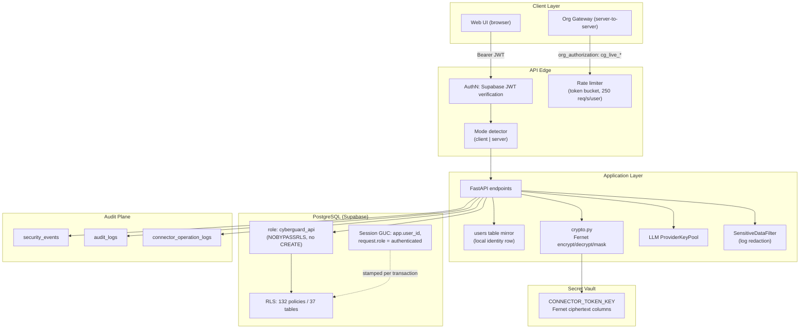
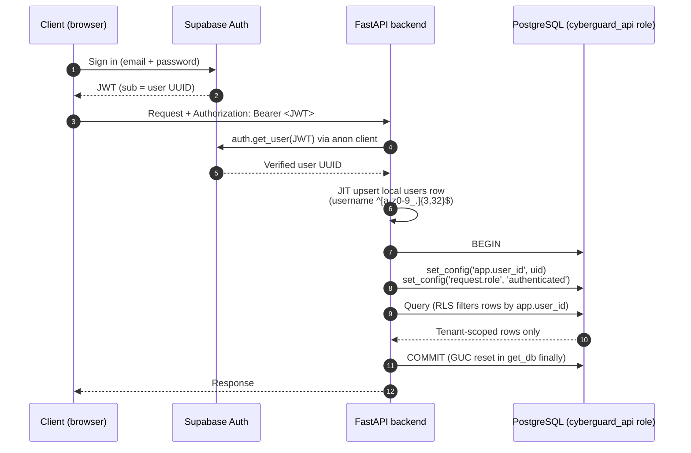
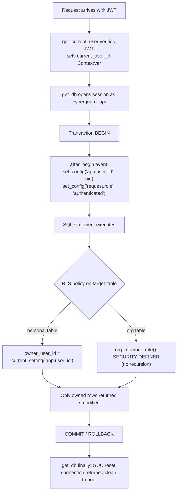
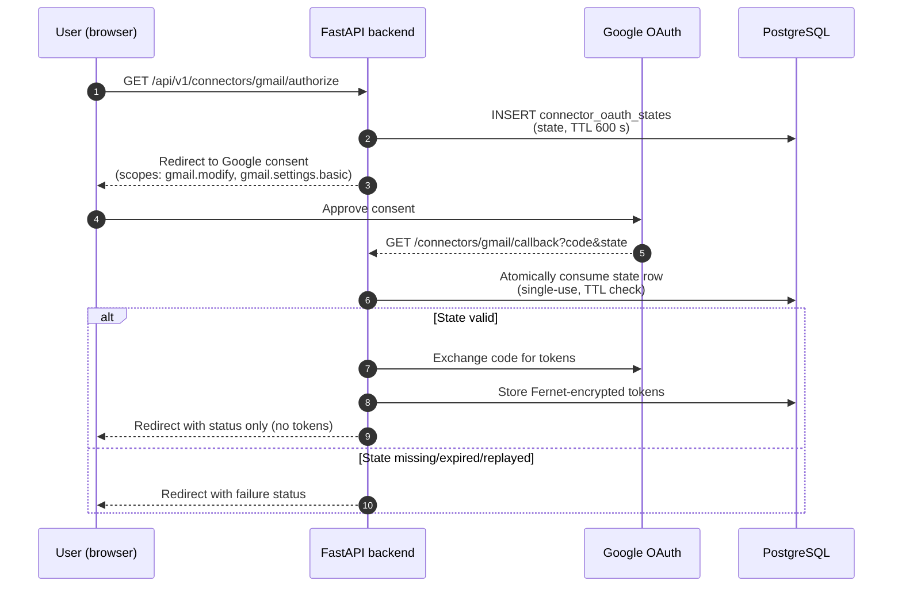
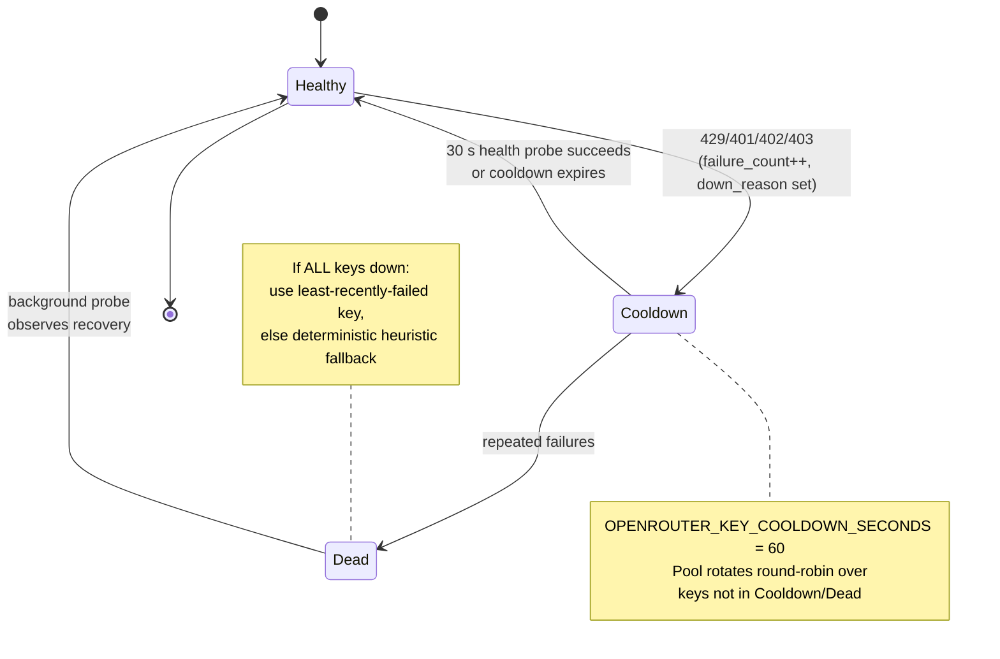
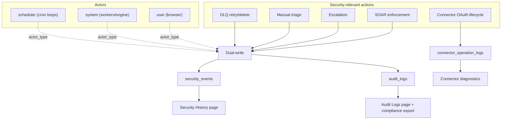

# CYBERGUARD — Security Model

**Audience:** security reviewers, operators, and contributors who need to understand how CYBERGUARD authenticates users, isolates tenant data, encrypts secrets, and defends its own attack surface.

CYBERGUARD is a SOC/SOAR platform that ingests email, URL, media, network, and authentication telemetry, classifies threats, and (in server mode) executes enforcement actions. Because the platform itself holds OAuth tokens, mail-server credentials, and API keys, its own security posture is treated as a first-class engineering concern. This document describes the security architecture as implemented, the threat model it defends against, and the controls operators must verify in production.

> **Related documents:** [README.md](README.md) (product overview), [ARCHITECTURE.md](ARCHITECTURE.md) (system architecture), [API_DOCUMENTATION.md](API_DOCUMENTATION.md) (endpoint reference), [DATA_MODEL.md](DATA_MODEL.md) (schema and tables), [RUNBOOK.md](RUNBOOK.md) (operational procedures), [DECISIONS.md](DECISIONS.md) (architecture decision records), [WORKER_ARCHITECTURE.md](WORKER_ARCHITECTURE.md) (background job design), [ML_MODELS.md](ML_MODELS.md) (detection models).

---

## Table of Contents

1. [Security Architecture Overview](#1-security-architecture-overview)
2. [Identity and Authentication](#2-identity-and-authentication)
3. [Authorization and Row-Level Security](#3-authorization-and-row-level-security)
4. [Encryption and Secret Handling](#4-encryption-and-secret-handling)
5. [API Key Security](#5-api-key-security)
6. [OAuth Flow Security](#6-oauth-flow-security)
7. [Webhook Security](#7-webhook-security)
8. [LLM Provider Key Rotation](#8-llm-provider-key-rotation)
9. [Log Sanitization](#9-log-sanitization)
10. [Audit Logging](#10-audit-logging)
11. [Rate Limiting](#11-rate-limiting)
12. [Mode Security: Client vs Server](#12-mode-security-client-vs-server)
13. [Threat Model](#13-threat-model)
14. [Compliance Mapping](#14-compliance-mapping)
15. [Operator Security Checklist](#15-operator-security-checklist)

---

## 1. Security Architecture Overview

Security in CYBERGUARD is layered. No single control is trusted to protect tenant data; instead, identity verification, database-level isolation, encryption at rest, and audit logging operate independently.



**Why layered?** A bug in the application layer (for example, a missing `owner_user_id` filter in a query) cannot leak another tenant's data, because PostgreSQL row-level security independently enforces tenant scope at the storage engine level. Conversely, a misconfigured RLS policy is caught by application-side tenant filters. Defense in depth means an attacker must defeat both layers.

---

## 2. Identity and Authentication

### 2.1 Identity providers

| Concern | Implementation |
|---|---|
| Credential verification | Supabase Auth issues JWTs; the backend verifies each bearer token using the **anon** client (`auth.get_user`) — the backend never trusts a client-asserted identity. |
| Local identity mirror | A `users` row in the CYBERGUARD database mirrors the Supabase UUID so foreign keys and RLS have a stable local subject. |
| Just-in-time provisioning | `get_current_user` performs a JIT upsert of the local row on first authenticated request. |
| Username policy | Usernames are **server-enforced**: `^[a-z0-9_.]{3,32}$`. On JIT upsert, an auto-generated unique username is created if none exists. |
| Signup/signin mediation | Signup and sign-in are mediated by the backend so the username rules above cannot be bypassed by talking to Supabase Auth directly. |
| Anonymous lookups | The username → email lookup runs on the **service-role engine**, because RLS denies anonymous reads of the users table. This is scoped to that single lookup, not a general elevation. |

### 2.2 Authentication sequence



**Why verify with the anon client?** Using the anon key means the verification path has no elevated database rights of its own. The backend performs a cryptographic verification of the JWT via Supabase and derives identity only from the verified result — a forged or expired token yields an error before any database session is stamped with a user identity.

**Why mirror users locally?** RLS policies compare `owner_user_id` against `current_setting('app.user_id')`. A local, foreign-keyable row keeps referential integrity inside the database and avoids cross-service lookups on every query.

---

## 3. Authorization and Row-Level Security

### 3.1 Dual-role database architecture

Database access is split into two deliberately unequal roles:

| Role | Used by | Privileges | Cannot |
|---|---|---|---|
| `postgres` | Migrations only, via `MIGRATION_DATABASE_URL` through Alembic | Full DDL, `BYPASSRLS` | — (never used by the running app) |
| `cyberguard_api` | Application runtime, selected via `server_settings={"role": "cyberguard_api"}` | DML on `cyberguard` schema, subject to RLS | Drop schemas, create objects, bypass RLS (`NOBYPASSRLS`) |

**Why two roles?** If the application connected as `postgres`, a single SQL-injection or application bug would be equivalent to full database compromise, including `DROP SCHEMA`. With `cyberguard_api`, the worst case is bounded by what RLS allows: the app physically cannot read rows it does not own, even with a malformed query.

### 3.2 Session GUC stamping

Every transaction is stamped with the caller's identity before any statement runs:

- `current_user_id` is held in a `contextvars.ContextVar` set by `get_current_user` after JWT verification.
- An `after_begin` SQLAlchemy event fires on **every** transaction and executes:
  - `set_config('app.user_id', <uid>)`
  - `set_config('request.role', 'authenticated')`
- The GUC is reset in `get_db`'s `finally` block, so pooled connections never leak a previous request's identity.
- `init_db` additionally emulates Supabase's `auth.uid()` function, reading `request.jwt.claim.sub` or falling back to `app.user_id`, so policies written in Supabase style work unchanged.

### 3.3 RLS policy inventory

- **37 tables** live in the `cyberguard` schema; **132 policies** exist after migration `0013`.
- Per-table policy naming: `{table}_select`, `{table}_insert`, `{table}_update`, `{table}_delete`, all granted `TO cyberguard_api`.
- Personal-workspace tables use:

  ```sql
  USING (owner_user_id = current_setting('app.user_id')::uuid)
  ```

- Organization-scoped tables use a `SECURITY DEFINER` function `org_member_role()` to answer "is the caller a member, and with which role?" without recursing into the `organization_members` table's own RLS (a classic self-referential policy recursion trap).
- Realtime (Supabase WALRUS) authorization uses `auth.uid()` via migration `0012`.
- Personal workspace semantics: rows have `owner_user_id` scope with `organization_id IS NULL`; the owner holds an implicit admin role.

### 3.4 RLS enforcement flow



**Why GUC stamping on every transaction instead of once per connection?** Connections are pooled and reused across requests and workers. Stamping at `BEGIN` guarantees the identity is always the current request's, and resetting in `finally` guarantees no identity bleeds into the next borrower of the connection.

---

## 4. Encryption and Secret Handling

### 4.1 Encryption at rest

All connector secrets are encrypted with Fernet (AES-128-CBC + HMAC-SHA256; AES-256-class symmetric envelope) under a single key, `CONNECTOR_TOKEN_KEY`:

| Secret | Storage | Helpers |
|---|---|---|
| Connector OAuth tokens (`access_token_enc`, `refresh_token_enc`) | Fernet ciphertext columns | `encrypt_secret` / `decrypt_secret` |
| Org mail server credentials (JSON blobs: `google_workspace`, `microsoft_365`, `imap_smtp`) | Fernet ciphertext under the same key | `encrypt_secret` / `decrypt_secret` |
| Any value shown in UI or API | Masked form | `mask_secret` (keeps 4 characters on each side) |

Error semantics are fail-closed:

- `encrypt_secret`/`decrypt_secret` raise `RuntimeError` if `CONNECTOR_TOKEN_KEY` is missing or invalid.
- `decrypt_secret` raises `RuntimeError` on `InvalidToken` (wrong key or tampered ciphertext) rather than returning garbage.
- `mask_secret` raises `RuntimeError` on missing key or `InvalidToken` — it never falls back to returning plaintext.

**Invariants:** plaintext tokens never appear in the database, in logs, or in API responses. Clients see a `has_credentials` boolean instead. Tokens are never exposed to client browsers. Decryption happens only inside the backend at the moment a provider API call is made.

### 4.2 At rest vs in transit

```mermaid
flowchart LR
    subgraph Transit["In Transit"]
        TLS1["Browser ⟷ API: HTTPS/TLS"]
        TLS2["API ⟷ Supabase: TLS"]
        TLS3["API ⟷ Google APIs: TLS"]
        TLS4["Pub/Sub push ⟷ Webhook: TLS + verification token"]
    end

    subgraph Rest["At Rest"]
        CT["OAuth tokens → Fernet ciphertext columns"]
        CC["Org mail credentials → Fernet JSON blob"]
        KH["API keys → SHA-256 hash only"]
        DBR["All other tenant rows → Supabase disk encryption"]
    end

    subgraph Runtime["In Memory (transient)"]
        DEC["decrypt_secret() just before provider call"]
        MT["mask_secret() for any display value"]
    end

    Transit --> Rest
    Rest --> Runtime
```



**Why one Fernet key for connectors and mail credentials?** It keeps key management to a single operator responsibility (`CONNECTOR_TOKEN_KEY` rotation) while the data domain is the same: secrets that unlock third-party mail systems on behalf of a tenant. Per-tenant keys are a future hardening path tracked in [DECISIONS.md](DECISIONS.md).

---

## 5. API Key Security

Organization API keys authenticate server-to-server gateway traffic (see [INTEGRATION_GUIDE.md](INTEGRATION_GUIDE.md)).

- Prefix: `cg_live_`, followed by ~256 bits of URL-safe randomness (43 characters).
- Only the **SHA-256 hash** is stored (`key_hash`, unique). The `key_prefix` (first 16 chars) is stored for display in dashboards.
- The plaintext key is returned **exactly once** at creation and never persisted or logged.
- Validation is an indexed exact-match lookup on `key_hash` — constant work regardless of table size, and no need to decrypt anything. Identity is resolved *from* the key match (the key exists before a user session does), so key validation is the one authentication path that runs before `app.user_id` exists.
- Gateway authorization checks that the key's organization matches the `org_id` in the URL; a valid key for the wrong org returns `403`.

**Why SHA-256 instead of bcrypt?** The key is a 256-bit random secret, not a human password. There is no dictionary to brute-force, so a fast hash with an indexed lookup is appropriate and keeps the hot gateway path fast. Password-like secrets (user credentials) never touch this path — they belong to Supabase Auth.

---

## 6. OAuth Flow Security

Connector OAuth (Google/Gmail) is protected at four points:

1. **Single-use state rows.** Every authorization creates a row in `connector_oauth_states` with a TTL of `CONNECTOR_OAUTH_STATE_TTL_SECONDS` = **600 s**. The state is consumed atomically by a service-role helper — a replayed state finds the row already deleted and fails.
2. **Safe redirect payloads.** The callback redirects carry only a status code, never tokens. Tokens land in encrypted database columns and stay server-side.
3. **Separate OAuth client.** CYBERGUARD's own Google OAuth client is deliberately separate from the Google identity provider configured in Supabase. Compromise or scope reduction of one does not affect the other; the IdP client needs no mail scopes at all.
4. **Operation logging.** The full OAuth lifecycle (`authorize`, `callback`, `token_refresh`, `test_connection`, `disconnect`) is recorded in `connector_operation_logs` with status (`success`, `failed`, `unsupported`, `insufficient_scope`, `reauth_required`).



---

## 7. Webhook Security

The Gmail push endpoint `POST /api/v1/webhooks/gmail` is internet-exposed and therefore defended in depth:

| Control | Detail |
|---|---|
| Verification token | `GOOGLE_PUBSUB_VERIFICATION_TOKEN` must match; rejected requests never enqueue work. |
| OIDC audience (optional) | `GMAIL_PUBSUB_AUDIENCE` validates the Pub/Sub push OIDC claim when configured. |
| Envelope validation | The Pub/Sub envelope (structure, base64 data) is validated **before** enqueue. |
| Deterministic job IDs | `gmail_sync:{owner_user_id}:{history_id}` makes duplicate pushes idempotent. |
| Rate limiting | Token bucket per `(owner_user_id, job_type)`; 250 req/s with 5 s defer (see [Section 11](#11-rate-limiting)). |
| Thin endpoint | The handler is deliberately lightweight (< 50 ms): validate, enqueue, return. No provider I/O. |

Full ingestion flow: [INTEGRATION_GUIDE.md](INTEGRATION_GUIDE.md), Section "Webhook Ingestion".

---

## 8. LLM Provider Key Rotation

Threat analysis depends on an external LLM provider (OpenRouter). Key availability is managed by a `ProviderKeyPool` per provider so a single revoked or rate-limited key cannot take down detection.

- **Round-robin over healthy keys.** Each key carries a `KeyState`: `is_healthy`, `failure_count`, `last_failure_time`, `down_reason`.
- **Cooldowns.** A failed key is benched for a cooldown period (e.g. `OPENROUTER_KEY_COOLDOWN_SECONDS` = 60 s).
- **Circuit breaker.** HTTP 429 (rate limit), 401 (invalid), 402 (payment), 403 (forbidden) trip the breaker for that key.
- **Background health probes every 30 s** re-release recovered keys automatically.
- **Last resort.** If every key is down, the least-recently-failed key is used — a degraded attempt beats no attempt.
- **Guaranteed availability floor.** If the LLM path is entirely unavailable, a deterministic heuristic explanation is produced as a fallback, so analysis jobs never hard-fail for lack of an LLM.



**Why rotate keys at all?** Detection is the revenue-critical path of a SOC tool. Aggregating multiple provider keys converts a per-key quota or billing failure from an outage into a latency blip, and the pool's state machine makes recovery automatic rather than an on-call action.

---

## 9. Log Sanitization

The structured JSON logger (`StructuredJsonFormatter` + `SensitiveDataFilter` in `app/core/logging_config.py`) applies redaction **at emission time** — before a line ever reaches disk or a log shipper:

| Pattern | Replaced with |
|---|---|
| `ya29.*` (Google access tokens) | `[REDACTED_TOKEN]` |
| `1//*` (Google refresh tokens) | `[REDACTED_TOKEN]` |
| `Bearer <token>` | `Bearer [REDACTED_TOKEN]` |
| `password="…"`, `client_secret="…"` | `[REDACTED_SECRET]` |
| Email bodies (`body=`, `body_text=`) | `[REDACTED_BODY]` |
| Attachment payloads (`attachment_data=`, `content_bytes=`) | `[REDACTED_ATTACHMENT_DATA]` |

**Why at emission time?** Downstream log aggregation (Loki, Filebeat — see [MONITORING_OBSERVABILITY.md](MONITORING_OBSERVABILITY.md)) often ships logs to systems with weaker access controls than the primary database. Redacting at the source means every downstream copy is already safe.

---

## 10. Audit Logging

### 10.1 Dual-write architecture

Every security-relevant event is written to **both** `security_events` and `audit_logs` with the same `actor_type` (`user` | `system` | `scheduler`). The two tables serve different consumers (security history UI vs. compliance export) and are written together so neither can silently diverge.

### 10.2 What is audited

| Event class | Audited? | Notes |
|---|---|---|
| Every SOAR enforcement action | Yes | Quarantine, release, block, delete decisions |
| Escalations | Yes | Alert-plane promotions |
| Manual triage | Yes | Analyst decisions |
| DLQ manual retry | Yes | `manual_dlq_retry` |
| DLQ manual delete | Yes | `manual_dlq_delete` |
| Connector OAuth lifecycle | Yes | `connector_operation_logs` (authorize/callback/refresh/test/disconnect) |
| Chat assistant content | **No** | Chat is ephemeral: session storage per browser tab, destroyed on close. Only the **intent class** of a chat interaction is audited. |

**Why is chat not audited?** Analysts discuss sensitive incidents in chat. Persisting chat bodies would recreate the exact data-leak surface the redaction pipeline works to avoid; the audit plane records *that* an assistant interaction of a given intent class occurred, which is sufficient for compliance without retaining content.

### 10.3 Audit pipeline diagram



Frontend surfaces: Audit Logs page, Security History page, and notification logs (see [MONITORING_OBSERVABILITY.md](MONITORING_OBSERVABILITY.md)).

---

## 11. Rate Limiting

The ingestion rate limiter protects **Google's quota and the webhook path**, not just our own API:

- In-memory **token bucket** keyed by `(owner_user_id, job_type)`.
- Capacity and refill rate default to **250** tokens — matching the Gmail API limit of 250 requests/user/second.
- When the bucket is empty, jobs are **deferred by 5 s** (not dropped, not rejected), smoothing bursts without losing events.

**Why a per-user bucket?** A burst of Pub/Sub pushes for one busy mailbox (or an abusive webhook loop) is the realistic worst case. Per-user isolation means one noisy tenant cannot exhaust the quota budget shared by everyone, while a single normal user at 250 req/s is never throttled.

---

## 12. Mode Security: Client vs Server

CYBERGUARD's most consequential safety property is that **client mode never auto-executes enforcement**.

- Default mode is `client`: analysis and recommendations only. `auto_execute` is forced `False` regardless of what the request asks for.
- `server` mode is implied when the event source is one of: `{email_gateway, firewall, proxy, siem, api_integration, sso, network_sensor}` — even if the caller omits `mode=server`.
- Enforcement strictness is a policy choice: `EnforcementPolicyLevel` = `strict | balanced | permissive`.

**Why force auto-execute off in client mode?** A consumer user who connects their own Gmail is delegating read-and-triage, not handing over the right to move their mail. Only deployments that ingest from infrastructure they control (gateways, SIEMs, sensors — i.e., server mode) are presumed to have authorized automated enforcement. The source-implied server list prevents a client-mode caller from sneaking enforcement in by mislabeling the source.

---

## 13. Threat Model

| # | Threat surface | Attack scenario | Mitigations (implemented) | Residual risk |
|---|---|---|---|---|
| 1 | **Webhook abuse** | Attacker floods `POST /api/v1/webhooks/gmail` to exhaust the queue or mine Google quota | Verification token; optional OIDC audience; envelope validation before enqueue; deterministic job IDs (idempotent replays); per-user token bucket (250 req/s, 5 s defer) | Token value leak — treat `GOOGLE_PUBSUB_VERIFICATION_TOKEN` as a secret |
| 2 | **Prompt injection via email** | Malicious email body instructs the LLM to return a "safe" verdict | LLM receives structured verdict data (heuristics/URL/media engines), not just raw text; prompts demand strict JSON; severity-consistency enforcement **wipes MITRE mappings for safe verdicts** so injected text cannot manufacture threat metadata | Adaptive injection remains an active research area — layered deterministic engines bound the damage |
| 3 | **Media DoS** | Giant uploads exhaust memory/disk on the analysis path | `MAX_MEDIA_SIZE_BYTES` = 25 MB hard limit on media ingestion (multipart) | None material; limit enforced before processing |
| 4 | **Poison payloads** | Malformed messages crash workers repeatedly (retry storms) | Input size limits; `NonRetryableError` transitions directly to `dead_letter` (see [WORKER_ARCHITECTURE.md](WORKER_ARCHITECTURE.md)) | DLQ growth — monitored via `dead_letter_jobs_total` ([MONITORING_OBSERVABILITY.md](MONITORING_OBSERVABILITY.md)) |
| 5 | **RLS bypass** | SQL injection or app bug attempts cross-tenant reads | `cyberguard_api` role with `NOBYPASSRLS` and no `CREATE` privilege; 132 RLS policies; GUC stamped per transaction and reset after; migrations isolated behind `postgres` role | Defense in depth; both layers must fail to leak data |
| 6 | **Token theft** | Database dump or response scraping yields usable OAuth tokens | Fernet encryption at rest (`CONNECTOR_TOKEN_KEY`); plaintext never in DB, logs, or API responses; `has_credentials` boolean exposed instead; fail-closed `RuntimeError` on decrypt failure | Key compromise — rotate `CONNECTOR_TOKEN_KEY` per checklist below |

---

## 14. Compliance Mapping

CYBERGUARD is **not certified** against the frameworks below. The mapping states which implemented controls *support* each requirement, to accelerate a future audit.

| Framework | Requirement area | CYBERGUARD controls | Reference |
|---|---|---|---|
| **SOC 2** | Audit logging | Dual-write `security_events` + `audit_logs`; `connector_operation_logs`; DLQ retry/delete audited | §10 |
| **SOC 2** | Access control | Supabase JWT verification; RLS (132 policies); dual DB roles; org API keys (SHA-256, once-only plaintext) | §2, §3, §5 |
| **ISO 27001** | A.9 Access control | Role-based DB access (`cyberguard_api` NOBYPASSRLS); RLS per-table policies; org role groups (`org_member_role()`) | §3 |
| **ISO 27001** | A.12 Logging & monitoring | Structured JSON logs with redaction; Prometheus metrics; alerting recommendations | §9, [MONITORING_OBSERVABILITY.md](MONITORING_OBSERVABILITY.md) |
| **HIPAA-style** | Retention | Soft-delete semantics on the dead-letter queue (retained for review, explicit audited delete) | §10, [RUNBOOK.md](RUNBOOK.md) |
| **GDPR-style** | Data minimization | Attachment metadata only by default; email bodies and attachment payloads redacted from logs; ephemeral chat (intent class only) | §9, §10 |

---

## 15. Operator Security Checklist

Verify each item before and during production operation.

### Secrets and keys

- [ ] `CONNECTOR_TOKEN_KEY` generated with `Fernet.generate_key()`, stored in the secret manager, and backed up — losing it makes all connector tokens undecryptable (fail-closed).
- [ ] `GOOGLE_PUBSUB_VERIFICATION_TOKEN` set and treated as a secret; `GMAIL_PUBSUB_AUDIENCE` configured where OIDC is available.
- [ ] `MIGRATION_DATABASE_URL` (postgres credentials) held by the deploy pipeline only — never by the application runtime.
- [ ] LLM provider keys registered in the `ProviderKeyPool` (more than one per provider recommended).

### Database

- [ ] Runtime role confirmed as `cyberguard_api` (`server_settings={"role": "cyberguard_api"}` in the engine URL) — not `postgres`.
- [ ] `cyberguard_api` has `NOBYPASSRLS` and no `CREATE` privilege on the schema.
- [ ] Policy count intact: 37 tables, 132 policies post-0013 (re-run policy audit after any migration).
- [ ] `init_db`'s `auth.uid()` emulation present (required for Supabase-style policies).

### Network and API

- [ ] API served exclusively over HTTPS.
- [ ] `POST /api/v1/webhooks/gmail` rejects requests missing the verification token (test with curl).
- [ ] Gateway keys issued via the API-key endpoint; plaintext captured by the integrator at creation time only.
- [ ] Gateway org-mismatch check verified: valid key + wrong `org_id` → `403`.

### Audit and monitoring

- [ ] `security_events` and `audit_logs` both receiving rows for a test enforcement action.
- [ ] Log shipping (Loki/Filebeat) confirms redaction markers appear in place of tokens in downstream stores.
- [ ] Alerts active for `dead_letter_jobs_total` growth and `gmail_api_errors_total{error_type="rate_limit"}` spikes (rule examples in [MONITORING_OBSERVABILITY.md](MONITORING_OBSERVABILITY.md)).
- [ ] `alert_logs` / audit pages reviewed periodically; DLQ deletions spot-checked against `manual_dlq_delete` audit rows.

### Mode and policy

- [ ] Client-mode behavior verified: enforcement proposals are produced but never executed, and `auto_execute=true` in a client-mode request is overridden to `False`.
- [ ] `EnforcementPolicyLevel` set deliberately per deployment (`strict` for infrastructure-owned inboxes, `permissive` for consumer demos).
- [ ] Trusted-sender exemptions reviewed — released senders are exempted with recommend-only enforcement and the annotation "You previously released a message from this sender."
