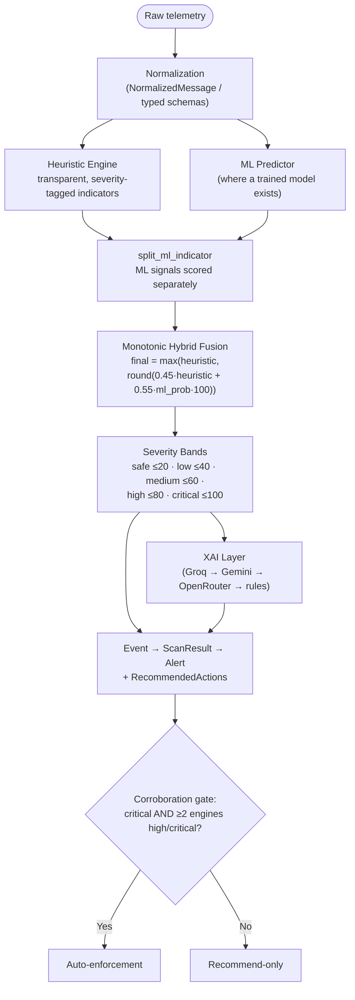
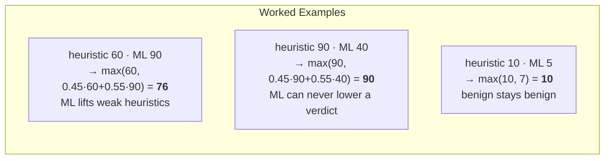
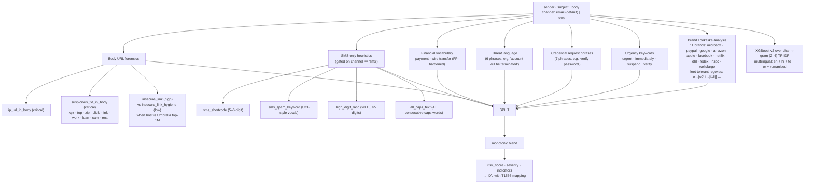
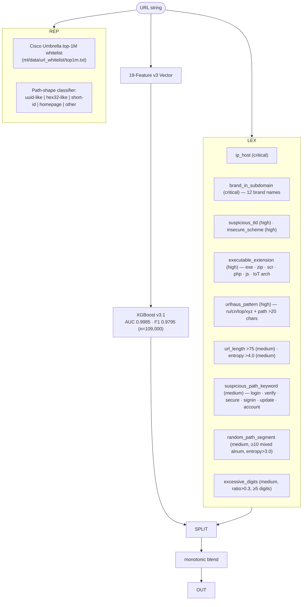
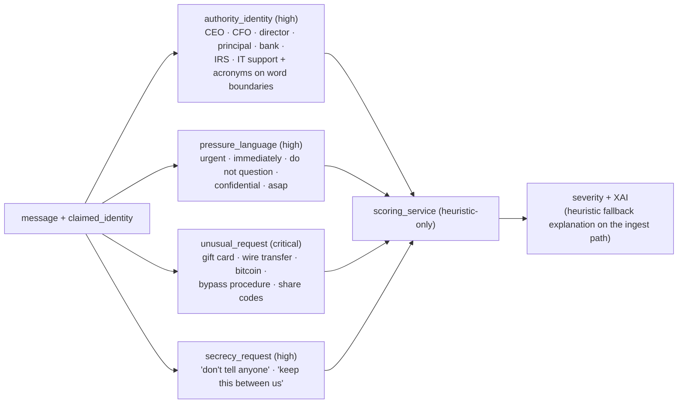
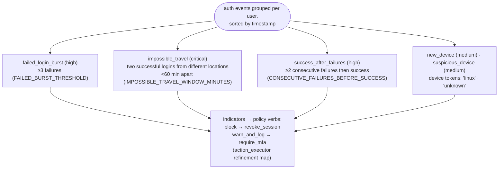
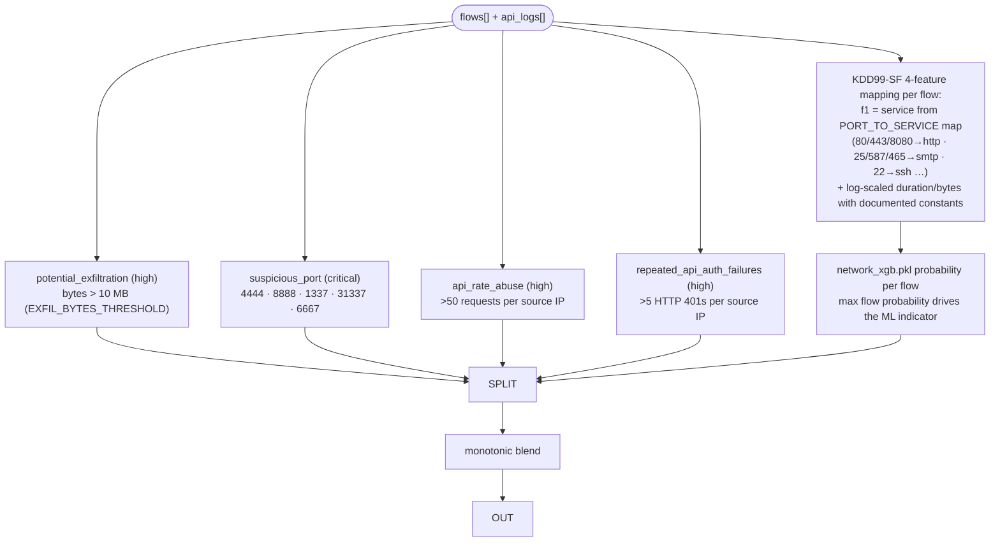
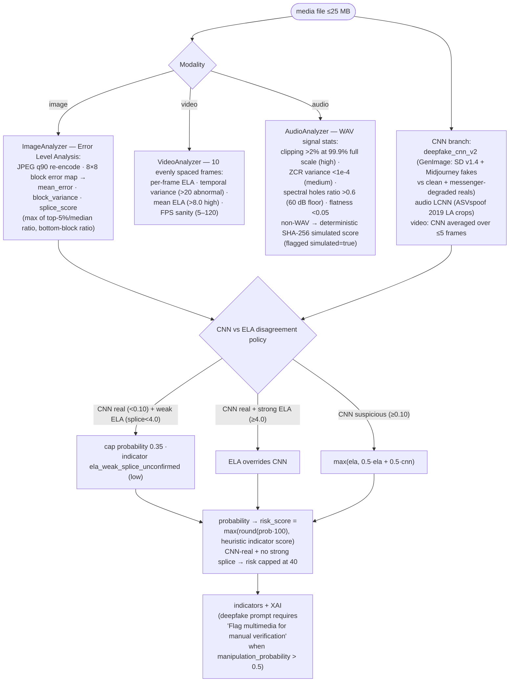
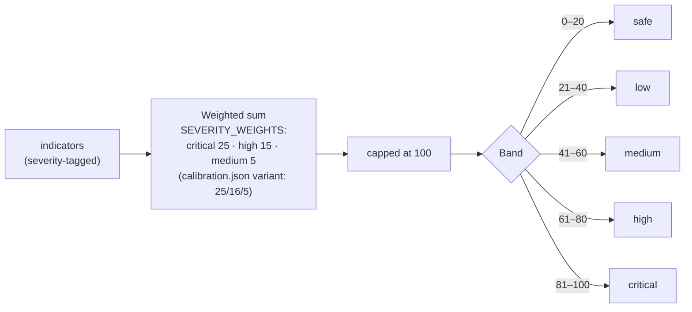
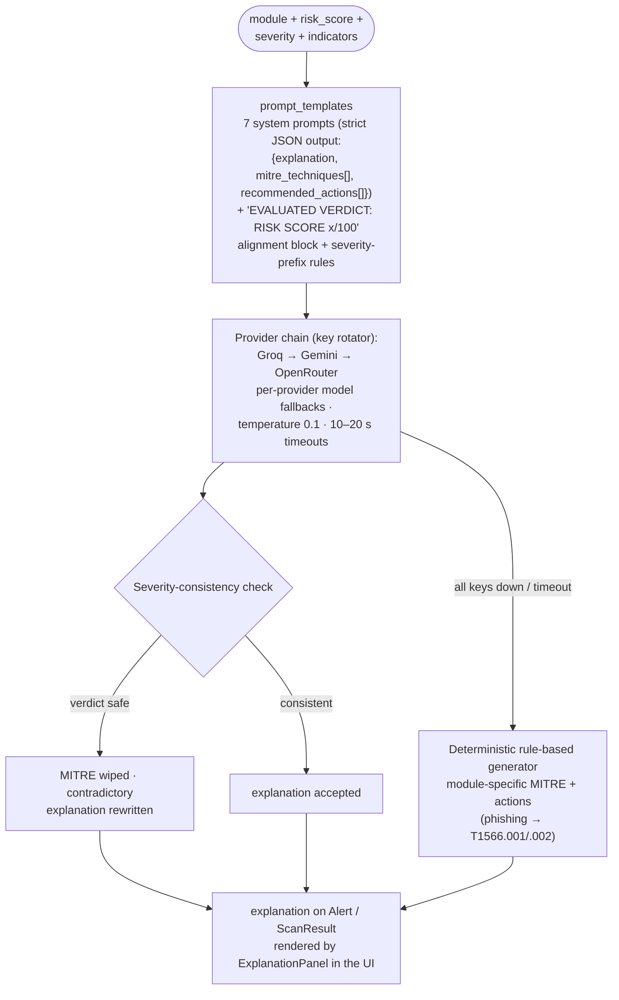

# CYBERGUARD — Threat Detection Engines

CYBERGUARD ships **six enterprise detection engines** behind one shared analytical spine: transparent heuristics, high-performance ML models, a monotonic fusion rule, severity banding, and Explainable-AI (XAI) threat intelligence. This document details each engine's inputs, signals, algorithms, thresholds, failure modes, and mitigation strategies.

**Related documents:** [ARCHITECTURE.md](ARCHITECTURE.md) · [ML_MODELS.md](ML_MODELS.md) · [API_DOCUMENTATION.md](API_DOCUMENTATION.md) · [DATA_MODEL.md](DATA_MODEL.md) · [DECISIONS.md](DECISIONS.md)

## Table of Contents

1. [The Shared Detection Spine](#1-the-shared-detection-spine)
2. [Engine 1 — Phishing & Social Engineering](#2-engine-1--phishing--social-engineering)
3. [Engine 2 — Malicious URL Forensics](#3-engine-2--malicious-url-forensics)
4. [Engine 3 — BEC & Impersonation](#4-engine-3--bec--impersonation)
5. [Engine 4 — ATO & Identity Defense](#5-engine-4--ato--identity-defense)
6. [Engine 5 — Network Flow & API Abuse](#6-engine-5--network-flow--api-abuse)
7. [Engine 6 — Deepfake & Media Forensics](#7-engine-6--deepfake--media-forensics)
8. [Confidence Scoring & Severity Bands](#8-confidence-scoring--severity-bands)
9. [False-Positive Mitigation](#9-false-positive-mitigation)
10. [Explainable AI (XAI) Layer](#10-explainable-ai-xai-layer)
11. [Engine Comparison Matrix](#11-engine-comparison-matrix)
12. [FAQ](#12-faq)

---

## 1. The Shared Detection Spine

Every engine, regardless of entry point (interactive API, mailbox scanning, real-time workers, org gateway), passes through the same pipeline. This is why a verdict is always reproducible: the same message submitted twice — via any route — produces the same score.



### Fusion Semantics



**Why monotonic blending?** Heuristics are transparent and auditable but miss novel attacks; ML generalizes but can confidently hallucinate. The `max()` rule keeps the safety property "a crisp rule-based verdict (IP-hosted credential form) can never be overruled by a model's false negative" while still letting genuine model strength raise weak heuristic scores. Decision record: [DECISIONS.md](DECISIONS.md), invariant I1.

---

## 2. Engine 1 — Phishing & Social Engineering

**Module:** `phishing` · **Service:** `app/services/phishing_detector.py` · **ML:** `email_phishing_xgb_v2.pkl` + `email_tfidf_v2.pkl` · **Endpoint:** `POST /api/v1/analysis/email` · **MITRE:** T1566.001 (Spearphishing Attachment), T1566.002 (Spearphishing Link)

### Pipeline



### Indicator Catalog

| Indicator | Severity | Trigger |
|---|---|---|
| `lookalike_domain` | critical | Sender domain matches a leet-tolerant pattern of a protected brand (e.g. `micr0soft-verify.xyz`) |
| `credential_request` | critical | Any of 7 credential-harvesting phrases |
| `ip_url_in_body` | critical | Body links to a raw IP host |
| `suspicious_tld_in_body` | critical | Body link uses a high-abuse TLD |
| `urgency` | high | Urgency keyword present |
| `threat_language` | high | Termination/suspension phrasing |
| `insecure_link` | high | http:// link not on the top-1M whitelist |
| `financial_vocabulary` | medium | Payment/wire language (deliberately FP-hardened) |
| `insecure_link_hygiene` | low | http:// on a whitelisted top-1M host |
| `sms_*` family | varies | Only for `channel="sms"` — shortcode, phone number, spam vocab, digit ratio, caps |

**Strengths / limitations:** the heuristic layer catches evasive lookalikes that fool token-level ML (leet substitutions), while the multilingual char-n-gram model covers novel phrasing and four Indic languages plus romanised Hinglish. Evaluation: hybrid F1 **0.9842** on 24,000 held-out emails; the SMS corpus is documented as out-of-domain for the text model.

---

## 3. Engine 2 — Malicious URL Forensics

**Module:** `url` · **Service:** `app/services/url_detector.py` · **ML:** `url_xgb_v3.1.pkl` (served version selected via `calibration.json → url_model_version`) · **Endpoint:** `POST /api/v1/analysis/url` · **Features:** `ml/url_features_v3.py` (shared training + serving)

### Pipeline



The 19 v3 features (`FEATURE_COLUMNS_V3`): `is_top_1m, domain_entropy, path_entropy, query_entropy, domain_length, path_length, query_length, total_length, has_tracking_params, num_query_params, has_ip, num_dots, num_subdomains, has_at_symbol, suspicious_tld, http_only, domain_digit_ratio, domain_hyphens, has_suspicious_path_keyword`.

**Why shared feature code matters:** training and serving import the *same* `url_features_v3.py` and `url_reputation.py`, eliminating training-serving skew by construction rather than by process discipline.

**Version lineage:** v1 (8 lexical features) → v2 (+ top-1M reputation + path-shape, 14 features) → v3 (19 features, trained on the mitchellkrogza active phishing feed with 50k real Umbrella benign domains) → v3.1 (+ brand-secondary benign augmentation to cut false positives on legit deep links). Rollback = edit `url_model_version` in `calibration.json`; the loader falls back gracefully if an artifact is missing.

---

## 4. Engine 3 — BEC & Impersonation

**Module:** `impersonation` · **Service:** `app/services/impersonation_detector.py` · **ML:** none (deliberately heuristic-only) · **Endpoint:** `POST /api/v1/analysis/impersonation`



**Why no ML here?** BEC volume is low and payloads are short; the four request-shaped signals are near-deterministic and fully explainable. A model trained on tiny BEC corpora would add opacity without recall. On the log-ingest path the detector runs **without any LLM call** — provider latency must never delay ingestion (ORG-2 decision); explanations use the deterministic fallback.

Calibration keyword sets (including `request_indicators` for the org gateway: payment_request, status_confirmation, urgency, secrecy, channel_change) live in the hot-reloaded `ml/calibration.json` under the `impersonation` key.

---

## 5. Engine 4 — ATO & Identity Defense

**Module:** `account_takeover` · **Service:** `app/services/account_takeover_detector.py` · **ML:** none (stream logic) · **Endpoint:** `POST /api/v1/analysis/account-takeover`



**Input shape:** a list of auth-event dicts (timestamp, user, ip, location, device, outcome) — the same shape the org log plane auto-detects from pasted auth logs (`user`+`ip`(+`status`/`location`) field signature). MITRE mapping: T1110 (Brute Force).

**Why stream logic instead of ML?** The signals are temporal relations (velocity, sequencing) that a per-event classifier cannot see; grouping and ordering *is* the model. Thresholds are calibration knobs, not learned weights, so a SOC can tighten them per deployment via enforcement policies.

---

## 6. Engine 5 — Network Flow & API Abuse

**Module:** `network` (flows) / `api_abuse` (API logs) · **Service:** `app/services/network_threat_detector.py` · **ML:** `network_xgb.pkl` + `network_scaler.pkl` (KDD99-SF, 4 features) · **Endpoint:** `POST /api/v1/analysis/network`



**Known calibration finding (recorded, not hidden):** per-flow heuristics are blind to low-and-slow beaconing, and the KDD99-SF feature vector uses documented constants for fields the platform does not ingest (duration → ln(0.1)); flows lacking `bytes_out` produce an `ml_warning` indicator instead of a silent guess. The evaluation harness measures this honestly (P 1.0 / R 0.666 on scenario data) rather than masking the gap.

---

## 7. Engine 6 — Deepfake & Media Forensics

**Module:** `deepfake` · **Services:** `deepfake_detector.py` + `media_forensics/` (image/video/audio analyzers) · **ML:** `deepfake_cnn_v2.pt` (MobileNetV3-Small, 128 px), `audio_cnn_v1.pt` (LCNN log-Mel) · **Endpoint:** `POST /api/v1/analysis/media` (multipart, max 25 MB) · **Storage:** Supabase `cyberguard-media` (private, 1-hour signed URLs) with local-disk fallback

### Forensic Pipeline



### Image Probability Composition

```
P = 0.05 (base)
  + min(0.55, (splice_score / 3.0)² × 0.40)   — block-variance term
  + 0.20 (container mismatch: extension ≠ decoded format)
  + 0.10 (uniform error map: mean<0.2 AND block_var<0.005)
  → capped at 0.95
```

**Why the disagreement policy matters:** the CNN was trained on GenImage generators; a real photo compressed by a messaging app (the `real_messenger` training subclass, FPR 2.2%) can still look synthetic to the CNN, and conversely a strong splice is forensic evidence no CNN sees. Capping CNN-real verdicts at risk 40 and letting strong ELA override prevents the two failure modes documented in `deepfake_v2_metrics.json` (per-generator recall: StableDiffusion 91.9%, Midjourney 74.3%).

**Audio domain-shift caveat (documented in the XAI prompt):** the LCNN was trained on ASVspoof 2019 attacks; modern neural TTS (ElevenLabs-class) is partly out of domain — the prompt instructs the LLM to state this caveat, and the non-speech tone cap limits model contribution to 0.35 on tonal content.

---

## 8. Confidence Scoring & Severity Bands



- The **adaptive positive threshold** (midpoint of class means) is used by the evaluation harness for engines whose score ranges sit below 50; threshold-free AUC is the headline metric.
- The `ml_model` indicator itself carries `probability` (0–1) and does not contribute to the heuristic sum — it enters only through the monotonic blend.
- Deepfake/media uses `manipulation_probability ≥ 0.5` as its flag threshold (evaluation convention).

**Enforcement thresholds** (per-module, from `enforcement_policies`): phishing/url high 75 · medium 40; deepfake 70/50; ATO 60/40; network 70/50; impersonation 70/40. Default policy: critical → `block_and_quarantine`, high → `block`, medium → `warn_and_log`, low → `allow`.

---

## 9. False-Positive Mitigation

| Mechanism | Engines | How It Works |
|---|---|---|
| Umbrella top-1M whitelist | URL, phishing body links | Legit top-1M hosts demote `insecure_link` → low-severity hygiene signal; v3/v3.1 models train on 50–59k real benign domains |
| Path-shape features | URL | `uuid-like`/`hex32-like` deep links on benign platforms stop looking like random malicious paths (v3.1's brand-secondary augmentation targeted exactly this FP class) |
| FP-hardened vocabularies | Phishing | `financial_vocabulary` downgraded to medium; hygiene vs threat split for insecure links |
| Leet-tolerant brand regexes | Phishing | Only *lookalike* brand domains fire (critical) — the real brand domain never matches |
| Trusted-sender feedback loop | All email vectors | Release + Trust adds the sender to `trusted_senders`; future mail from them is recommend-only with the annotation "You previously released a message from this sender." |
| Corroboration gate | Auto-enforcement | A single engine's critical score never triggers a real mailbox write — critical severity AND ≥2 engines high/critical is required |
| Disagreement caps | Deepfake/audio | CNN-real verdicts cap risk at 40 absent strong ELA; non-speech audio caps model contribution at 0.35 |
| Honest simulation flags | Org mail connectors | `SimulationTransport` results always carry `"simulated": true` — a detection is never laundered into a false enforcement claim |
| Evaluation harness | All | Findings (URL v2 top-1m FPs, low-and-slow blindness, SMS out-of-domain) are recorded in reports, not silently patched |

---

## 10. Explainable AI (XAI) Layer

The XAI layer turns a numeric verdict into an analyst-readable explanation with MITRE ATT&CK mapping — and it can never contradict the verdict:



Key guarantees:

1. **Deterministic fallback** — if every LLM key is down (circuit breaker state), `generate_heuristic_explanation` produces a module-specific explanation. Platform availability does not depend on any external provider.
2. **Severity consistency enforcement** — a `safe` verdict can never ship with MITRE techniques attached; the layer rewrites contradictory LLM output.
3. **Key rotation with circuit breaking** — 429/401/402/403 → key quarantined (60 s cooldown); background probes every 30 s re-release recovered keys; up to 10 keys per provider round-robin.
4. **Ingest-path honesty** — the org log plane never calls the LLM during ingestion; only promoted alerts get (fallback) explanations.

---

## 11. Engine Comparison Matrix

| Engine | ML Model | Heuristic Signals | MITRE Mapping | Latency (p95) | Notable Limitation |
|---|---|---|---|---|---|
| Phishing | XGBoost v2 + char-n-gram TF-IDF (multilingual) | 10+ incl. SMS-only family | T1566.001/.002 | <10 ms (heuristics) | SMS corpus out-of-domain for the text model |
| URL Forensics | XGBoost v3.1 (19 features, AUC 0.9985) | 11 lexical + reputation/shape | T1566.002, T1071 | 3.7 ms | documented single FN on shortened lookalike (`lnk.ink`) |
| BEC / Impersonation | none | 4 request-shaped checks | T1534 / internal mapping | <10 ms | relies on explicit phrasing; terse BEC may score low |
| ATO | none | 5 temporal-stream rules | T1110 | <10 ms | needs location/device fields in auth events |
| Network / API Abuse | XGBoost (KDD99-SF, 4 features) | 4 + per-flow ML | T1071, T1041-class | 33.9 ms | no low-and-slow beaconing detection |
| Deepfake / Media | MobileNetV3-Small v2 + LCNN audio | ELA / frame-sampling / spectral | manual-verification recommendation | seconds (frame sampling) | Midjourney recall 74.3%; ASVspoof domain shift vs modern TTS |

---

## 12. FAQ

**Q: Which engines feed the auto-quarantine decision?**
Any engine producing a ScanResult can, but the corroboration gate requires critical severity **and** ≥2 engines at high/critical. In the real-time email pipeline, the analysis worker auto-enforces when classification is `phishing` or risk ≥ 0.7, then the same gate applies.

**Q: Can I add my own heuristic without touching ML?**
Yes — indicators are data. Append a severity-tagged indicator to the engine's output list; scoring, fusion, XAI, alerting, and policy evaluation pick it up automatically.

**Q: How do I tune thresholds without code changes?**
Two knobs: `ml/calibration.json` (hot-reloaded: keyword sets, deepfake thresholds, scoring weights) and `enforcement_policies` rows (per-module high/medium thresholds and per-band actions) via `PUT /api/v1/policies/{id}`.

**Q: Why does the URL model default to v2 in `calibration.json` when v3.1 exists?**
`url_model_version` is a rollout control. v3/v3.1 artifacts are trained and validated (AUC 0.9987/0.9985); switching the key is a one-line, instantly reversible promotion. The served model falls back down the version chain if an artifact is missing.

**Q: Are detection results deterministic?**
Yes for heuristics + ML (temperature-independent, fixed artifacts). The LLM explanation is generation-varied but always post-validated for severity consistency; with all providers down, the fallback is fully deterministic.
