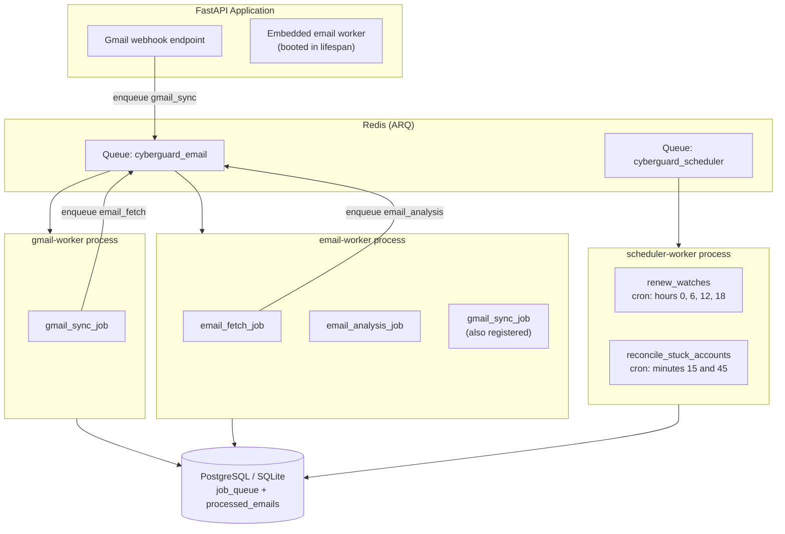
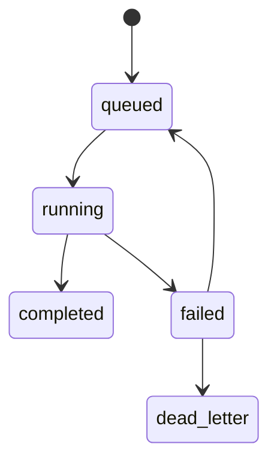
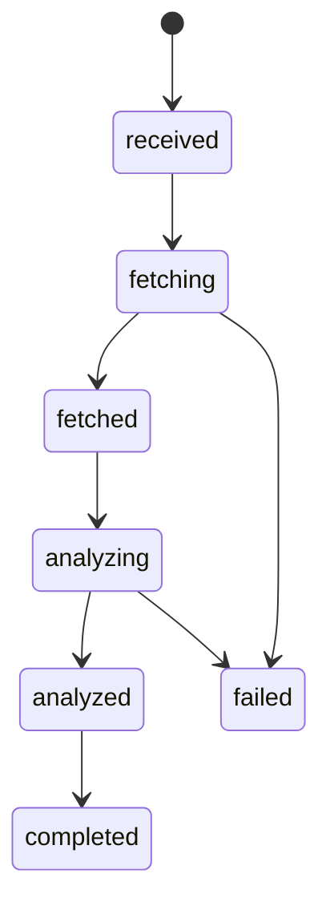
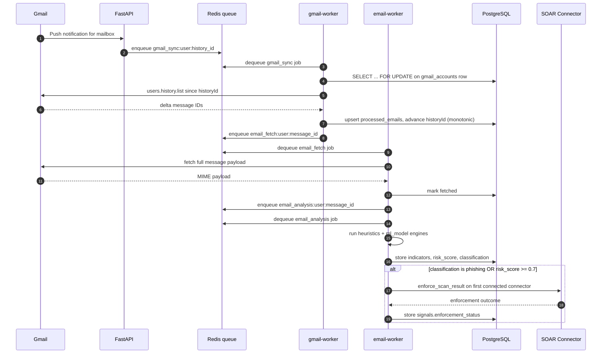
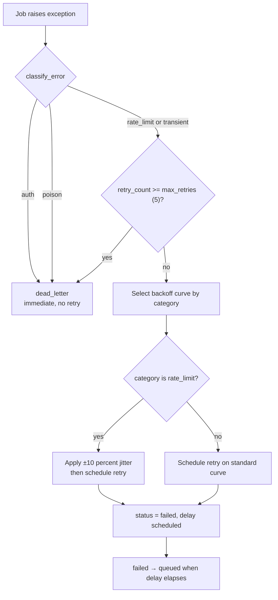
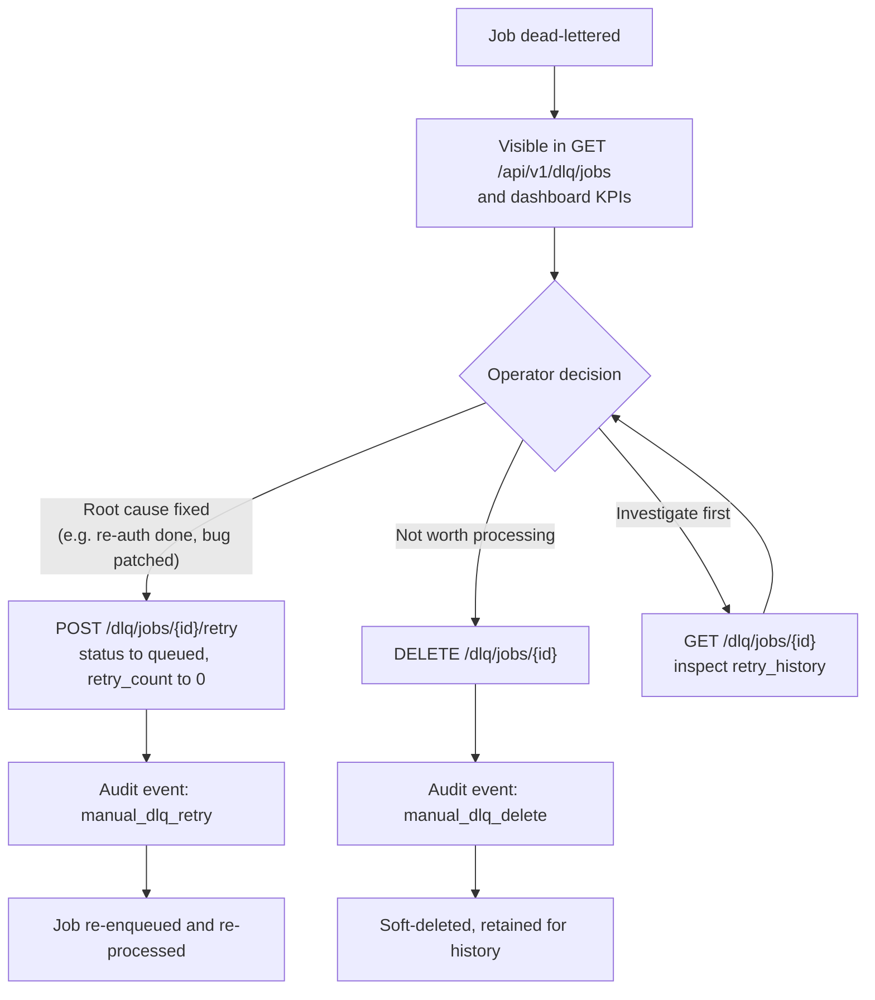

# WORKER ARCHITECTURE

> CYBERGUARD SOC/SOAR Platform — Background Processing, Job Lifecycle, Retry Policy, and Dead-Letter Queue Operations

This document describes the asynchronous worker architecture of the CYBERGUARD platform: the Arq-based worker pool, the deterministic job identifiers that guarantee idempotency, the job state machine, the layered retry and poison-pill protection policies, dead-letter queue (DLQ) operations, and the horizontal scaling strategy.

**Related documentation:** [README.md](README.md) · [ARCHITECTURE.md](ARCHITECTURE.md) · [API_DOCUMENTATION.md](API_DOCUMENTATION.md) · [DATA_MODEL.md](DATA_MODEL.md) · [DECISIONS.md](DECISIONS.md) · [RUNBOOK.md](RUNBOOK.md) · [THREAT_DETECTION_ENGINES.md](THREAT_DETECTION_ENGINES.md) · [ML_MODELS.md](ML_MODELS.md)

---

## Table of Contents

1. [Overview](#1-overview)
2. [Why Arq Instead of Celery](#2-why-arq-instead-of-celery)
3. [Worker Pool Architecture](#3-worker-pool-architecture)
4. [Worker Base Infrastructure](#4-worker-base-infrastructure)
5. [Worker Catalogue](#5-worker-catalogue)
6. [Deterministic Job IDs and Idempotency](#6-deterministic-job-ids-and-idempotency)
7. [Job State Machine](#7-job-state-machine)
8. [End-to-End Pipeline](#8-end-to-end-pipeline)
9. [Retry Policy and Backoff](#9-retry-policy-and-backoff)
10. [Poison Pill Protection](#10-poison-pill-protection)
11. [Dead-Letter Queue Operations](#11-dead-letter-queue-operations)
12. [Scaling Strategy](#12-scaling-strategy)
13. [Configuration Reference](#13-configuration-reference)
14. [Observability](#14-observability)
15. [Troubleshooting](#15-troubleshooting)

---

## 1. Overview

CYBERGUARD is a real-time SOC/SOAR platform. Its threat detection pipeline is event-driven: Gmail push webhooks arrive at the API, deltas are synchronized, message payloads are fetched, and each message is analyzed by heuristic and machine-learning engines (see [THREAT_DETECTION_ENGINES.md](THREAT_DETECTION_ENGINES.md) and [ML_MODELS.md](ML_MODELS.md)). None of this work happens inside the API request cycle — it is executed by a pool of asynchronous background workers backed by Redis.

The worker layer has four responsibilities:

| Responsibility | Mechanism |
| --- | --- |
| Asynchronous job execution | Arq workers consuming Redis queues |
| Exactly-once semantic work | Deterministic job IDs + database unique constraints |
| Failure containment | Categorized retry policy, poison-pill guards, dead-letter queue |
| Operational control | DLQ API, admin UI, Prometheus metrics, audit logging |

Source locations:

- `backend/app/workers/base.py` — worker base classes, settings, and job context helpers
- `backend/app/workers/gmail_worker.py`, `email_worker.py`, `scheduler_worker.py` — the three worker processes
- `backend/app/queue/client.py` — deterministic job ID construction and enqueue logic
- `backend/app/core/retry_policy.py` — error classification and backoff computation
- `backend/app/services/job_state_service.py` and `app/db/models.py` (`JobQueue.can_transition`) — job state machine
- `backend/app/api/` — DLQ management endpoints

---

## 2. Why Arq Instead of Celery

The platform standardizes on **asyncio end-to-end**: FastAPI, SQLAlchemy 2.0 async sessions, and the `asyncpg` / `aiosqlite` drivers. This decision is recorded as **RT-1** in [DECISIONS.md](DECISIONS.md).

Celery would have forced synchronous task bodies (or a hybrid asyncio bridge) inside an otherwise async runtime, introducing thread-pool hops and duplicated connection pools. **Arq** is asyncio-native: job functions are plain `async def` coroutines that share the same event loop patterns, session factories, and drivers as the API layer. Its dependency footprint is minimal — `arq` plus Redis — which keeps the container image small and the failure surface narrow.

**Why this matters:** the entire pipeline (webhook receipt, Gmail API calls, database writes, ML inference) is I/O-bound. Native async workers saturate on I/O concurrency rather than process count, so a single worker with `ARQ_MAX_JOBS=10` can keep ten messages in flight without thread contention.

---

## 3. Worker Pool Architecture

The platform runs three worker processes. Two consume the email queue (`cyberguard_email`, the value of `ARQ_QUEUE_NAME`); the scheduler consumes a dedicated queue (`cyberguard_scheduler`) so cron housekeeping never competes with message throughput. In single-container deployments, the API also boots an embedded email worker inside its lifespan (`create_worker` + `async_run` in `backend/app/main.py`) so queued jobs drain even when no standalone worker container is running.



**Why separate scheduler queue and process:** cron jobs (watch renewal, stuck-account reconciliation) are latency-tolerant but must never be starved by a burst of webhook-triggered syncs. A dedicated queue gives them an isolated consumer; workers compete on Redis lists, so scaling the email worker pool does not affect cron delivery.

### Scheduler cron jobs

| Cron job | Schedule | Purpose |
| --- | --- | --- |
| `renew_watches` | Hours `{0, 6, 12, 18}` (4x daily) | Gmail watches expire after 7 days. The job renews any watch with an expiry inside a 24-hour lookahead window (`watch_expiration < now() + 24h`), so no mailbox ever goes dark. |
| `reconcile_stuck_accounts` | Minutes `{15, 45}` | Detects accounts that have not synced for more than 2 hours. Accounts in a fatal state (`reauth_required`, `scope_error`) are excluded — those require user action, not retries. Eligible accounts are re-driven by dispatching the deterministic job `gmail_sync:{owner_user_id}:reconciliation`. |

The reconciliation job ID is itself deterministic, which means repeated scheduler ticks cannot pile up duplicate reconciliation jobs for the same account (see [Section 6](#6-deterministic-job-ids-and-idempotency)).

---

## 4. Worker Base Infrastructure

All three workers subclass a shared `WorkerSettings` base class in `backend/app/workers/base.py`, which centralizes connection and lifecycle configuration.

### 4.1 WorkerSettings base class

| Setting | Value | Source |
| --- | --- | --- |
| `redis_settings` | `RedisSettings.from_dsn(REDIS_URL)` | Environment |
| `queue_name` | `ARQ_QUEUE_NAME` (default `cyberguard_email`) | Environment |
| `max_jobs` | `ARQ_MAX_JOBS` (default `10`) | Environment |
| `job_timeout` | `ARQ_JOB_TIMEOUT` (default `300` seconds) | Environment |
| `retry_jobs` | `True` | Static |
| `max_tries` | `3` | Static |

`__init_subclass__` copies these defaults onto every subclass that does not explicitly override them. **Why:** a new worker cannot silently omit `redis_settings` or lifecycle hooks; the base guarantees a correct, testable configuration baseline while still allowing per-worker overrides (for example, the scheduler overrides `queue_name` and `cron_jobs`).

### 4.2 Lifecycle and session management

- **`base_startup(ctx)`** builds the admin database sessionmaker (`_get_admin_session_maker`) and attaches a structured JSON logger to the Arq context.
- **`base_shutdown(ctx)`** logs graceful shutdown and disposes the engine bound to the sessionmaker.
- **`get_db_session(ctx)`** is an async context manager that yields admin sessions from `ctx["db_maker"]` to job bodies.

**Why an admin sessionmaker:** worker jobs run outside any HTTP request and therefore outside request-scoped authentication. They operate on the pipeline's own tables (job queue, processed emails, gmail accounts) with the service's internal credentials, consistent with the data model in [DATA_MODEL.md](DATA_MODEL.md).

### 4.3 Job context and metrics

`job_context(...)` binds `correlation_id`, `job_id`, `job_type`, `user_id`, and `worker_name` to **contextvars** for the duration of a job. Every structured log record emitted within the job carries this metadata, so a single message can be traced across sync → fetch → analysis by its correlation ID. On completion or failure it increments:

```
worker_jobs_total{worker_name, job_type, status}
```

where `status` is `success` or `failed`. These counters feed the observability stack described in [Section 14](#14-observability) and the alerting checks in [RUNBOOK.md](RUNBOOK.md).

---

## 5. Worker Catalogue

| Worker | Module | Registered jobs | Queue | Worker name |
| --- | --- | --- | --- | --- |
| gmail-worker | `app/workers/gmail_worker.py` | `gmail_sync_job` (name `gmail_sync`) — plus the fetch/analysis jobs are included in its `WorkerSettings.functions` | `cyberguard_email` | `gmail-worker` |
| email-worker | `app/workers/email_worker.py` | `email_fetch_job` (name `email_fetch`), `email_analysis_job` (name `email_analysis`), and `gmail_sync_job` | `cyberguard_email` | `email-worker` |
| scheduler-worker | `app/workers/scheduler_worker.py` | `renew_watches`, `reconcile_stuck_accounts` (cron) | `cyberguard_scheduler` | — |

**Why every email-queue worker registers all three job functions:** each `WorkerSettings.functions` list includes the full job set for the email queue (`gmail_sync`, `email_fetch`, `email_analysis`). Because jobs fan out down a pipeline (sync enqueues fetch, fetch enqueues analysis), letting any email-queue worker execute any stage removes pipeline head-of-line blocking — a worker that just finished a sync can immediately pick up the next fetch without waiting for a differently-configured process.

### Gmail sync worker internals (RT-4)

The `gmail_sync_job` implements delta synchronization against the Gmail API:

1. **Delta-only pulls via `users.history.list`.** The job requests only changes since the mailbox's last stored `historyId`. This is quota-efficient (no full re-listing) and exact (the history API returns precisely the added/removed message IDs since the checkpoint).
2. **Per-mailbox serialization via `SELECT ... FOR UPDATE`.** Row locks on `gmail_accounts` serialize concurrent syncs for the *same* mailbox while leaving *different* mailboxes fully parallel. This prevents two workers from interleaving history batches for one account and corrupting the checkpoint.
3. **Monotonic history ID comparison.** A checkpoint is advanced only when the new `historyId` is strictly greater than the stored one (`new > old`), preventing history regression from stale webhook deliveries replayed out of order.
4. **Initial sync via `getProfile`.** The first sync for an account establishes the baseline `historyId` from the profile without performing a historical message backfill; only post-connect deltas are processed.

---

## 6. Deterministic Job IDs and Idempotency

Duplicate delivery is a fact of life in a webhook-driven system: Gmail may redeliver a push notification, the scheduler may reconcile an account mid-sync, and a retried job may re-enqueue its successor. CYBERGUARD neutralizes duplicates at two layers.

### 6.1 Deterministic job ID formats (`app/queue/client.py`)

| Job | Deterministic ID format |
| --- | --- |
| Gmail sync | `gmail_sync:{user}:{history_id}` |
| Email fetch | `email_fetch:{user}:{message_id}` |
| Email analysis | `email_analysis:{user}:{message_id}` |
| On-demand scan | `email_scan:{user}:{message_id}` |
| Scheduler reconciliation | `gmail_sync:{owner_user_id}:reconciliation` |

When `enqueue_job` is called with a `_job_id` that already exists in Redis, Arq returns the **existing job** instead of creating a second one. This is Redis-level idempotency: redelivered webhooks and retried jobs collapse into a single queued unit of work.

### 6.2 Database-level uniqueness

- `job_queue.job_id` carries a **UNIQUE** constraint — even across a Redis flush or a multi-instance race, PostgreSQL rejects duplicate job rows.
- The idempotency service additionally provides `ensure_processed_email` (unique on `(owner_user_id, gmail_message_id)`; on `IntegrityError` the existing row is returned rather than raising) and `ensure_job` (unique `job_id`).

**Why two layers:** Redis and PostgreSQL fail independently. If Redis is restarted and loses queued job records, the database constraint still prevents duplicate message rows; if the database row exists but the job was lost from the queue, re-enqueuing with the same deterministic ID is safe and cheap. Together they give the pipeline effectively exactly-once processing despite at-least-once delivery.

---

## 7. Job State Machine

Job lifecycle state is persisted on the `job_queue` table and enforced by `JobQueue.can_transition` (`app/db/models.py`) plus the helpers in `app/services/job_state_service.py`.



Transitions in prose:

| From | To | Meaning |
| --- | --- | --- |
| `queued` | `running` | A worker picked up the job. |
| `running` | `completed` | Job finished successfully. |
| `running` | `failed` | Job raised; the retry policy decides the next move. |
| `failed` | `queued` | Retry path — the job is re-enqueued after its backoff delay. |
| `failed` / any exhausted state | `dead_letter` | Terminal quarantine for manual or admin-driven remediation. |

When a job is forced into `dead_letter`, the system sets `retry_count = max_retries`, making the terminal status explicit in the record itself.

**Why a persisted state machine instead of ad-hoc status strings:** every transition is validated against the allowed edge set, so an out-of-order webhook or a duplicate worker cannot move a job backwards or into an impossible state. It also gives the DLQ and dashboards a trustworthy single source of truth.

### Email processing states

In parallel, each message tracks its own fine-grained pipeline state on `processed_emails.processing_status`:



The job-level state machine answers "did the *unit of work* succeed?"; the message-level states answer "how far did *this email* get?" — which is the question the debugging workflow in [RUNBOOK.md](RUNBOOK.md) starts from.

---

## 8. End-to-End Pipeline

The following sequence traces one phishing email from Gmail push notification to SOAR enforcement.



The analysis stage's auto-SOAR hook (`email_worker.py`): when `classification == "phishing"` or `risk_score >= 0.7`, the job builds a `ScanResult` from the `heuristics` and `ml_model` engines and calls `enforce_scan_result` on the first connected connector. The outcome is persisted in `signals.enforcement_status` — the value `"enforcement_error"` records a connector failure without failing the analysis job itself, and `"clean"` records that no connector required action. See [THREAT_DETECTION_ENGINES.md](THREAT_DETECTION_ENGINES.md) for the engines and [ARCHITECTURE.md](ARCHITECTURE.md) for the connector layer.

---

## 9. Retry Policy and Backoff

Retry behavior is centralized in `app/core/retry_policy.py` (recorded as RT-10) rather than scattered across job bodies. It rests on two schedules and an error classifier.

### 9.1 Backoff schedules

| Schedule | Delays (seconds) | Used for |
| --- | --- | --- |
| `STANDARD_BACKOFF_DELAYS` | 5, 30, 120, 600, 1800 | Transient errors |
| `RATE_LIMIT_BACKOFF_DELAYS` | 30, 300, 1800, 7200, 21600 | Gmail rate limits / quota errors |

### 9.2 Error categories

`classify_error` maps exceptions (and error-message substrings) into four categories:

| Category | Trigger examples | Retry behavior |
| --- | --- | --- |
| `auth` | `GmailAuthError`, `401`, `invalid_grant`, `reauth_required` | **Immediate dead-letter** — retries cannot fix revoked credentials |
| `poison` | `MIMECorruptionError`, `OversizedEmail`, `poison_pill` markers | **Immediate dead-letter** — the payload itself is unprocessable |
| `rate_limit` | `GmailRateLimitError`, `429`, `quota`, `user_rate_limit_exceeded` | Retry on the long rate-limit curve **with ±10% jitter** |
| `transient` | `NetworkTimeout`, `GmailServerError`, `TimeoutError` | Retry on the standard curve |

Poison-class exceptions are `MIMECorruptionError`, `OversizedEmail`, and `NetworkTimeout`; `evaluate_retry_policy` treats the `auth` and `poison` categories as non-retryable, sends `retry_count >= max(5)` straight to `dead_letter`, and otherwise returns a `failed` status with a computed delay.

### 9.3 Decision flow



**Why jitter only for rate limits:** when a quota window resets, every worker holding a backed-off rate-limit job retries at nearly the same instant — the classic thundering herd. A ±10% multiplicative jitter (applied only when `RETRY_JITTER_ENABLED=True`) desynchronizes those retries. Standard transient retries are few and naturally spread by their own failures, so jitter there would only add delay without benefit.

---

## 10. Poison Pill Protection

A single malformed email must never be able to crash a worker, stall its queue, or consume unbounded memory. The pipeline enforces hard resource limits (RT-5) before and during payload processing:

| Guard | Limit | Constant |
| --- | --- | --- |
| Total email size | 10,000,000 bytes | `MAX_EMAIL_BYTES` |
| Body text length | 200,000 characters | `MAX_BODY_CHARS` |
| URLs per message | 100 | `MAX_URLS` |
| MIME parts per message | 100 | `MAX_MIME_PARTS` |
| Fetch timeout | 30 seconds | `FETCH_TIMEOUT_S` |
| Attachment metadata entries | 20 | `MAX_ATTACHMENT_META` |

Exceeding a size boundary raises `NonRetryableError("size_exceeded")`, which the state machine maps to an **immediate `dead_letter`** transition — no retry attempts are spent on a payload that will always fail. The corresponding `processed_emails.processing_status` is set to `failed` so the message is visible in message-level triage.

**Why metadata-only attachments:** attachment *content* is never downloaded during analysis; only metadata (name, size, type, up to 20 entries) is recorded. This bounds memory per job, removes an entire class of archive/malware-handling risk in the worker process, and makes the byte and part limits fully deterministic.

---

## 11. Dead-Letter Queue Operations

### 11.1 What lands in the DLQ

A job enters `dead_letter` when the error category is non-retryable (`auth`, `poison`, size-exceeded) or when `retry_count` reaches `max_retries`. Dead-lettered jobs retain their full history and are quarantined until an operator acts.

### 11.2 DLQ API

All endpoints live under `/api/v1/dlq` and are documented in [API_DOCUMENTATION.md](API_DOCUMENTATION.md):

| Endpoint | Method | Behavior |
| --- | --- | --- |
| `/api/v1/dlq/jobs` | GET | Paginated dead-letter listing with filters |
| `/api/v1/dlq/stats` | GET | Aggregates: `total_dead_letter`, `by_job_type`, `oldest_age_hours` |
| `/api/v1/dlq/jobs/{id}` | GET | Single job with its `retry_history` |
| `/api/v1/dlq/jobs/{id}/retry` | POST | **Admin only.** Resets `status → queued` and `retry_count → 0`, writes an audit event `manual_dlq_retry`, and re-enqueues the job |
| `/api/v1/dlq/jobs/{id}` | DELETE | Soft-delete: sets `status = 'deleted'`, writes audit event `manual_dlq_delete` |

Access control is enforced by the `get_dlq_user` dependency: analyst-role users receive **403**; non-admin users who do have access see **only their own** dead-lettered jobs; admins see everything. Every mutating operation is audit-logged (see [DATA_MODEL.md](DATA_MODEL.md) for the audit trail).

### 11.3 Operational flow



**Why soft-delete:** deleted jobs remain queryable for forensics and audit compliance; hard deletion would destroy the evidence trail that a SOC is required to keep.

### 11.4 Frontend DLQ dashboard

The dashboard route `/dlq` (admin-only, enforced client-side by `RoleGuard`) provides:

- KPI cards: **Total Dead Letters**, **Oldest Age**, **Breakdown by Job Type**
- A retry/delete drawer per job mirroring the API operations
- Live updates via WebSocket with a **20-second polling fallback** and a `LIVE`/`POLLING` connection-status pill

---

## 12. Scaling Strategy

Workers are **stateless and horizontally scalable**: all coordination happens through Redis (queue consumption) and PostgreSQL (state), so any number of worker replicas can compete on the same queues without configuration changes.

### 12.1 Scaling out

```bash
docker compose up -d --scale email-worker=N
```

Each replica consumes from the same Redis queue; Arq guarantees each job is delivered to exactly one worker.

### 12.2 Bounding per-process resources

`ARQ_MAX_JOBS` (default `10`) bounds concurrent jobs per process. This matters because the ML engines load torch- and XGBoost-based models **per process** (see [ML_MODELS.md](ML_MODELS.md)); the cap keeps worst-case memory at roughly `max_jobs × model footprint` rather than unbounded. When scaling for throughput, prefer more replicas over raising `max_jobs` far beyond the default.

### 12.3 What does not need scaling

- **Scheduler worker:** two lightweight cron jobs; a single replica is sufficient and avoids duplicate cron firings (deterministic job IDs provide a second safety net).
- **API:** scales independently behind its own deployment; the embedded worker exists for single-container deployments, not for throughput.

**Why competing consumers instead of partitioning:** mailbox sharding would add operational complexity for little gain — the per-mailbox `SELECT ... FOR UPDATE` lock already serializes work within a mailbox, while all other parallelism is realized by the pool. See [ARCHITECTURE.md](ARCHITECTURE.md) for the surrounding deployment topology.

---

## 13. Configuration Reference

| Variable | Default | Description |
| --- | --- | --- |
| `ARQ_QUEUE_NAME` | `cyberguard_email` | Primary queue consumed by the email workers |
| `ARQ_MAX_JOBS` | `10` | Maximum concurrent jobs per worker process (memory bound for ML models) |
| `ARQ_JOB_TIMEOUT` | `300` | Per-job timeout in seconds |
| `WORKER_CONCURRENCY` | `4` | Application-level concurrency knob for worker-side parallel work |
| `RETRY_BASE_DELAY_S` | `5` | Base unit for backoff computation |
| `RETRY_MAX_RETRIES` | `5` | Attempts before a retryable failure dead-letters |
| `RETRY_JITTER_ENABLED` | `True` | Enables ±10% jitter for rate-limit category retries |
| `REDIS_URL` | — | DSN used to derive `RedisSettings.from_dsn` |
| `ML_ENABLED` | `True` | Enables the `ml_model` engine inside analysis jobs (see [ML_MODELS.md](ML_MODELS.md)) |

Operational deployment settings (compose profiles, container topology) are covered in [README.md](README.md) and [RUNBOOK.md](RUNBOOK.md).

---

## 14. Observability

- **Prometheus counter:** `worker_jobs_total{worker_name, job_type, status}` — incremented per job outcome by `job_context`. Alerting guidance is in [RUNBOOK.md](RUNBOOK.md).
- **Structured logging:** every log line emitted inside a job carries `correlation_id`, `job_id`, `job_type`, `user_id`, and `worker_name`, with a sensitive-data filter applied. Trace any message across the full pipeline with its correlation ID.
- **DLQ stats endpoint:** `/api/v1/dlq/stats` exposes `total_dead_letter`, `by_job_type`, and `oldest_age_hours` — the three numbers an on-call engineer needs first.
- **Audit trail:** manual DLQ operations write audit events (`manual_dlq_retry`, `manual_dlq_delete`).

---

## 15. Troubleshooting

| Symptom | Likely cause | Diagnosis / remedy |
| --- | --- | --- |
| Messages stuck in `received`/`fetching` | Email worker down or queue backed up | Check worker process health and `worker_jobs_total` rate; the `reconcile_stuck_accounts` cron will re-drive accounts not synced for more than 2 hours. |
| Account shows `reauth_required` | Gmail OAuth token revoked/expired | This is a fatal category — the job dead-letters immediately. The user must re-authenticate; then use the DLQ retry endpoint to re-run dead-lettered jobs. |
| Growing dead-letter count for one job type | Systemic failure (bug, quota exhaustion, corrupt source) | Inspect `GET /dlq/jobs/{id}` `retry_history` for the dominant error category; check the troubleshooting playbook in [RUNBOOK.md](RUNBOOK.md). |
| Duplicate-looking sync activity | Redelivered webhooks | Expected and harmless — deterministic job IDs collapse duplicates at the Redis level; the DB unique constraints catch the rest. Verify no errors in the sync worker logs. |
| Rate-limit storms after quota reset | Jitter disabled | Confirm `RETRY_JITTER_ENABLED=True`; jitter exists precisely to spread these retries. |
| Jobs exceeding 300s | Heavy ML inference or oversized payloads | `ARQ_JOB_TIMEOUT` bounds each job; check whether `MAX_EMAIL_BYTES`/`MAX_MIME_PARTS` guards were bypassed and raise `ARQ_MAX_JOBS` memory headroom or scale replicas instead (Section 12). |
| Same mailbox syncing concurrently | Lock contention expected | `SELECT ... FOR UPDATE` serializes per-mailbox syncs by design; parallel *mailboxes* are unaffected. |
| Scheduler jobs not firing | Scheduler worker not running on `cyberguard_scheduler` queue | Verify the scheduler-worker container/process is up and consuming the dedicated queue (Section 3). |
| Dead letters invisible to an analyst user | Intentional access control | `get_dlq_user` returns 403 for analysts and scopes non-admins to their own jobs; use an admin account for platform-wide triage. |
| Dashboard shows POLLING instead of LIVE | WebSocket unavailable | The dashboard falls back to 20-second polling automatically; check the gateway/proxy WebSocket configuration. |
