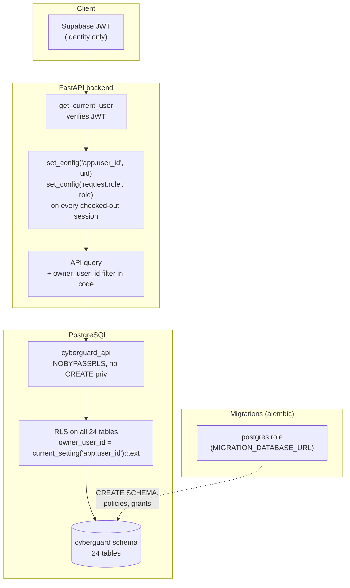
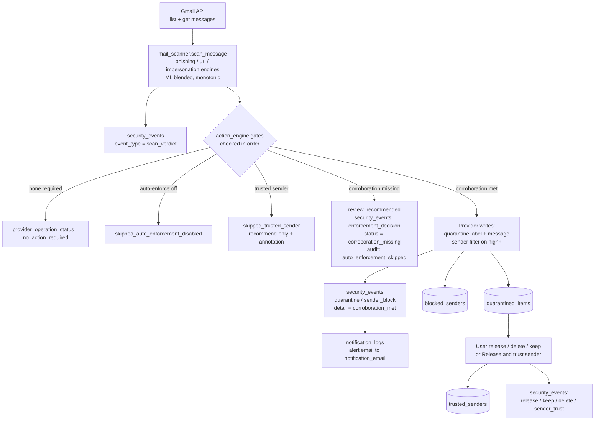

# CYBERGUARD Database Design

The authoritative reference for the PostgreSQL schema behind CYBERGUARD.
Everything here is generated from the SQLAlchemy models (`app/db/models.py`)
via the single from-scratch baseline migration
(`alembic/versions/0001_cyberguard_baseline.py`) — the ORM is the source of
truth, the database can never drift from it. Day-to-day operations live in
[RUNBOOK.md](RUNBOOK.md).

---

## 1. Design principles

1. **One schema, fully isolated** — every table lives in the dedicated
   `cyberguard` PostgreSQL schema (`CREATE SCHEMA IF NOT EXISTS` is baked into
   both the migration and app startup). Nothing leaks into `public` except
   Alembic's own `alembic_version` bookkeeping table.
2. **Owner-scoped row-level security everywhere** — all 24 tables have RLS
   enabled (deny-all by default). The application role `cyberguard_api` is
   NOBYPASSRLS and every request sets an `app.user_id` GUC; Postgres filters
   rows server-side. RLS is the second line of defence — the API also filters
   by `owner_user_id` in every query.
3. **Two role separation** — the app role can read/write data but cannot
   create schemas or manage policies; only the migration role (`postgres`,
   via `MIGRATION_DATABASE_URL`) can change DDL. This is why a schema wipe
   heals with `alembic upgrade head`, not by restarting the app.
4. **Personal-first, org-capable** — most rows are owned directly by a user
   (`owner_user_id`). Organization tables exist for team mode, and org-scoped
   tables (alerts, incidents, policies…) carry *both* columns.
5. **Snapshots over joins for history** — scan results are stored as a JSON
   snapshot (`quarantined_items.scan_result_json`, `events.raw_data`,
   `alerts.indicators`) so verdicts and event chains stay immutable and
   self-describing even if detectors evolve.

**Counts:** 24 tables · 92 RLS policies · every table RLS-enabled.

---

## 2. Entity–relationship overview

The full picture. `PK` marks primary keys; relationships are the actual
foreign keys in the schema.

```mermaid
erDiagram
    users ||--o{ organizations : "owns (owner_id)"
    users ||--o{ organization_members : "membership"
    organizations ||--o{ organization_members : "has"
    organizations ||--o{ events : "optional org"
    users ||--o{ email_connector_accounts : "connects"
    users ||--o{ events : "owns"
    users ||--o{ connector_oauth_states : "oauth"
    users ||--o{ notification_logs : "receives"
    users ||--o{ trusted_senders : "trusts"

    events ||--o{ alerts : "raised from"
    events ||--o{ media_files : "attaches"
    alerts ||--o{ recommended_actions : "suggests"
    alerts ||--o{ incident_alerts : "linked"
    incidents ||--o{ incident_alerts : "contains"
    incidents ||--o{ incident_events : "timeline"
    alerts ||--o{ action_executions : "triggers"
    events ||--o{ action_executions : "triggers"
    enforcement_policies ||--o{ action_executions : "governs"
    organizations ||--o{ enforcement_policies : "sets"

    response_catalog ||--o{ response_executions : "catalogues"
    organizations ||--o{ response_executions : "performs"

    email_connector_accounts ||--|| connector_settings : "1:1 settings"
    email_connector_accounts ||--o{ blocked_senders : "auto-blocks"
    email_connector_accounts ||--o{ quarantined_items : "auto-quarantines"
    email_connector_accounts ||--o{ connector_operation_logs : "logs"
    email_connector_accounts ||--o{ security_events : "context"
    quarantined_items ||--o{ security_events : "lifecycle"
    blocked_senders ||--o{ security_events : "lifecycle"
    users ||--o{ security_events : "owns"

    users {
        varchar_64 id PK
        varchar_255 email
        varchar_64 username UK
        varchar_16 account_type
        varchar_255 notification_email
        varchar_36 active_organization_id
    }
    organizations {
        varchar_36 id PK
        varchar_255 slug UK
        boolean is_personal
        varchar_64 owner_id FK
    }
    events {
        varchar_36 id PK
        varchar_64 event_type
        json raw_data
        varchar_64 owner_user_id
    }
    alerts {
        varchar_36 id PK
        varchar_36 event_id FK
        varchar_64 module
        varchar_32 severity
        int risk_score
        json indicators
        json mitre
    }
    incidents {
        varchar_36 id PK
        varchar_255 title
        varchar_32 severity
        varchar_32 status
    }
    media_files {
        varchar_36 id PK
        varchar_36 event_id FK
        varchar_512 storage_path
        bigint size_bytes
    }
    action_executions {
        varchar_36 id PK
        varchar_36 alert_id FK
        varchar_64 action_type
        varchar_32 status
        json target
        json execution_result
    }
    enforcement_policies {
        varchar_36 id PK
        varchar_36 organization_id FK
        int phishing_high_threshold
        varchar_64 action_on_critical
        boolean auto_execute_critical
    }
    response_catalog {
        varchar_36 id PK
        varchar_255 action UK
        boolean requires_approval
    }
    response_executions {
        varchar_36 id PK
        varchar_36 catalog_id FK
        varchar_32 status
    }
    email_connector_accounts {
        varchar_36 id PK
        varchar_32 provider
        varchar_255 provider_email
        varchar_32 status
        text access_token_enc
        text refresh_token_enc
    }
    connector_settings {
        varchar_36 id PK
        varchar_36 connector_id FK, UK
        boolean auto_quarantine_enabled
        int quarantine_expiry_hours
    }
    quarantined_items {
        varchar_36 id PK
        varchar_36 connector_id FK
        varchar_128 provider_message_id
        json scan_result_json
        varchar_32 status
    }
    blocked_senders {
        varchar_36 id PK
        varchar_36 connector_id FK
        varchar_255 sender_email
        varchar_128 provider_rule_id
        varchar_32 status
    }
    security_events {
        varchar_36 id PK
        varchar_48 event_type
        varchar_16 actor_type
        varchar_32 operation_status
        text operation_detail
    }
    connector_operation_logs {
        varchar_36 id PK
        varchar_36 connector_id FK
        varchar_64 operation
        varchar_32 status
    }
    connector_oauth_states {
        varchar_128 state PK
        varchar_64 owner_user_id FK
        datetime expires_at
    }
    notification_logs {
        varchar_36 id PK
        varchar_48 event_type
        varchar_255 recipient_email
        varchar_16 backend
        varchar_16 status
    }
    trusted_senders {
        varchar_36 id PK
        varchar_255 sender_email
        varchar_255 reason
    }
    organization_members {
        varchar_36 id PK
        varchar_36 organization_id FK
        varchar_64 user_id FK
        varchar_32 role
    }
    incident_alerts {
        varchar_36 incident_id PK, FK
        varchar_36 alert_id PK, FK
    }
    incident_events {
        varchar_36 id PK
        varchar_36 incident_id FK
        varchar_255 action
        varchar_255 actor
    }
    recommended_actions {
        varchar_36 id PK
        varchar_36 alert_id FK
        varchar_255 action
        boolean executed
    }
    audit_logs {
        varchar_36 id PK
        varchar_36 organization_id FK
        varchar_16 actor_type
        varchar_255 action
        varchar_255 resource
    }
```



### Ownership without foreign keys

Two ownership groups exist. Tables in the **connector subsystem** carry a
hard `FK → users.id` (see diagram). Tables from the **org-mode era**
(`events`, `alerts`, `incidents`, `media_files`, `enforcement_policies`,
`response_executions`, `action_executions`, `audit_logs`) carry
`owner_user_id` as an *indexed logical column* — no FK — so personal
workspaces (org-less rows, `organization_id = NULL`) are legal. RLS treats
both groups identically; the app filters on the column either way.

---

## 3. Domain groups

### 3.1 Detection pipeline (org-mode core)

```
raw input ──► events ──► alerts ──► recommended_actions
                 │           │
                 │           ├──► incident_alerts ──► incidents ──► incident_events
                 └──► media_files (deepfake/media forensics, storage-backed)
```

| Table | Purpose | Notable columns |
|---|---|---|
| `events` | raw detection input (email, URL, auth log, network flow) | `raw_data` JSON snapshot, `source`, `status` |
| `alerts` | one analysis verdict per event | `module` (phishing/url/deepfake/ato/network/impersonation), `risk_score` 0-100, `indicators` + `mitre` JSON |
| `recommended_actions` | per-alert suggested playbook actions | `automation_level`, `requires_approval`, `executed` |
| `incidents` / `incident_alerts` / `incident_events` | case management: group alerts, append-only timeline | join table has composite PK |
| `media_files` | binary media metadata for deepfake analysis | `storage_path` points at Supabase Storage, `file_hash` for dedup |

### 3.2 Response & enforcement (org-mode)

| Table | Purpose |
|---|---|
| `response_catalog` | seeded playbook of available response actions (10 rows at startup) |
| `response_executions` | one row per playbook execution (client or server mode, approval workflow) |
| `enforcement_policies` | per-org threshold→action mapping (`action_on_critical`, `auto_execute_*`, SOC notification flags) |
| `action_executions` | approval-gated execution records with risk context denormalized (`risk_score`, `severity`, `module`) |

### 3.3 Email connector subsystem (personal workspace)

| Table | Purpose |
|---|---|
| `email_connector_accounts` | OAuth-connected mailboxes (Gmail). Tokens are **encrypted at rest** (`access_token_enc` / `refresh_token_enc`); never returned by any API |
| `connector_settings` | 1:1 enforcement toggles: `auto_quarantine_enabled`, `quarantine_expiry_hours`, `permanent_delete_enabled` |
| `connector_oauth_states` | short-lived CSRF `state` rows for the OAuth round-trip |
| `connector_operation_logs` | every provider write (quarantine, filter, delete) with honest failure details |

### 3.4 Security history & trust (Phase 5 / FP-hardening)

| Table | Purpose |
|---|---|
| `security_events` | the **permanent event chain**: one row per scan verdict, quarantine, release, keep, delete, sender block/unblock, trust/untrust, enforcement decision. `actor_type` (user/system/scheduler) + `operation_status` + `operation_detail` keep it explainable. Nullable FKs to `quarantined_items`, `blocked_senders`, `email_connector_accounts` tie lifecycle events to their objects |
| `trusted_senders` | user trust list (unique per owner+sender): future auto-enforcement for that sender becomes recommend-only |
| `audit_logs` | compliance-grade audit of state-changing actions (also auto-written by `record_event`) |
| `notification_logs` | delivery log for event alert emails — always to `users.notification_email`, never to a connected mailbox; `backend` records `db_log` vs `smtp` |

---

## 4. Row-level security model

Every table is RLS-enabled. Policies are keyed on a per-request GUC, set by
the API layer inside the DB session:



Policy families installed by the baseline:

| Family | Tables | Rule |
|---|---|---|
| Owner-scoped | 18 tables (users keys on `id`, others on `owner_user_id`) | SELECT/INSERT/UPDATE/DELETE where owner = GUC; INSERT/UPDATE also WITH CHECK |
| Child/join | `recommended_actions`, `incident_alerts`, `incident_events` | ownership derived from the parent row via `EXISTS` |
| Membership | `organization_members` | `user_id = app.user_id` |
| Shared read | `response_catalog`, `organizations` | SELECT for PostgREST `authenticated`; full access for `cyberguard_api` (startup seeding) |

Consequence: an unauthenticated request (empty GUC) sees **zero rows** — a
"count returns 0" surprise is usually RLS, not missing data.

---

## 5. Data flow: mailbox scan → enforcement → event chain

How the connector subsystem writes the database during one scan
(the FP-hardening decision points are marked):



The corroboration gate condition: **overall severity critical AND at least 2
engines at high+** → provider writes; otherwise `review_recommended` with the
decision reason recorded in `security_events` and `audit_logs`.

`provider_message_id` and `provider` are stored on every connector-side row
so the system stays provider-neutral (today Gmail, by contract any
`EmailProvider` implementation).

---

## 6. Table reference

| # | Table | Owner key | Group |
|---|---|---|---|
| 1 | `users` | `id` | identity |
| 2 | `organizations` | shared | identity |
| 3 | `organization_members` | `user_id` | identity |
| 4 | `events` | `owner_user_id` (logical) | detection |
| 5 | `alerts` | `owner_user_id` (logical) | detection |
| 6 | `recommended_actions` | via alert EXISTS | detection |
| 7 | `incidents` | `owner_user_id` (logical) | detection |
| 8 | `incident_alerts` | via incident EXISTS | detection |
| 9 | `incident_events` | via incident EXISTS | detection |
| 10 | `media_files` | `owner_user_id` (logical) | detection |
| 11 | `response_catalog` | shared | response |
| 12 | `response_executions` | `owner_user_id` (logical) | response |
| 13 | `enforcement_policies` | `owner_user_id` (logical) | response |
| 14 | `action_executions` | `owner_user_id` (logical) | response |
| 15 | `audit_logs` | `owner_user_id` (logical) | audit |
| 16 | `email_connector_accounts` | `owner_user_id` (FK) | connectors |
| 17 | `connector_settings` | `owner_user_id` (FK) | connectors |
| 18 | `connector_oauth_states` | `owner_user_id` (FK) | connectors |
| 19 | `connector_operation_logs` | `owner_user_id` (FK) | connectors |
| 20 | `quarantined_items` | `owner_user_id` (FK) | enforcement |
| 21 | `blocked_senders` | `owner_user_id` (FK) | enforcement |
| 22 | `security_events` | `owner_user_id` (FK) | history |
| 23 | `notification_logs` | `owner_user_id` (FK) | notifications |
| 24 | `trusted_senders` | `owner_user_id` (FK) | trust |

"Logical" = indexed column without a foreign key (see §2) so org-less
personal rows are legal; RLS and the app filter on it identically.

---

## 7. Conventions

- **IDs**: UUID strings stored as `VARCHAR(36)` (client-generated).
- **Timestamps**: `TIMESTAMPTZ`, UTC, `now()` server defaults; indexed on
  every event/log table (they are always queried newest-first).
- **JSON**: `PortableJSON` type — native `JSONB` on Postgres, `TEXT` on
  SQLite (test suite).
- **Status enums**: plain `VARCHAR` + `CHECK`-less by design; the valid
  value sets are documented in code comments on each column (e.g.
  `quarantined_items.status`: quarantined / released / deleted / expired).
- **Indexes**: every `owner_user_id`, FK, status and `created_at` column is
  indexed (declared in the models, created by the baseline).
- **Migrations**: a single idempotent baseline regenerates schema + RLS from
  the ORM. Reset procedure: [RUNBOOK.md §4](RUNBOOK.md) /
  `scripts/drop_cyberguard_schema.py`.
