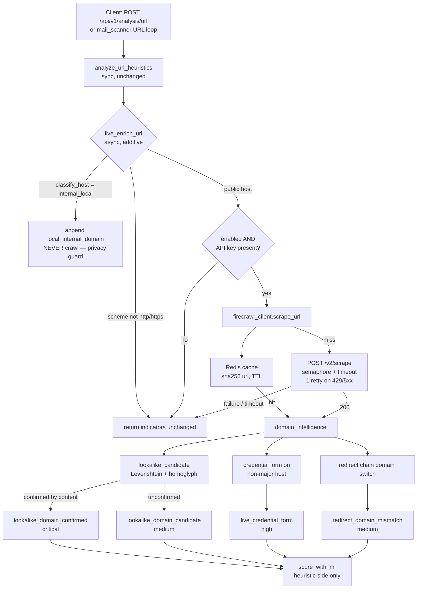

# Firecrawl Live Page Intelligence — URL Enrichment Layer

Optional, additive enrichment for the URL detection pipeline: Firecrawl-powered
live page scraping to identify **lookalike domains** and **local/internal
domains**, confirm **credential-harvesting forms**, and detect **redirect
domain mismatches**.

Everything here is strictly opt-in: with no `FIRECRAWL_API_KEY` the pipeline
behaves byte-identically to before (heuristics-only).

## Architecture

## Modules

| Module | Responsibility |
| --- | --- |
| `app/services/firecrawl_client.py` | HTTP client, Redis cache, semaphore, retry, metrics. **Never raises** — returns `None` on any failure. |
| `app/services/domain_intelligence.py` | Host classification, brand lookalike logic, content confirmation, redirect detection, `live_enrich_url` pipeline entry point. |

Integration points (both **async callers only**; `analyze_url_heuristics` stays
fully synchronous and signature-stable):

- `app/api/routes_analysis.py` — `analyze_url` endpoint, after heuristics, before `_run_analysis_pipeline` / `score_with_ml`.
- `app/services/mail_scanner.py` — `_url_analysis` URL loop (now async), before `calculate_score`.

## Environment variables

| Variable | Default | Meaning |
| --- | --- | --- |
| `FIRECRAWL_API_KEY` | `""` | API key. **Empty ⇒ enrichment cleanly disabled** (heuristics-only, no extra latency). Nulled in `TEST_MODE`. |
| `FIRECRAWL_BASE_URL` | `https://api.firecrawl.dev` | API base URL. |
| `FIRECRAWL_ENABLED` | `true` | Master switch. |
| `FIRECRAWL_TIMEOUT_SECONDS` | `10` | Hard per-scrape bound (`asyncio.wait_for`). Total added latency per URL is bounded by this. |
| `FIRECRAWL_CACHE_TTL_SECONDS` | `3600` | Redis cache TTL (key: `sha256(url)`). |
| `FIRECRAWL_MAX_CONCURRENCY` | `4` | `asyncio.Semaphore` bound on outbound scrapes. |
| `FIRECRAWL_SKIP_INTERNAL_URLS` | `true` | Privacy guard: classify internal hosts but never crawl them. |

## Indicator schema

| type | severity | description template |
| --- | --- | --- |
| `local_internal_domain` | medium | Internal/local network host, classified but not crawled (privacy guard). |
| `lookalike_domain_confirmed` | critical | Lookalike of brand `{brand}` CONFIRMED by live page content (`{reason}`; `{evidence}`). |
| `lookalike_domain_candidate` | medium | Host looks like a `{brand}` lookalike (`{reason}`); live content did not confirm. |
| `live_credential_form` | high | Password input on a non-major domain — consistent with credential harvesting. |
| `redirect_domain_mismatch` | medium | Redirect chain switched registrable domains between submitted and final URL. |

All of these are **heuristic-side** indicators: they feed `calculate_score`
exactly like existing heuristics and can only *raise* the blended ML verdict
(monotonic blend in `ml_inference.blend_scores`). The ML indicator path
(`ml_indicator`, `split_ml_indicator`, `blend_scores`) is untouched.

## Degradation matrix

| Condition | Behaviour | Latency added | Indicators |
| --- | --- | --- | --- |
| `FIRECRAWL_API_KEY` empty or `FIRECRAWL_ENABLED=false` | Skip scraping entirely | ~0 | unchanged (byte-identical) |
| Timeout / connection error / non-recoverable HTTP | Return `None` after ≤ 1 retry | ≤ `FIRECRAWL_TIMEOUT_SECONDS` | unchanged |
| 429 / 5xx | One jittered-backoff retry, then `None` | ≤ ~2× timeout | unchanged |
| Redis cache outage | Proceed uncached, log warning | — | normal indicators |
| Scrape succeeds | Append enrichment indicators | cache hit ≈ 0 | enriched |
| Internal/local host | Never crawled; `local_internal_domain` appended | ~0 | privacy-guarded |
| Any unexpected exception in enrichment | Caught, logged, indicators returned unchanged | — | unchanged |

## Privacy guard rationale

Internal URLs (RFC1918/loopback/link-local IPs, `.local`/`.internal`/`.lan`/
`.home`/`.corp`/`.intranet`/`.localdomain` suffixes, single-label hostnames,
`localhost`) **must never leave the platform**. Sending them to a third-party
scraper would (a) leak internal hostnames and topology, and (b) invite
SSRF-style probing. Such hosts are therefore classified locally and flagged
with `local_internal_domain`, and the scraper is never invoked.

## Observability

- Prometheus counters: `firecrawl_scrapes_total{status}` (`success` / `http_error` / `rate_limited` / `error`) and `firecrawl_cache_hits_total`.
- Logger names: `cyberguard.firecrawl`, `cyberguard.domain_intelligence` (structured; sizes/stats only — raw keys and scraped HTML are never logged; keys are masked as `fc-****1234`).

## Known limitations

- `registrable_domain` uses a last-two-labels approximation (no public-suffix list dependency).
- The "top-1M domain" gate for `live_credential_form` is a curated major-domain set (dependency-free stand-in); brand lookalikes are always flagged regardless.
