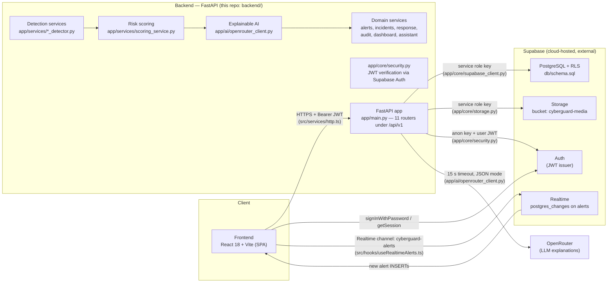

# CYBERGUARD System Architecture

AI-Powered Cyber Threat, Phishing & Digital Impersonation Detection and Response System.

## High-Level Architecture



The backend is the only holder of the **service role key**; the browser only ever holds the **anon key** plus the per-user JWT issued by Supabase Auth.

## Component Inventory (actual codebase)

| Layer | Module | Responsibility |
|---|---|---|
| API | `app/main.py` | FastAPI app, CORS, routers, validation (400) and global (500) JSON error handlers |
| API | `app/api/routes_health.py` | `GET /api/v1/health` liveness + Supabase connectivity |
| API | `app/api/routes_events.py` | Multi-source ingestion (`/events/email`, `/url`, `/message`, `/auth-log`, `/network`, `/api-log`, `/media`) |
| API | `app/api/routes_analysis.py` | Detection pipelines (`/analysis/email|url|impersonation|account-takeover|network|media`) and alert reads |
| API | `app/api/routes_alerts.py` | Alert list/search/filter, detail, status transitions |
| API | `app/api/routes_incidents.py` | Incident CRUD-lite: create, list, detail, status, assign, escalate |
| API | `app/api/routes_response.py` | Response catalog, approval-gated execution, history |
| API | `app/api/routes_dashboard.py` | Aggregated dashboard summary (Python-side grouping) |
| API | `app/api/routes_audit.py` | Audit trail reads |
| API | `app/api/routes_assistant.py` | SOC assistant chat |
| Core | `app/core/config.py` | pydantic-settings (`SUPABASE_*`, `OPENROUTER_*`, `API_V1_PREFIX`, `CORS_ORIGINS`) |
| Core | `app/core/supabase_client.py` | Service-role client singleton + `check_connection()` |
| Core | `app/core/security.py` | `get_current_user` (HTTPBearer → `supabase.auth.get_user`), `require_role` |
| Core | `app/core/storage.py` | Media upload (25 MB cap), 1-hour signed URLs, download |
| AI | `app/ai/openrouter_client.py` | Async OpenRouter chat call, JSON mode, 15 s timeout, deterministic fallback |
| AI | `app/ai/prompt_templates.py` | System prompts for all 6 modules + SOC assistant |
| Detection | `app/services/phishing_detector.py` | Email + SMS heuristics (lookalike domains, urgency, credential requests, URLs, SMS shortcodes/keywords) |
| Detection | `app/services/url_detector.py` | URL forensics (IP hosts, entropy, extensions, random paths, digit ratio, URLhaus patterns) |
| Detection | `app/services/impersonation_detector.py` | Authority claims, pressure, unusual requests, secrecy |
| Detection | `app/services/account_takeover_detector.py` | Failed bursts, impossible travel, unknown devices, success-after-failures |
| Detection | `app/services/network_threat_detector.py` | Exfiltration volumes, C2 ports, API rate abuse, 401 bursts |
| Detection | `app/services/media_forensics/` | ELA image/video forensics + WAV signal statistics (`deepfake_detector.py` selects) |
| Scoring | `app/services/scoring_service.py` | Indicator weights (critical 25 / high 15 / medium 5), severity bands |
| Data | `db/schema.sql` | 7 enums, 11 tables, indexes, RLS policies, `handle_new_user` trigger, response catalog seed |

## Workspace-scoped navigation (frontend)

Navigation and route guarding share a single source of truth:
`frontend/src/nav.ts`. Every nav item declares `scope` (`user` | `org` |
`both`) and a section; `getNavSections({ isOrg, can })` resolves what the
active workspace may see, and `isOrgScopeRoute(path)` powers the
`WorkspaceGuard` route wrapper.

| Nav item | Personal (user) | Org workspace |
|---|---|---|
| Dashboard, Phishing, URL, Impersonation, Deepfake | yes | yes |
| Log Analysis (paste-box) | yes | yes |
| Email Connectors, Quarantine, Blocked Senders, Security History, Notification Log, Settings | yes | yes |
| Account Takeover, Network & API | no | yes |
| Alerts, Incidents, Response Actions, Audit Logs, Reports | no | yes |
| Approvals, Block List, Action Log, Policies, Org Mgmt | no | yes (admin-gated) |
| Admin Users | no | yes (admin-gated) |

In personal mode, direct URLs to org-scope routes render the ComingSoon
placeholder ("This module is part of the Organization workspace.") — no
redirect loops; backend org endpoints additionally answer 501 while
`ORG_ENABLED=false`.

## Data Flow (detection-to-response pipeline)

```
Input Source (email, URL, message, auth log, network flow, API log, media file)
    |
    v
Ingestion API            POST /api/v1/analysis/*          (event row, status='analyzing')
    |
    v
Heuristic Engine         app/services/*_detector.py       (indicator list, typed + severities)
    |
    v
Risk Scoring             app/services/scoring_service.py  (risk_score = sum of weights, cap 100;
    |                                                      severity band safe..critical)
    v
Explainable AI           app/ai/openrouter_client.py      (LLM explanation, MITRE mapping,
    |                                                      recommended actions; 15 s timeout,
    |                                                      falls back to generic explanation)
    v
Alert Generation         app/services/alert_service.py    (alerts row, recommended_actions rows
    |                                                      matched against response_catalog,
    |                                                      event status -> 'completed')
    v
Dashboard                GET /api/v1/dashboard/summary    (React SOC console)
    ^
    |--- Supabase Realtime pushes new alert INSERTs to the frontend
         (channel `cyberguard-alerts`, hook: src/hooks/useRealtimeAlerts.ts)
```

Every state-changing action (alert status change, incident create/assign/escalate, response execution, assistant query) writes an `audit_logs` row via `app/services/audit_service.py`.

## Security Model

### Dedicated schema, tenancy, and RLS (Phase -1)

All application tables live in a dedicated **`cyberguard`** PostgreSQL schema
(never `public`). Migrations are managed by **Alembic** (`backend/alembic/`,
async template); `alembic/env.py` reads `MIGRATION_DATABASE_URL` (service /
postgres role, RLS-bypassing) falling back to `DATABASE_URL`. SQLite (tests,
local dev) resolves the schema prefix to the default schema via
`schema_translate_map={"cyberguard": None}` on the engine (`app/db/session.py`),
so the full suite runs unchanged without PostgreSQL.

**Tenancy.** With `ORG_ENABLED=false` (the default), every request resolves to
a *personal* tenant: `TenantContext { organization_id: None, owner_user_id:
user.id, role: "admin" }`. All queries are scoped through
`tenant_criteria(model, tenant)` (`app/core/security.py`): personal tenants
filter `owner_user_id == tenant.owner_user_id`; organization tenants (frozen
until the Orgs Phase) filter `organization_id == tenant.organization_id`.
Organization endpoints (`/organizations/*`, `/auth/switch-org`) are frozen
behind `require_org_enabled` → `HTTP 501 {"detail": "Organization accounts are
coming soon."}`. The server-mode integration surface
(`app/api/routes_integrations.py`) remains organization-scoped and therefore
inactive for personal users; it reactivates unchanged with the Orgs Phase
(alongside `enforcement_engine.py` / `action_executor.py`, which stay
org-scoped).

**Row-Level Security.** RLS is enabled on every `cyberguard` table:

- *Owner-scoped tables* (`events`, `alerts`, `action_executions`,
  `enforcement_policies`, `audit_logs`, `media_files`, `incidents`,
  `response_executions`, `users`): split SELECT/INSERT/UPDATE/DELETE policies
  on `owner_user_id = current_setting('app.user_id', true)::text` (`users`
  keys on `id`), with `WITH CHECK` on writes.
- *Shared read tables* (`response_catalog`, `organizations`): SELECT for the
  Supabase `authenticated` role via `current_setting('request.role', true) =
  'authenticated'`, plus full access for `cyberguard_api` (startup seeding,
  org resolution).
- *Child/join tables* (`recommended_actions`, `incident_alerts`,
  `incident_events`, `organization_members`): ownership derived from the
  parent row via `EXISTS` predicates.

**GUC wiring.** The backend connects as `cyberguard_api` (`NOBYPASSRLS`); it
can only see rows the GUCs permit. `current_user_id` (`ContextVar`,
`app/db/session.py`) is set by `get_current_user` immediately after token
verification — before any SQL runs, including the JIT user upsert. A session
`after_begin` event stamps `set_config('app.user_id', ..., false)` +
`set_config('request.role', 'authenticated', false)` onto every new
transaction (PostgreSQL only), surviving mid-request commits; `get_db` resets
the GUCs on session release. Unauthenticated requests run with an empty GUC
and therefore see nothing. The only pre-auth database operations are
username-availability and username→email lookups at sign-in, which run on a
separate service-role engine (`app/db/admin.py`).

**Auth paths.** `POST /auth/signup` creates the Supabase auth identity and the
project user row atomically, enforcing `username` (`^[a-z0-9_.]{3,32}$`,
DB-unique) and `account_type='user'`. `POST /auth/signin` accepts email *or*
username (usernames are resolved server-side). OAuth (Google/GitHub) sign-ins
materialize their project row in `get_current_user`'s JIT upsert with an
auto-generated unique username (sanitized email prefix, `-2`, `-3`… on clash);
duplicate identities for the same verified email are impossible because the
upsert keys on Supabase user id and email. Two Supabase keys remain strictly
separated (anon = verification, service role = migrations/storage only).

### Provider-neutral contract (finalized Phase 6)

`EmailProvider` (`app/services/email_providers/base.py`) defines the exact
14-method contract: `authorize`, `refresh_token`, `list_messages`,
`get_message`, `get_attachment`, `create_draft`, `send_message`,
`modify_message`, `move_to_trash`, `delete_message`, `quarantine_message`,
`create_sender_rule`, `update_sender_rule`, `delete_sender_rule` (plus the
operational `get_profile` / `test_connection` /
`release_message` / `ensure_quarantine_label` extensions). A `capabilities`
property exposes boolean `supports_*` flags so engines and the UI query what
a provider actually supports instead of guessing. Two implementations exist:
`GmailProvider` and an in-memory `MockEmailProvider` (configurable failure
flags) — proving the enforcement engine and scheduler rely only on the
contract. Providers are resolved through `get_provider(connector.provider)`;
`action_engine.py` and `scheduler.py` contain zero Gmail-specific imports.

### Event email notifications (Phase 7)

High-severity security events (`quarantine`, `sender_block`, `release`,
`delete`, `sender_expiry`, `sender_release`) trigger an alert email rendered
from a standard template ("CYBERGUARD Alert: [Event] - [Sender]") and
delivered to the user's registered `users.notification_email` — **never** to
a connected mailbox. Delivery backends: `db_log` (default; the rendered email
is persisted to `cyberguard.notification_logs` — deterministic, demo-safe)
or optional best-effort SMTP (`NOTIFICATION_SMTP_HOST`; any failure falls
back to DB logging with the real error recorded). The hook lives in
`record_event`, is fail-safe, and users register/clear the address via
`PUT /auth/notification-email`; the log is browsable on the Notification Log
page (`/notification-log`).

### Email connectors (Phase 1-2)

Gmail is the only live provider. It uses CYBERGUARD's **own Google OAuth
client** (Supabase Google login stays identity-only) with the `gmail.modify`
scope and offline access. Access/refresh tokens are encrypted at rest
(Fernet, `CONNECTOR_TOKEN_KEY`) in `cyberguard.email_connector_accounts`;
the browser only ever receives connector metadata. The OAuth callback
consumes single-use, expiring state rows via the service-role helper and
redirects to the frontend with a safe status — never tokens. Google errors
map to honest failure classes (`reauth_required`, `insufficient_scope`,
`rate_limited`, `failed`) recorded in `connector_operation_logs`. Outlook,
Yahoo, and iCloud are declared coming-soon/unsupported in the capability
registry, never faked. Details: `docs/email_connectors.md`.

### Original hardening (unchanged)

1. **Two Supabase keys, strictly separated**
   - **Anon key** — public, safe for the browser. Used by the frontend (`src/lib/supabaseClient.ts`) for sign-in/session and by the backend (`app/core/security.py`) only to *verify* user JWTs.
   - **Service role key** — backend-only (`app/core/supabase_client.py`, `app/core/storage.py`); never leaves the backend environment and is never committed (`.env` is git-ignored).
2. **JWT authentication** — every protected route depends on `get_current_user` (`app/core/security.py`), which validates the bearer token with `supabase.auth.get_user(token)` on the anon client and returns the caller's identity. The frontend refreshes the session once on a 401 (`src/services/http.ts`) and falls back to sign-out.
3. **Row Level Security** — see above: enforced in the database itself against the `cyberguard_api` role, defense-in-depth beneath the application-level `tenant_criteria` filters.
4. **Human-in-the-loop response actions** — catalog actions flagged `requires_approval` return HTTP 403 from `POST /responses/execute` unless `approved: true`; every execution (and rejection path) is audit-logged.
5. **Input hardening** — Pydantic validation returns structured 400s; media uploads are limited to 25 MB (413) and image/video/audio content types; file names are sanitized before storage; LLM output is parsed defensively with a deterministic fallback when OpenRouter fails or returns non-JSON.
6. **Secrets** — all secrets come from environment variables (backend `.env`, frontend `VITE_*`); `.env.example` files document them without real values.
