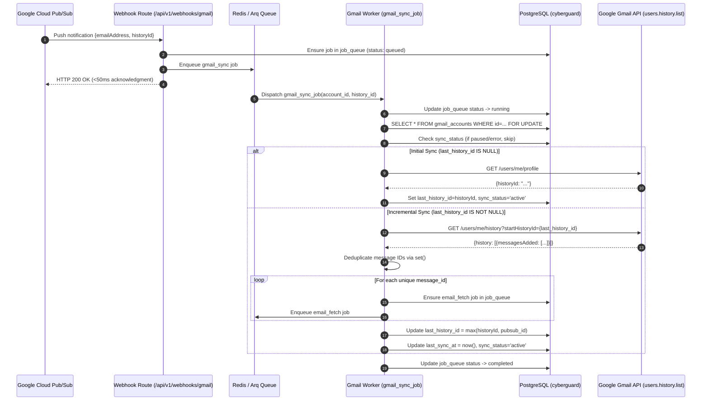

# RT-4 — Gmail Sync Worker Specification

## Overview

The `gmail_sync_job` background worker processes real-time synchronization jobs triggered by Pub/Sub webhook pushes. Its primary role is message discovery using the Gmail `users.history.list` API, converting change notifications into individual, idempotent `email_fetch` jobs for processing without ever fetching full email contents or running machine learning pipelines during mailbox discovery.

---

## 1. Sequence Diagram



---

## 2. Error Handling Matrix

| HTTP Status | Exception Class | Account Action | Job Action | Arq Worker Behavior |
|---|---|---|---|---|
| **401 Unauthorized** | `GmailAuthError` | `sync_status = 'error'`, `last_error = 'reauth_required'` | Marked `status = 'failed'`, error recorded | Does not retry indefinitely; requires user re-authentication |
| **403 Forbidden** | `GmailScopeError` | `sync_status = 'error'`, `last_error = 'insufficient_scopes'` | Marked `status = 'failed'`, error recorded | Aborted; user must grant required Gmail scopes |
| **429 Too Many Requests** | `GmailRateLimitError` | Preserved (`active`); rate limit noted | Marked `status = 'failed'`, `retry_count += 1` | Retries with exponential backoff (5s, 30s, 2m, 10m, 30m) |
| **5xx Server Error** | `GmailServerError` | Preserved (`active`); transient error | Marked `status = 'failed'`, `retry_count += 1` | Retries with exponential backoff up to `max_retries` |

### Automatic Token Refresh on 401
When a Gmail API call encounters HTTP 401, `GmailClient` automatically triggers a single-retry token refresh via `oauth_service.refresh_token(refresh_token)`. If the refresh succeeds, the request is transparently re-executed with the new bearer token. If the refresh fails or the retried request also returns 401, `GmailAuthError` is raised.

---

## 3. Concurrency Guarantees (`SELECT ... FOR UPDATE`)

When rapid Pub/Sub notifications or overlapping webhooks arrive for the same user mailbox:
1. The worker acquires an exclusive row lock:
   ```sql
   SELECT * FROM cyberguard.gmail_accounts WHERE id = :account_id FOR UPDATE;
   ```
2. Concurrent worker tasks attempting to process the same mailbox block until the active transaction commits.
3. Once unblocked, subsequent executions observe the committed `last_history_id`.
4. Monotonic history comparison:
   ```python
   if is_greater_history_id(new_history_id, account.last_history_id):
       account.last_history_id = str(new_history_id)
   ```
   Older or out-of-order history notifications are safely ignored, preventing lost updates or regression.

---

## 4. Initial Sync Behavior

When a Gmail account is newly connected:
- `last_history_id` is initialized to `None`.
- On the first sync invocation, the worker bypasses `users.history.list` (which requires a valid start history ID) and queries `users.getProfile`.
- The current mailbox checkpoint `historyId` is recorded in `gmail_accounts.last_history_id`.
- Zero historical email fetch jobs are enqueued during initial sync, establishing a clean baseline for future push events.
- Subsequent push notifications discover only newly added messages (`messagesAdded`) arriving after the checkpoint.
